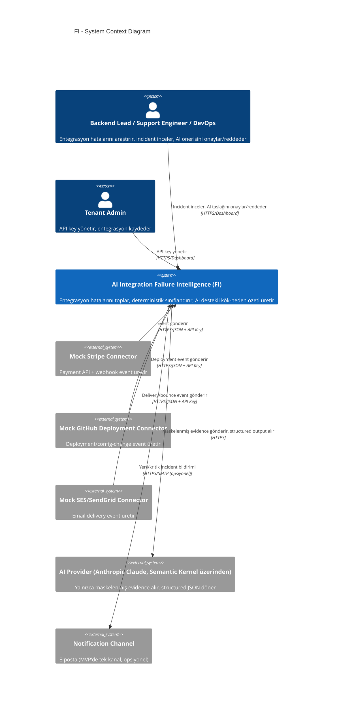
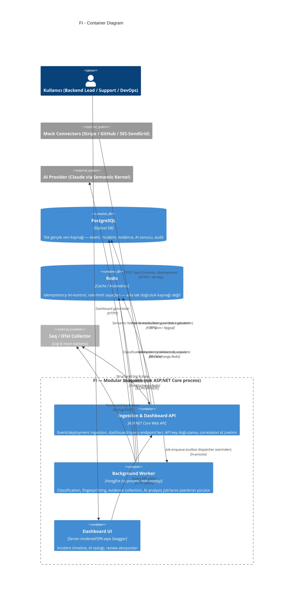
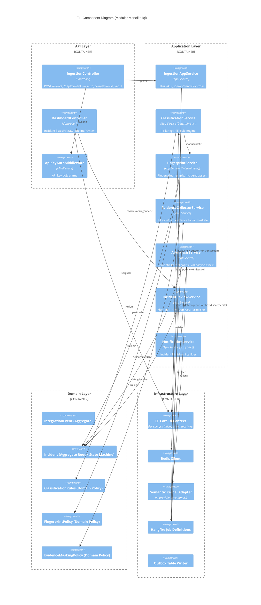
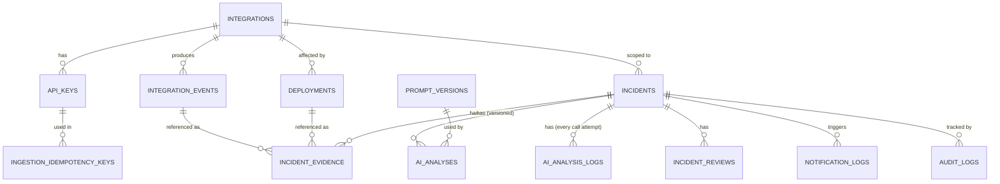
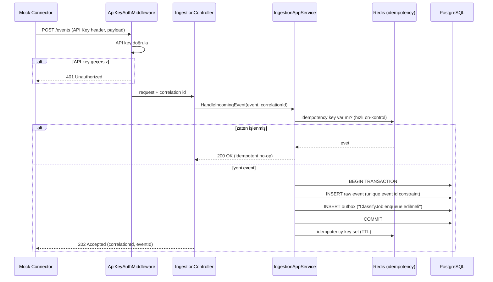
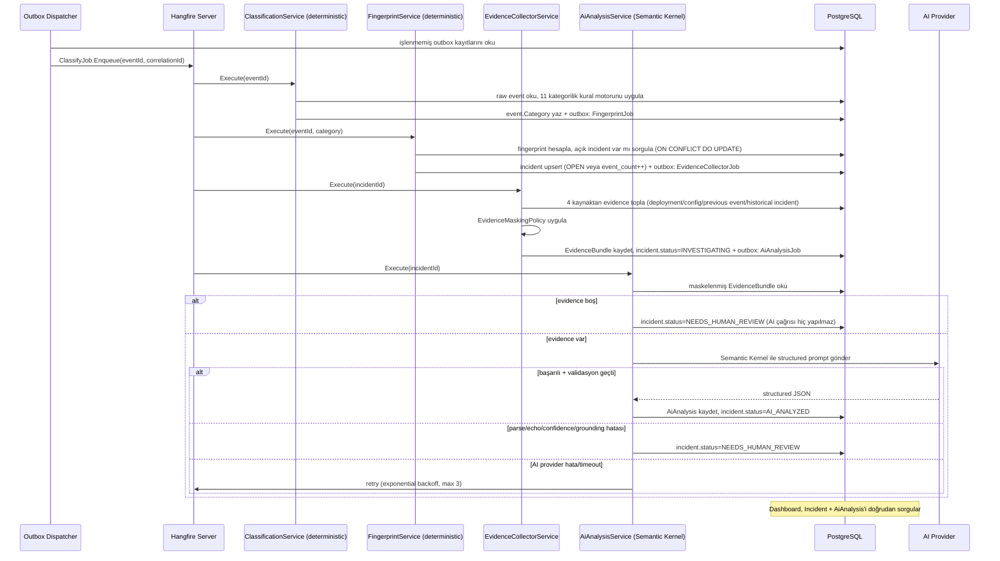
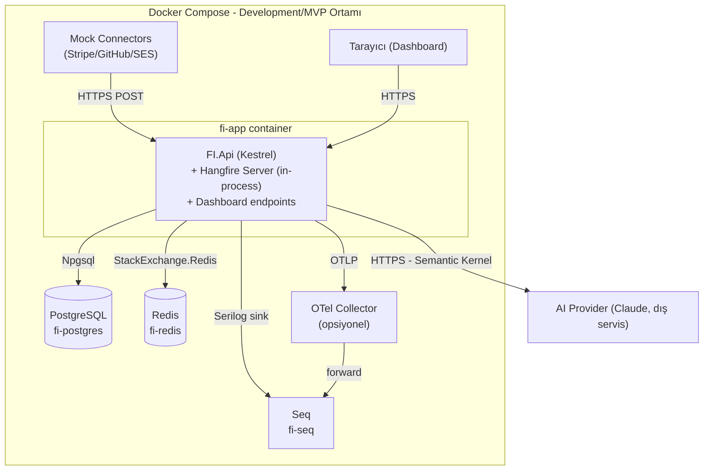

# AI Integration Failure Intelligence (FI) — Nihai Mimari Doküman

**Doküman türü:** Sentezlenmiş, tek-kaynak nihai mimari (v1.0, MVP)
**Tarih:** 2026-07-12
**Rol:** Principal .NET Architect sentezi — 6 uzman analiz dokümanının (01–06) birleştirilmiş, çelişkileri çözülmüş, MVP'ye budanmış hali.
**Kaynaklar:** `docs/analysis/failure-intelligence/01-*.md` … `06-*.md`, `ai-integration-operations-platform-master-plan-v3.html`

> Bu doküman tek başına yeterli olacak şekilde yazılmıştır. Kaynak dokümanlarla çelişen her yerde, hangi kararın seçildiği ve neden seçildiği açıkça **Not:** blokları ile işaretlenmiştir. Emin olunmayan noktalar Bölüm 49'da "Open Decision" olarak toplanmıştır.

---

## 1. Executive Summary

FI (Failure Intelligence), 5-50 kişilik SaaS ekiplerinin üçüncü taraf entegrasyonlarında (payment API+webhook, deployment webhook, email delivery API) yaşadığı arızaları **kanıta dayalı (evidence-backed)** şekilde triyaj eden bir incident-intelligence katmanıdır. Ürün ham log/metric/trace toplayan genel bir observability aracı değildir; entegrasyon event'lerini alır, **deterministik kodla** sınıflandırır ve fingerprint'ler, bir eşik aşıldığında **deterministik kodla** incident açar, sonra yalnızca toplanmış ve maskelenmiş kanıt üzerinden **AI ile** kök-neden açıklaması + önerilen aksiyon + confidence skoru üretir. AI hiçbir zaman incident açıp kapatmaz, kategori belirlemez; sadece zaten var olan bir incident'ı yorumlar ve düşük güvende insan onayına düşürür (`NEEDS_HUMAN_REVIEW`).

Mimari kasıtlı olarak dar kapsamlıdır: **tek process modüler monolith**, **tek PostgreSQL + Redis**, **Hangfire + outbox pattern** ile asenkron iş kuyruğu, **gerçek multi-tenancy yok**, **billing yok**, **otomatik remediation yok**, **generic repository yok**. MVP, 14 günlük bir geliştirme takvimiyle üç somut entegrasyon senaryosunda (mock Stripe, mock GitHub Deployment, mock SES/SendGrid) "evidence-backed root cause" değer önerisinin gerçekten çalıştığını kanıtlamayı hedefler; bununla paralel yürüyen bir pazar-doğrulama (15 problem-interview + pilot) süreci, ürünün gerçek bir ürüne mi yoksa güçlü bir portföy parçasına mı dönüşeceğine karar verir.

---

## 2. Product Scope

> **Tek cümlelik değer önermesi:** "Entegrasyonunuz bozuldu. Ne bozuldu, neden bozulmuş olabilir, kim etkilendi ve ne yapmanız gerektiğini kanıtlarla gösteriyoruz."

FI, genel gözlemlenebilirlik (Sentry/Datadog) ile webhook teslimat altyapısı (Hookdeck/Svix) arasındaki boşlukta oturur. Kapsam MVP'de bilinçli olarak üç entegrasyon tipiyle sınırlıdır:

| Entegrasyon Tipi | Mock Connector | Temsil Ettiği Gerçek Dünya |
|---|---|---|
| Payment API + Webhook | Mock Stripe Connector | Ödeme sağlayıcısı webhook/charge API'si |
| Deployment Webhook | Mock GitHub Deployment Connector | CI/CD deploy bildirimi |
| Email Delivery API | Mock AWS SES / SendGrid Connector | Transactional email delivery/bounce/complaint |

Genişlik değil derinlik hedeflenir: 20 connector'lük bir kütüphane yerine, bu üç senaryoda "evidence-backed root cause" iddiasının gerçekten doğru çalıştığı kanıtlanır.

---

## 3. Target Users

| Persona | Rol | İhtiyaç |
|---|---|---|
| **Ali — Backend Lead** | 5-15 kişilik SaaS, payment/webhook yoğun | 5 dakikada "bu neden oldu, kaç müşteri etkilendi, ne yapmalıyım" cevabı |
| **Zeynep — Support Engineer** | Ajans, çoklu müşteri entegrasyonu | Müşteri bazlı etki özeti + kanıt listesi, "müşteriye nasıl anlatırım" seviyesinde |
| **Emre — Founding Engineer / DevOps** | 10-50 kişilik, tüm entegrasyonlardan sorumlu tek kişi | Deploy/config event'i ile hata artışı arasında otomatik korelasyon, ama nihai kararı kendisi verir (human review) |

Bu üç persona MVP'nin tüm UX/API kararlarının referans noktasıdır; dördüncü bir persona (örn. "Enterprise Compliance Officer") MVP kapsamına dahil edilmemiştir (bkz. Bölüm 8).

---

## 4. Main User Journeys

### J1 — Entegrasyon kaydet ve event almaya başla
Kullanıcı admin UI/Swagger'dan entegrasyon kaydeder → sistem API key üretir (bir kez gösterilir) → kullanıcı ingestion endpoint'ini kendi sistemine/connector'una tanımlar → ilk event birkaç dakika içinde akmaya başlar.

### J2 — Bir webhook 401 vermeye başladı
Ali'nin sistemi art arda 401 event'i gönderir → rule engine `AUTHENTICATION_ERROR` sınıflandırır → aynı fingerprint altında tek incident açılır (10 event yerine "1 incident, 9 tekrar") → evidence toplanır (son 6 saatte API key rotasyonu var mı?) → AI kök-neden hipotezi üretir → Ali dashboard'da 2 dakikada "API key rotate edilmiş, muhtemel neden bu" görür.

### J3 — Müşteri şikayet etti, Zeynep araştırıyor
Zeynep incident listesine girer, entegrasyon/tarih filtresiyle daralt → ilgili incident'ı açar → etkilenen request sayısını, zaman aralığını, kanıt listesini görür → bu bilgiyle müşteriye somut açıklama yazar.

### J4 — Deploy sonrası hata patlaması
Emre'nin CI/CD'si `POST /deployments` çağırır → 4 dakika sonra aynı entegrasyonda 5xx patlaması olur → evidence collector deploy event'ini otomatik evidence'a ekler ("Bu deploy'dan 4 dakika sonra 5xx oranı arttı") → AI bunu kanıt olarak kullanır → Emre "bizim değişikliğimiz mi" sorusunu saniyeler içinde cevaplar.

### J5 — AI'nin güvenmediği bir durum
Evidence yetersiz veya çelişkili → confidence < 0.65 → incident `NEEDS_HUMAN_REVIEW` durumuna düşer → reviewer AI taslağını onaylar/düzenler/reddeder → karar `IncidentReview` kaydına yazılır.

---

## 5. Functional Requirements

| ID | Gereksinim |
|---|---|
| FR-1 | Kullanıcı bir entegrasyon kaydedebilir, API key üretilir, entegrasyon tipi seçilir (payment/deployment/email) |
| FR-2 | Sistem API key ile event ingestion kabul eder (`POST /api/v1/events`) |
| FR-3 | Sistem deployment/config-change event'lerini ayrı bir endpoint'ten kabul eder (`POST /api/v1/deployments`) |
| FR-4 | Gelen her event deterministik kurallarla otomatik sınıflandırılır (11 kategorilik taksonomi, bkz. Bölüm 21) |
| FR-5 | Benzer hatalar deterministik bir fingerprint algoritmasıyla gruplanır |
| FR-6 | Fingerprint eşiği aşıldığında sistem otomatik incident açar/günceller (idempotent upsert) |
| FR-7 | Incident'a bağlı bir timeline (ilk görülme, tekrarlar, ilgili deploy/config event'leri, çözülme) tutulur |
| FR-8 | Sistem incident için evidence toplar (deployment, config change, geçmiş event, geçmiş incident) ve maskeler |
| FR-9 | AI, yalnızca maskelenmiş evidence üzerinden structured JSON çıktı (özet, kök neden, kanıt, aksiyon, confidence) üretir |
| FR-10 | AI çıktısı parse/şema/echo/confidence/grounding kontrollerinden geçer; geçmezse `NEEDS_HUMAN_REVIEW` |
| FR-11 | Kullanıcı incident'ı onaylayabilir/düzenleyebilir/reddedebilir/ignore edebilir; her karar audit edilir |
| FR-12 | Sistem etkilenen request/müşteri sayısını incident üzerinde gösterir |
| FR-13 | Kullanıcı API key rotate/revoke edebilir |
| FR-14 | Sistem her request/job'a correlation id atar, yapılandırılmış log üretir |
| FR-15 | Health check endpoint'leri (liveness/readiness) temel bağımlılıkları doğrular |
| FR-16 | Sistem Docker Compose ile tek komutla ayağa kalkar |

---

## 6. Non-Functional Requirements

| Kategori | Gereksinim |
|---|---|
| **Tutarlılık** | Event → classification → fingerprint → incident zinciri ACID transaction + outbox pattern ile en-az-bir-kez garantili, idempotent |
| **İzlenebilirlik** | Her request/job correlation id taşır; Serilog + OpenTelemetry ile uçtan uca tek sorguda izlenebilir |
| **Güvenlik** | API key hash'lenir (asla plaintext saklanmaz), hassas payload AI'a gitmeden maskelenir, webhook imzaları HMAC ile doğrulanır |
| **Dayanıklılık** | AI provider/Redis down olsa da sistem "graceful degradation" ile temel işlevini (ingestion, classification, incident) sürdürür |
| **Performans** | Ingestion endpoint p95 < 300ms (senkron kısım); AI analiz job'u p95 < 4sn |
| **Test edilebilirlik** | Deterministik modüller (classifier, fingerprint) %85+ unit test coverage hedefler; her milestone deploy edilebilir ve test edilebilir olmalı |
| **Basitlik** | Gereksiz soyutlama yok (generic repository, microservice, mesaj broker MVP'de yok) |
| **Maliyet kontrolü** | AI çağrısı incident başına sınırlı sayıda tetiklenir (yeni incident + belirgin durum değişikliği), token/latency bütçesi sabittir |

---

## 7. MVP Scope

**MVP'de OLACAKLAR:**
- Integration Registry (kayıt, API key üretimi/rotasyon/revoke, entegrasyon tipi)
- 3 mock connector (Stripe, GitHub Deployment, SES/SendGrid) ile event/deployment ingestion
- Deterministik sınıflandırma (11 kategori, bkz. Bölüm 21) + fingerprinting
- Incident oluşturma + 7 durumlu state machine + timeline
- Evidence collection (4 kaynak: deployment, config change, previous event, historical incident) + maskeleme
- AI kök-neden analizi (evidence-only, structured output, validasyon zinciri)
- Confidence skoru + `needsHumanReview` bayrağı + human-in-the-loop review akışı
- Serilog + Seq + correlation id + OpenTelemetry + health check'ler
- Docker Compose (API + PostgreSQL + Redis + Seq)
- Swagger/minimal admin UI
- Test piramidi (unit/integration/contract/e2e) CI'da yeşil

**Kapsam gerekçesi:** MVP'nin tek amacı üç somut senaryoda "evidence-backed root cause" değerinin gerçekten çalıştığını, gösterilebilir ve test edilebilir şekilde kanıtlamaktır — genel bir platform kurmak değil.

---

## 8. Explicitly Out of Scope

| Özellik | Neden dışarıda | Post-MVP koşulu |
|---|---|---|
| **Gerçek multi-tenancy** (RLS, org yönetimi, RBAC) | Tenant izolasyon karmaşıklığı değer kanıtlamayı geciktirir | Gerçek 2. müşteri/pilot onaylanınca |
| **Billing/faturalama** | Ürün henüz ticari teklif değil | Ödeme niyeti netleşince (Bölüm 44 karar kriterleri) |
| **20+ connector kütüphanesi** | Derinlik > genişlik | 3 senaryoda değer kanıtlandıktan sonra |
| **Kafka/Kubernetes** | Event hacmi bunu gerektirmiyor | Saniyede binlerce event gerçek ihtiyaç olunca |
| **Microservice ayrımı** | Modüler monolith yeterli, dağıtık sistem karmaşıklığı gereksiz | Bkz. Bölüm 43 servis ayrıştırma koşulları |
| **Otomatik remediation** | Güven inşası önce gelir; yanlış otomatik aksiyon riski kabul edilemez | MVP'de hiç planlanmıyor — ürünün wedge'i "anlamak", "düzeltmek" değil |
| **Agent swarm / çoklu-ajan orkestrasyon** | Tek, kanıta dayalı analiz akışı yeterli, ekstra karmaşıklık güveni azaltır | Planlanmıyor |
| **Slack/Teams gibi zengin bildirim kanalları** | E-posta + basit webhook yeterli MVP kanıtı için | Kullanıcı talebi netleşince |
| **Plan bazlı (Free/Pro/Enterprise) rate limit farklılaşması** | Billing yokken plan kavramı anlamsız | Billing eklenince |
| **PostgreSQL Row-Level Security (tenant bazlı)** | Gerçek multi-tenancy olmadığı için RLS'nin koruyacağı bir sınır yok | Multi-tenancy eklenince |
| **ML tabanlı PII tespiti, format-preserving encryption** | Regex + field-based maskeleme MVP için yeterli | Gerçek dünya false-negative oranı yüksek çıkarsa |
| **Çoklu AI provider fallback** | Tek provider + degrade mode yeterli | AI provider SLA sorunu tekrarlanırsa |
| **Tam on-call rotasyonu (PagerDuty vb.)** | E-posta/Slack webhook alert MVP'de yeterli | Ekip büyüyünce |

---

## 9. Domain Model

### 9.1 Ubiquitous Language (Domain Glossary)

| Terim | Tanım |
|---|---|
| **Integration** | Kayıtlı, izlenen üçüncü taraf sistem bağlantısı. Kendi API key'i, tipi (payment/deployment/email) ve durumu (active/paused) vardır. |
| **IntegrationEvent** | Bir entegrasyondan ingest edilen tekil olay: HTTP status, latency, request/response metadata, timestamp, correlation id. |
| **Deployment** | Bir deploy/release/config-change bildirimi; root-cause korelasyonunda kullanılır. |
| **Classification** | Event'e atanan deterministik hata kategorisi (11 kategori, Bölüm 21). |
| **Fingerprint** | Benzer event'leri gruplayan SHA-256 imza (integration + category + normalize edilmiş hata imzası). |
| **Incident** | Bir fingerprint'in eşik aşımıyla açılan, 7 durumlu state machine'e sahip olay kaydı. |
| **Evidence** | AI'a giden, deterministik template ile üretilmiş, maskelenmiş kanıt kalemleri. |
| **AiAnalysis** | Evidence'a dayanan, versiyonlu (append-only) AI çıktısı: özet, kök neden, aksiyon, confidence. |
| **AiAnalysisLog** | Her AI çağrısının teknik gözlemlenebilirlik kaydı (token, maliyet, parse/echo/grounding sonucu) — `AiAnalysis`'tan ayrı, hatalı denemeler dahil her çağrıyı tutar. |
| **Confidence** | AI analizinin güvenilirlik skoru (0.0-1.0). |
| **NeedsHumanReview** | Confidence eşik altındaysa veya kanıt/şema sorunu varsa set edilen zorunlu bayrak. |
| **IncidentReview** | Bir insan reviewer'ın AI taslağı üzerindeki kararının (onay/düzenle/reddet/ignore) kalıcı kaydı. |
| **Severity** | Incident'ın önem derecesi (LOW/MEDIUM/HIGH/CRITICAL) — deterministik hesaplanır. |
| **CorrelationId** | Bir isteği/işlem zincirini uçtan uca izleyen tekil kimlik. |
| **PromptVersion** | AI sistem prompt'unun ve output şemasının versiyonlanmış kaydı (A/B test ve rollback için). |

### 9.2 Aggregate ve Sınırlar

- **Integration** (Aggregate Root) → `ApiKey` (child entity, 1-N)
- **IntegrationEvent** (Aggregate Root, immutable/append-only)
- **Deployment** (Aggregate Root, immutable/append-only)
- **Incident** (Aggregate Root) → `IncidentEvidence` (child, 1-N), `AiAnalysis` (child, 1-N versioned), `IncidentReview` (child, 1-N)
- **AuditLog**, **NotificationLog**, **AiAnalysisLog**, **PromptVersion**, **IngestionIdempotencyKey** — bağımsız kayıt tabloları (aggregate değil, append-only log/registry niteliğinde)

### 9.3 Domain Kuralları (Invariants)

1. Bir `IntegrationEvent` asla güncellenmez, sadece eklenir (immutable evidence kaynağı).
2. Bir `Incident`'ın resmi `category`/`severity` alanları yalnızca deterministik kod tarafından yazılır; AI bunları asla ezemez (sadece `aiSeveritySuggestion` önerebilir).
3. `AiAnalysis.confidence < CONFIDENCE_THRESHOLD` ise `needsHumanReview` sistem tarafından zorla `true` yapılır — modelin kendi beyanına güvenilmez.
4. Evidence, AI'a gitmeden önce `EvidenceMaskingPolicy`'den geçmek **zorundadır**; tip sisteminde ham event tipi ile maskelenmiş `EvidenceBundle` tipi ayrıştırılır, `AiAnalysisService` yalnızca `EvidenceBundle` kabul eder.

---

## 10. System Context (Mermaid)

> **Not:** Kaynak `02-system-architecture.md` context diyagramında yalnızca "Mock Stripe Connector" gösterilmişti; ürün kapsamı (Bölüm 2) üç connector'ı da içerdiğinden diyagram üç connector'ı yansıtacak şekilde genişletildi.



---

## 11. Container Architecture (Mermaid)



---

## 12. Component Architecture (Mermaid)



---

## 13. Module Boundaries

FI, **Clean/Onion Architecture** ile 4 katmana ayrılır; her katman kendi .NET class library projesinde yaşar, tek solution içinde derlenir, tek process olarak deploy edilir.

| Katman | Proje | Sorumluluk |
|---|---|---|
| **Domain** | `FI.Domain` | Entity, Value Object, domain event, deterministik kurallar (ClassificationRules, FingerprintPolicy, EvidenceMaskingPolicy). Dışa bağımlılık yok. |
| **Application** | `FI.Application` | Use case orkestrasyonu, interface tanımları (`IEventRepository`, `IAiAnalysisClient`, `IEvidenceStore`) — implementasyon Infrastructure'da. |
| **Infrastructure** | `FI.Infrastructure` | EF Core, PostgreSQL, Redis, Semantic Kernel adapter, Hangfire job'ları, Serilog/OTel, outbox implementasyonu. |
| **API (+ Worker Host)** | `FI.Api` | Controller, middleware, DI, Hangfire server host (worker ayrı process DEĞİL). |

**Bağımlılık kuralı:**
```
API  ──depends on──>  Application  ──depends on──>  Domain
API  ──depends on──>  Infrastructure  ──depends on──>  Application (interfaces), Domain
Infrastructure  ──implements──>  Application interfaces
Domain  ──depends on──>  (hiçbir şey; framework-free)
```

Domain katmanı EF Core/Semantic Kernel/ASP.NET Core'a asla referans vermez. Application, Infrastructure'a bağımlı olamaz (Dependency Inversion). Modüller arası çağrı (ör. Classification → Fingerprinting) doğrudan somut sınıf yerine interface/domain event üzerinden yapılır — bu, ileride bir modülü ayrı servise çıkarmayı ucuzlaştırır (bkz. Bölüm 43).

**Modül dikey dilimleri** (her katman içinde): `Ingestion`, `Classification`, `Fingerprinting`, `Evidence`, `AiAnalysis`, `Notification`. Bir modül başka bir modülün internal detayına doğrudan erişemez; yalnızca public application service interface'i veya domain event üzerinden konuşur. Bu, C# `internal` erişim belirleyicisi + proje-içi klasör disiplini ile zorlanır; ayrı assembly'lere bölmek MVP'de gereksiz overhead'dir.

**Worker'ın konumu:** Hangfire server, `FI.Api` host process'i içinde `AddHangfireServer()` ile başlatılır — ayrı deploy birimi değildir. İleride job yükü API yükünü etkilerse, Hangfire server'ı ayrı process'e taşımak **kod değişikliği gerektirmeden**, sadece deploy konfigürasyonuyla mümkündür.

---

## 14. Repository and Folder Structure

```
FI/
├── FI.sln (veya .slnx)
├── global.json
├── Directory.Build.props
├── src/
│   ├── FI.Domain/
│   │   ├── Ingestion/            (IntegrationEvent, DeploymentEvent)
│   │   ├── Classification/       (ClassificationRules, FailureCategory)
│   │   ├── Fingerprinting/       (FingerprintPolicy, Incident, IncidentStateMachine)
│   │   ├── Evidence/             (EvidenceBundle, EvidenceMaskingPolicy)
│   │   ├── AiAnalysis/           (AiFinding, RecommendedAction, PromptVersion)
│   │   └── Shared/                (ValueObjects, DomainEvent base tipleri)
│   ├── FI.Application/
│   │   ├── Ingestion/
│   │   ├── Classification/
│   │   ├── Fingerprinting/
│   │   ├── Evidence/
│   │   ├── AiAnalysis/
│   │   ├── Review/                (IncidentReviewService)
│   │   └── Notification/
│   ├── FI.Infrastructure/
│   │   ├── Persistence/           (DbContext, EF Core configurations, migrations)
│   │   ├── Caching/               (Redis client)
│   │   ├── Ai/                    (Semantic Kernel adapter, prompt templates)
│   │   ├── Connectors/            (StripeConnector, GitHubDeploymentConnector, SesSendGridConnector)
│   │   ├── Jobs/                  (Hangfire job tanımları, outbox dispatcher)
│   │   └── Observability/         (Serilog config, OpenTelemetry config)
│   └── FI.Api/
│       ├── Controllers/           (IngestionController, DeploymentController, IncidentController, IntegrationController)
│       ├── Middleware/            (ApiKeyAuthMiddleware, CorrelationIdMiddleware, ErrorHandlingMiddleware)
│       ├── Program.cs
│       └── appsettings*.json
├── tests/
│   ├── FI.Domain.Tests/           (unit — classifier, fingerprint, masking policy)
│   ├── FI.Application.Tests/      (unit — servisler, mock repository)
│   ├── FI.Integration.Tests/      (Testcontainers PostgreSQL + Redis)
│   ├── FI.Contract.Tests/         (JSON Schema doğrulama)
│   └── FI.E2E.Tests/              (event → incident → AI zinciri, cassette AI)
├── docs/
│   ├── adr/                       (ADR-001 … ADR-010)
│   └── FAILURE_INTELLIGENCE_ARCHITECTURE.md (bu doküman)
├── docker/
│   ├── Dockerfile
│   ├── docker-compose.yml
│   └── docker-compose.prod.yml
└── .github/workflows/ci.yml
```

> **Not:** Bu klasör ağacı yalnızca isimlendirme/organizasyon önerisidir; kod üretilmemiştir.

---

## 15. Database Design

Tek PostgreSQL veritabanı, tek "gerçek veri kaynağı" ilkesi. Redis yalnızca cache/hızlandırıcıdır (asıl garanti her zaman PostgreSQL constraint'lerindedir).



Tam kolon şeması Bölüm 16'da; index/partition/retention stratejisi Bölüm 17'de.

**Not:** `05-security-reliability-observability.md`, log şeması ve trust boundary bölümlerinde `TenantId` alanını tüm tablolara zorunlu olarak eklemişti (log context, Postgres RLS önerisi, plan bazlı rate limit). Bu, görev tanımındaki "MVP'de gerçek multi-tenancy yok" kuralıyla **doğrudan çelişiyordu**. Karar: MVP şemasında `tenant_id` kolonu **yoktur**; tek-organizasyon varsayımıyla çalışılır. `TenantId` log alanı ve RLS önerisi post-MVP roadmap'ine taşındı (bkz. Bölüm 8, Bölüm 43). Rate limit plan bazlı değil, tek sabit eşikle (entegrasyon başına) uygulanır (bkz. Bölüm 31).

---

## 16. Entity Definitions

Aşağıdaki liste, `03-data-api-integrations.md`'nin temel şemasını esas alır; `04-incident-ai-intelligence.md`'de tanımlanan ama `03`'ün SQL şemasında **eksik olan** `AiAnalysisLog`, `PromptVersion` ve `IncidentReview` tabloları buraya eklenmiştir (bu, kaynaklar arası bir boşluktu — 04 bu tabloları kavramsal olarak tanımlamış ama 03 fiziksel şemaya işlememişti).

### 16.1 Integrations
```sql
CREATE TABLE integrations (
    id                  uuid PRIMARY KEY DEFAULT gen_random_uuid(),
    name                varchar(200) NOT NULL,
    provider            varchar(100) NOT NULL,        -- 'stripe' | 'github' | 'ses' | 'sendgrid'
    environment         varchar(50)  NOT NULL,        -- 'production' | 'staging' | 'development'
    owner               varchar(200) NOT NULL,        -- MVP'de free-text
    endpoint_url        varchar(500),
    business_criticality varchar(20) NOT NULL DEFAULT 'MEDIUM', -- LOW|MEDIUM|HIGH|CRITICAL — severity hesaplamasında kullanılır
    status              varchar(30)  NOT NULL DEFAULT 'ACTIVE', -- ACTIVE | PAUSED | ARCHIVED
    created_at          timestamptz  NOT NULL DEFAULT now(),
    updated_at          timestamptz  NOT NULL DEFAULT now(),
    CONSTRAINT uq_integrations_name_env UNIQUE (name, environment)
);
```

### 16.2 ApiKeys
```sql
CREATE TABLE api_keys (
    id                  uuid PRIMARY KEY DEFAULT gen_random_uuid(),
    integration_id      uuid NOT NULL REFERENCES integrations(id) ON DELETE CASCADE,
    key_prefix          varchar(12)  NOT NULL,        -- "fi_live_ab12" — log/UI'da güvenle gösterilebilir
    key_hash            varchar(200) NOT NULL,        -- HMAC-SHA256 + pepper
    created_at          timestamptz  NOT NULL DEFAULT now(),
    last_rotated_at     timestamptz,
    revoked_at          timestamptz,
    last_used_at        timestamptz,
    usage_count         bigint       NOT NULL DEFAULT 0,
    CONSTRAINT uq_api_keys_hash UNIQUE (key_hash)
);
CREATE INDEX ix_api_keys_integration_active ON api_keys (integration_id) WHERE revoked_at IS NULL;
```

### 16.3 IntegrationEvents
```sql
CREATE TABLE integration_events (
    id                  uuid PRIMARY KEY DEFAULT gen_random_uuid(),
    integration_id      uuid NOT NULL REFERENCES integrations(id) ON DELETE CASCADE,
    event_type          varchar(50)  NOT NULL,        -- 'API_CALL' | 'WEBHOOK_IN' | 'WEBHOOK_OUT'
    status_code         int          NOT NULL,
    category            varchar(50),                  -- rule engine tarafından doldurulur (Bölüm 21)
    request_redacted    jsonb,
    response_redacted   jsonb,
    latency_ms          int,
    correlation_id      uuid         NOT NULL,
    idempotency_key     varchar(200),
    api_key_id          uuid REFERENCES api_keys(id),
    is_signature_verified boolean,                    -- webhook imza doğrulaması sonucu (nullable: API_CALL için N/A)
    payload_size_bytes  int          NOT NULL DEFAULT 0,
    is_truncated        boolean      NOT NULL DEFAULT false,
    occurred_at         timestamptz  NOT NULL,
    received_at         timestamptz  NOT NULL DEFAULT now(),
    CONSTRAINT ck_events_status_code CHECK (status_code BETWEEN 100 AND 599),
    CONSTRAINT ck_events_occurred_not_future CHECK (occurred_at <= received_at + interval '5 minutes')
) PARTITION BY RANGE (occurred_at);
```

### 16.4 Deployments
```sql
CREATE TABLE deployments (
    id                  uuid PRIMARY KEY DEFAULT gen_random_uuid(),
    integration_id      uuid REFERENCES integrations(id) ON DELETE SET NULL, -- nullable: platform-geneli deploy
    service             varchar(200) NOT NULL,
    environment         varchar(50)  NOT NULL,
    commit              varchar(100) NOT NULL,
    changed_config      jsonb,                         -- sadece {"key": "...", "changed": true} — değer YOK
    deployed_at         timestamptz  NOT NULL,
    received_at         timestamptz  NOT NULL DEFAULT now(),
    CONSTRAINT ck_deploy_not_future CHECK (deployed_at <= received_at + interval '5 minutes')
);
```

### 16.5 Incidents

> **Not (çelişki çözümü):** `03` şemasında incident durumu `OPEN|ACKNOWLEDGED|RESOLVED|REOPENED|IGNORED` (5 durum) olarak tanımlanmıştı. `04` dokümanı ise ürünün "AI incident açmaz, sadece açıklar" ilkesini somutlaştıran 7 durumlu bir state machine tanımlıyor: `OPEN|INVESTIGATING|AI_ANALYZED|NEEDS_HUMAN_REVIEW|RESOLVED|REOPENED|IGNORED`. **04'ün state machine'i tercih edildi** çünkü mandatory kural olan "AI incident oluşturmanın tek sorumlusu değildir, insan review korunur" doğrudan bu duruma bağlıdır; `ACKNOWLEDGED` durumu ayrı bir kavram olarak düşürüldü (triage akışı `INVESTIGATING`/`AI_ANALYZED` durumlarıyla zaten karşılanıyor).

```sql
CREATE TABLE incidents (
    id                          uuid PRIMARY KEY DEFAULT gen_random_uuid(),
    integration_id              uuid NOT NULL REFERENCES integrations(id) ON DELETE CASCADE,
    fingerprint                 varchar(64) NOT NULL,  -- sha256 hex
    fingerprint_algorithm_version int       NOT NULL DEFAULT 1,
    category                    varchar(50) NOT NULL,  -- Bölüm 21, 11 kategori
    severity                    varchar(20) NOT NULL,  -- LOW | MEDIUM | HIGH | CRITICAL
    status                      varchar(30) NOT NULL DEFAULT 'OPEN',
        -- OPEN | INVESTIGATING | AI_ANALYZED | NEEDS_HUMAN_REVIEW | RESOLVED | REOPENED | IGNORED
    assignee_id                 uuid,
    first_seen                  timestamptz NOT NULL,
    last_seen                   timestamptz NOT NULL,
    event_count                 int         NOT NULL DEFAULT 1,
    reopen_count                int         NOT NULL DEFAULT 0,
    resolution_source           varchar(30),            -- HUMAN_MANUAL | AUTO_SILENCE | AI_APPROVED
    resolved_at                 timestamptz,
    created_at                  timestamptz NOT NULL DEFAULT now(),
    updated_at                  timestamptz NOT NULL DEFAULT now(),
    CONSTRAINT uq_incidents_open_fingerprint
        UNIQUE (integration_id, fingerprint, fingerprint_algorithm_version)
);
CREATE INDEX ix_incidents_status_lastseen ON incidents (status, last_seen DESC);
CREATE INDEX ix_incidents_severity_status ON incidents (severity, status);
```

### 16.6 IncidentEvidence
```sql
CREATE TABLE incident_evidence (
    id                  uuid PRIMARY KEY DEFAULT gen_random_uuid(),
    incident_id         uuid NOT NULL REFERENCES incidents(id) ON DELETE CASCADE,
    source_type         varchar(30) NOT NULL,  -- DEPLOYMENT | CONFIG_CHANGE | PREVIOUS_EVENT | HISTORICAL_INCIDENT | MANUAL_NOTE
    source_id           uuid,                  -- MANUAL_NOTE ise NULL olabilir
    summary             text NOT NULL,          -- deterministik template ile üretilir (AI tarafından değil)
    structured_data      jsonb,
    window_start        timestamptz,
    window_end          timestamptz,
    collected_at         timestamptz NOT NULL DEFAULT now()
);
CREATE INDEX ix_incident_evidence_incident_ts ON incident_evidence (incident_id, collected_at);
```

### 16.7 PromptVersions *(04'ten eklenen, 03 şemasında eksikti)*
```sql
CREATE TABLE prompt_versions (
    id                  uuid PRIMARY KEY DEFAULT gen_random_uuid(),
    prompt_version_id   varchar(50) NOT NULL UNIQUE,   -- örn. "fi-root-cause-v3"
    prompt_hash         varchar(64) NOT NULL,
    system_prompt_text  text NOT NULL,
    output_schema_version varchar(10) NOT NULL,
    status              varchar(20) NOT NULL DEFAULT 'DRAFT', -- DRAFT | ACTIVE | DEPRECATED
    rollout_percentage  int NOT NULL DEFAULT 0,
    created_at          timestamptz NOT NULL DEFAULT now(),
    created_by          varchar(200)
);
```

### 16.8 AIAnalyses (append-only, versioned — business-facing sonuç)
```sql
CREATE TABLE ai_analyses (
    id                  uuid PRIMARY KEY DEFAULT gen_random_uuid(),
    incident_id         uuid NOT NULL REFERENCES incidents(id) ON DELETE CASCADE,
    incident_title      varchar(120) NOT NULL,
    summary             text NOT NULL,
    root_cause          text NOT NULL,
    actions             jsonb NOT NULL,
    evidence_refs       jsonb NOT NULL,
    ai_severity_suggestion varchar(20),        -- danışma amaçlı, resmi severity'yi ezmez
    confidence          numeric(3,2) NOT NULL CHECK (confidence BETWEEN 0 AND 1),
    needs_human_review  boolean NOT NULL DEFAULT false,
    out_of_evidence_claims_detected boolean NOT NULL DEFAULT false,
    edited_by_human     boolean NOT NULL DEFAULT false,
    prompt_version_id   varchar(50) NOT NULL REFERENCES prompt_versions(prompt_version_id),
    model_version       varchar(60) NOT NULL,
    is_latest           boolean NOT NULL DEFAULT true,
    created_at          timestamptz NOT NULL DEFAULT now()
);
CREATE UNIQUE INDEX uq_ai_analyses_latest ON ai_analyses (incident_id) WHERE is_latest;
```

### 16.9 AIAnalysisLogs *(04 §12'den eklenen, 03 şemasında eksikti — teknik gözlemlenebilirlik, `ai_analyses`'tan farklı: başarısız denemeler dahil HER çağrıyı tutar)*
```sql
CREATE TABLE ai_analysis_logs (
    id                  uuid PRIMARY KEY DEFAULT gen_random_uuid(),
    incident_id         uuid NOT NULL REFERENCES incidents(id) ON DELETE CASCADE,
    prompt_version_id   varchar(50) NOT NULL,
    model_version       varchar(60) NOT NULL,
    request_sent_at     timestamptz NOT NULL,
    response_received_at timestamptz,
    latency_ms          int,
    input_token_count   int,
    output_token_count  int,
    estimated_cost_usd  numeric(10,6),
    parse_success       boolean NOT NULL,
    retry_count         int NOT NULL DEFAULT 0,
    schema_validation_passed boolean,
    echo_mismatch       boolean NOT NULL DEFAULT false,
    confidence          numeric(3,2),
    needs_human_review_final boolean,
    grounding_check_flagged_tokens jsonb,
    evidence_truncated  boolean NOT NULL DEFAULT false,
    used_cached_result  boolean NOT NULL DEFAULT false,
    raw_output_hash     varchar(64),
    created_at          timestamptz NOT NULL DEFAULT now()
);
CREATE INDEX ix_ai_analysis_logs_incident ON ai_analysis_logs (incident_id, created_at DESC);
```

### 16.10 IncidentReviews *(04 §13'ten eklenen, 03 şemasında eksikti)*
```sql
CREATE TABLE incident_reviews (
    id                  uuid PRIMARY KEY DEFAULT gen_random_uuid(),
    incident_id         uuid NOT NULL REFERENCES incidents(id) ON DELETE CASCADE,
    reviewed_by         varchar(200) NOT NULL,
    reviewed_at         timestamptz NOT NULL DEFAULT now(),
    decision            varchar(30) NOT NULL, -- APPROVED | EDITED_AND_APPROVED | REJECTED_MANUAL | IGNORED
    original_ai_output  jsonb,
    final_content       jsonb,
    reviewer_notes      text
);
CREATE INDEX ix_incident_reviews_incident ON incident_reviews (incident_id, reviewed_at DESC);
```

### 16.11 AuditLogs
```sql
CREATE TABLE audit_logs (
    id                  uuid PRIMARY KEY DEFAULT gen_random_uuid(),
    actor_type          varchar(20) NOT NULL,  -- USER | SYSTEM | AI
    actor_id            varchar(200),
    action              varchar(100) NOT NULL, -- INCIDENT_RESOLVED | API_KEY_ROTATED | ...
    entity_type         varchar(50) NOT NULL,
    entity_id           uuid,
    correlation_id      uuid,
    changes             jsonb,
    created_at          timestamptz NOT NULL DEFAULT now()
);
```

### 16.12 NotificationLogs
```sql
CREATE TABLE notification_logs (
    id                  uuid PRIMARY KEY DEFAULT gen_random_uuid(),
    incident_id         uuid NOT NULL REFERENCES incidents(id) ON DELETE CASCADE,
    channel             varchar(30) NOT NULL,  -- EMAIL (MVP'de tek kanal)
    target               varchar(300) NOT NULL,
    status               varchar(20) NOT NULL,  -- SENT | FAILED | RETRYING
    error_message        text,
    sent_at              timestamptz,
    created_at           timestamptz NOT NULL DEFAULT now()
);
```

### 16.13 IngestionIdempotencyKeys
```sql
CREATE TABLE ingestion_idempotency_keys (
    id                  uuid PRIMARY KEY DEFAULT gen_random_uuid(),
    integration_id      uuid NOT NULL REFERENCES integrations(id) ON DELETE CASCADE,
    idempotency_key     varchar(200) NOT NULL,
    request_hash        varchar(64) NOT NULL,
    resource_type       varchar(30) NOT NULL,  -- EVENT | DEPLOYMENT
    resource_id         uuid NOT NULL,
    created_at          timestamptz NOT NULL DEFAULT now(),
    CONSTRAINT uq_idempotency UNIQUE (integration_id, idempotency_key)
);
```

### 16.14 Outbox *(02'den — job zincirleme garantisi)*
```sql
CREATE TABLE outbox_messages (
    id                  uuid PRIMARY KEY DEFAULT gen_random_uuid(),
    message_type        varchar(50) NOT NULL,   -- ClassifyJob | FingerprintJob | EvidenceCollectorJob | AiAnalysisJob | NotificationJob
    payload              jsonb NOT NULL,          -- eventId/incidentId + correlationId
    status                varchar(20) NOT NULL DEFAULT 'PENDING', -- PENDING | DISPATCHED | FAILED
    created_at            timestamptz NOT NULL DEFAULT now(),
    dispatched_at         timestamptz
);
CREATE INDEX ix_outbox_pending ON outbox_messages (status, created_at) WHERE status = 'PENDING';
```

---

## 17. Indexing and Retention

### 17.1 Index Stratejisi

| Tablo | Index | Amaç |
|---|---|---|
| `integration_events` | `(integration_id, occurred_at DESC)` | Timeline sorguları |
| `integration_events` | `(correlation_id)` | Uçtan uca izleme |
| `integration_events` | `(status_code) WHERE status_code >= 400` (partial) | Hata event'lerini tarayan job'lar |
| `incidents` | `UNIQUE (integration_id, fingerprint, fingerprint_algorithm_version)` | Idempotent upsert anchor |
| `incidents` | `(status, last_seen DESC)` | Liste ekranı |
| `ai_analyses` | `UNIQUE (incident_id) WHERE is_latest` | "En son analiz" O(1) lookup |
| `deployments` | `(integration_id, deployed_at DESC)` | Deployment-correlation sorgusu |
| `api_keys` | `UNIQUE (key_hash)` | Auth lookup |
| `ingestion_idempotency_keys` | `UNIQUE (integration_id, idempotency_key)` | Idempotency kontrolü |

**Genel kural:** `integration_events` en yüksek yazma hacmine sahip tablo olduğu için index sayısı bilinçli sınırlı tutulur; `occurred_at` üzerindeki partition zaten zaman filtresini partition pruning ile hızlandırır, JSONB kolonlarına GIN index MVP'de **eklenmez** (yazma maliyeti > sorgu ihtiyacı).

### 17.2 Retention

| Veri | Retention | Mekanizma |
|---|---|---|
| `integration_events` (raw) | 90 gün | Aylık range partition + günlük Hangfire job ile partition drop |
| `integration_events` — incident'a bağlı olanlar | Ham veri gider, özet kalır | `incident_evidence.summary` zaten özet metni taşır |
| `deployments` | 1 yıl | Ayrı partition/scheduled cleanup |
| `incidents`, `incident_evidence`, `ai_analyses`, `ai_analysis_logs`, `incident_reviews` | Kalıcı | Silinmez; `status=IGNORED` ile arşivlenir ama satır kalır |
| `audit_logs` | Kalıcı, min. 2 yıl | Uyum/denetim |
| `notification_logs` | 180 gün | Scheduled cleanup |
| `ingestion_idempotency_keys` | 7 gün | Idempotency penceresi kısa |

---

## 18. Public API Contracts

Base path: `/api/v1`. İki ayrı auth mekanizması: **Ingestion API** (`X-Api-Key` header) ve **Product/Dashboard API** (session/JWT).

### 18.1 `POST /api/v1/integrations` (Product API)
```json
// Request
{ "name": "Stripe Payments", "provider": "stripe", "environment": "production", "owner": "payments-team" }

// 201 Created
{ "integrationId": "8a2e...-uuid", "apiKey": "fi_live_ab12CD34...", "keyPrefix": "fi_live_ab12" }
```
`apiKey` yalnızca bu yanıtta bir kez döner. Validation: `name` unique+env, `provider` allow-list, çakışma → `409`.

### 18.2 `POST /api/v1/events` (Ingestion API)
Headers: `X-Api-Key`, `Idempotency-Key` (opsiyonel, önerilir).
```json
// Request
{
  "integrationId": "8a2e...-uuid",
  "type": "API_CALL",
  "statusCode": 401,
  "request": { "method": "POST", "path": "/v1/charges", "headers": { "...": "..." } },
  "response": { "error": { "type": "authentication_error", "code": "invalid_api_key" } },
  "latency": 142,
  "occurredAt": "2026-07-12T09:14:03.221Z"
}

// 201 Created
{ "eventId": "c1f0...-uuid", "correlationId": "9b77...-uuid" }
```
Validation: `statusCode` 100-599 (422), `occurredAt` gelecekte olamaz (+5dk tolerans, 422), payload ≤ 64KB (aşarsa truncate+kaydet), tek alan ≤ 256KB (413 red).

### 18.3 `POST /api/v1/deployments` (Ingestion API)
```json
// Request
{
  "service": "payments-api", "environment": "production", "commit": "a1b2c3d",
  "deployedAt": "2026-07-12T09:12:00.000Z",
  "changedConfig": [ { "key": "STRIPE_SECRET_KEY", "changed": true } ]
}
// 201 Created
{ "deploymentEventId": "d4e5...-uuid" }
```
`changedConfig` **değer içeremez**, sadece key adı + boolean — secret sızıntısı API sözleşmesi seviyesinde engellenir.

### 18.4 `GET /api/v1/incidents` (Product API)
Query: `status`, `severity`, `category`, `integrationId`, `from`, `to`, `page`, `pageSize` (max 100).
```json
{
  "items": [ { "id": "f1a2...-uuid", "integrationName": "Stripe Payments", "category": "AUTHENTICATION_ERROR",
    "severity": "HIGH", "status": "AI_ANALYZED", "firstSeen": "...", "lastSeen": "...", "eventCount": 83 } ],
  "page": 1, "pageSize": 20, "totalCount": 47
}
```

### 18.5 `GET /api/v1/incidents/{id}` (Product API)
```json
{
  "id": "f1a2...-uuid",
  "integration": { "id": "8a2e...-uuid", "name": "Stripe Payments", "provider": "stripe" },
  "category": "AUTHENTICATION_ERROR", "severity": "HIGH", "status": "AI_ANALYZED",
  "firstSeen": "2026-07-12T09:14:03Z", "lastSeen": "2026-07-12T09:20:11Z", "eventCount": 83,
  "timeline": [
    { "type": "DEPLOYMENT", "timestamp": "2026-07-12T09:12:00Z", "summary": "Deploy a1b2c3d — STRIPE_SECRET_KEY changed" },
    { "type": "EVENT", "timestamp": "2026-07-12T09:14:03Z", "summary": "401 authentication_error on POST /v1/charges" }
  ],
  "evidence": [ { "sourceType": "CONFIG_CHANGE", "summary": "API key for integration rotated 42 minutes before first failure", "collectedAt": "..." } ],
  "latestAnalysis": {
    "id": "aa11...-uuid", "summary": "Stripe authentication failures after deployment",
    "rootCause": "Production API secret changed during the latest deployment.",
    "actions": ["Verify the current production secret", "Compare with previous secret version", "Rollback if mismatch confirmed"],
    "confidence": 0.92, "promptVersion": "fi-root-cause-v3", "needsHumanReview": true, "createdAt": "..."
  }
}
```
`404` incident yoksa.

### 18.6 `POST /api/v1/incidents/{id}/reanalyze`
Yeni `ai_analyses` satırı eklenir (eskisi `is_latest=false`). Rate limit: incident başına 5 dk'da 1 (`429`). Response `202 Accepted`: `{ "analysisJobId": "job-556...-uuid", "status": "QUEUED" }`.

### 18.7 `POST /api/v1/incidents/{id}/review`
Human-in-the-loop kararı (Bölüm 20, Bölüm 26 §13.3 davranışlarına karşılık gelir).
```json
// Request
{ "decision": "EDITED_AND_APPROVED", "finalContent": { "rootCause": "...", "actions": ["..."] }, "reviewerNotes": "..." }
// 200 OK
{ "incidentId": "f1a2...-uuid", "status": "AI_ANALYZED", "reviewId": "rev_01J...-uuid" }
```
`decision` ∈ `APPROVED | EDITED_AND_APPROVED | REJECTED_MANUAL | IGNORED`. Sonuç incident status'unu Bölüm 20'deki state machine kurallarına göre günceller.

### 18.8 `POST /api/v1/incidents/{id}/resolve` / `/reopen`
`resolve`: `{ "resolutionNote": "..." }` → `status=RESOLVED`. Zaten resolved ise `409`.
`reopen`: `{ "reason": "..." }` → `status=REOPENED`. Sadece `RESOLVED`/`IGNORED`'dan geçerli, aksi halde `409`.

### 18.9 Ek endpoint'ler
- `GET /api/v1/integrations`, `GET /api/v1/integrations/{id}` — CRUD tamamlığı.
- `GET /api/v1/integrations/{id}/errors` — henüz incident'a gruplanmamış ham hata event listesi (debug/triage).
- `POST /api/v1/integrations/{id}/api-keys/rotate` — 24 saat grace period.
- `POST /api/v1/integrations/{id}/api-keys/{keyId}/revoke` — anında iptal.

### 18.10 Versiyonlama
URL-based (`/api/v1/...`). Breaking change → `/api/v2/...` paralel yayınlanır, `v1` en az 6 ay `Sunset` header ile desteklenir. AI çıktı şeması (`promptVersion`) API versiyonundan bağımsız kendi eksenine sahiptir.

---

## 19. Internal Application Flows

### 19.1 Request Lifecycle (Ingestion → Response)



### 19.2 Background Job Lifecycle (Event → Classify → Fingerprint → Incident → Evidence → AI)



---

## 20. Event Ingestion Pipeline

Pipeline iki fazdan oluşur: **senkron** (garanti gerektiren, hızlı) ve **asenkron** (yavaş, hataya toleranslı, retry edilebilir).

### 20.1 Senkron adımlar (tek DB transaction, ~ms mertebesi)
1. API key doğrulama (hash karşılaştırma).
2. Correlation id üretimi/okuma.
3. Şema validasyonu (Bölüm 18.2 kuralları).
4. Raw event'in PostgreSQL'e yazılması + idempotency kontrolü.
5. Outbox kaydının aynı transaction'da yazılması.

İngestion endpoint'i yalnızca bunlar tamamlandıktan sonra `202 Accepted` döner.

### 20.2 Asenkron adımlar (Hangfire job zinciri, outbox dispatcher ile tetiklenir)

| Job | Tetikleyici | Neden asenkron |
|---|---|---|
| `ClassifyJob` | Outbox (ingestion sonrası) | Ingestion response'unu kural motoruna bağımlı kılmamak |
| `FingerprintJob` | ClassifyJob tamamlanınca | Var olan incident eşleştirmesi sorgu maliyetli |
| `EvidenceCollectorJob` | Yeni/güncellenen incident | I/O ağırlıklı, 4 kaynaktan paralel sorgu |
| `AiAnalysisJob` | Evidence hazır olunca | Dış AI çağrısı — değişken gecikme, retry/circuit breaker gerektirir |
| `NotificationJob` (opsiyonel) | AI analiz tamamlanınca | E-posta gönderimi dış sisteme bağımlı |

### 20.3 Neden Outbox Pattern (Kafka/RabbitMQ Değil)

"Event işlendi ama sıradaki job hiç tetiklenmedi" riskini ortadan kaldırmak için transactional outbox kullanılır: raw event + "ClassifyJob enqueue edilmeli" kaydı aynı PostgreSQL transaction'ında yazılır; hafif bir outbox dispatcher (Hangfire recurring job, saniyede bir) bu kayıtları okuyup gerçek job'u enqueue eder. Bu, ayrı bir mesajlaşma altyapısı kurmadan "en az bir kez teslim" garantisini tek PostgreSQL + Hangfire ile sağlar — MVP ölçeğinde yeterlidir.

---

## 21. Incident Classification

> **Not (çelişki çözümü):** `01` ve `03` dokümanları basit bir kategori seti (401/403/429/5xx/timeout/schema) kullanıyordu; `04` dokümanı bunu önceliklendirilmiş, 11 kategorilik, somut koşullu bir rule engine tablosuna genişletmişti. **04'ün detaylı tablosu kanonik taksonomi olarak seçildi** çünkü fingerprint algoritması ve evidence modeli doğrudan bu kategorilere bağımlı ve daha yüksek çözünürlük evidence kalitesini artırıyor.

Rule engine, gelen her event için sırayla aşağıdaki tabloyu üstten alta değerlendirir. İlk eşleşen kural kategoriyi belirler; hiçbiri eşleşmezse `UNKNOWN_ERROR` (her zaman `needsHumanReview=true`).

| Öncelik | Kategori | Somut koşul |
|---|---|---|
| 1 | `SIGNATURE_ERROR` | `header["X-Signature-Valid"]==false` VEYA errorBody regex `/invalid.*signature/i` VEYA provider error code ∈ {`signature_verification_failed`, `invalid_hmac`} |
| 2 | `AUTHENTICATION_ERROR` | `statusCode==401` VEYA (`403` VE errorBody regex `/invalid[_ ]api[_ ]key|unauthorized|invalid[_ ]token/i`) |
| 3 | `AUTHORIZATION_ERROR` | `403` VE errorBody regex `/insufficient[_ ]scope|permission[_ ]denied|forbidden/i` |
| 4 | `RATE_LIMIT_ERROR` | `statusCode==429` VEYA `Retry-After` header VEYA errorBody regex `/rate[_ ]limit/i` |
| 5 | `SCHEMA_MISMATCH` | JSON şema validasyon FAIL (zorunlu alan eksik/tip uyuşmazlığı) |
| 6 | `DUPLICATE_EVENT` | `idempotencyKey`/provider `eventId` son 24 saatte zaten işlenmiş |
| 7 | `TIMEOUT` | İstek süresi > configured timeout VEYA `TaskCanceledException`/`SocketException`(ETIMEDOUT) |
| 8 | `PROVIDER_ERROR` | `500 <= statusCode < 600` |
| 9 | `CLIENT_ERROR_OTHER` | `400 <= statusCode < 500` (daha spesifik kurallara girmeyen) |
| 10 | `NETWORK_ERROR` | `SocketException`(ECONNREFUSED/ECONNRESET), DNS hatası |
| 11 (fallback) | `UNKNOWN_ERROR` | Hiçbiri eşleşmedi — `needsHumanReview=true` zorunlu |

### 21.1 Severity Hesaplama (deterministik, kategoriden bağımsız)

| Severity | Koşul |
|---|---|
| `CRITICAL` | Kategori ∈ {`PROVIDER_ERROR`, `AUTHENTICATION_ERROR`} VE etkilenen istek ≥ 50/10dk VEYA entegrasyon `businessCriticality==CRITICAL` |
| `HIGH` | Etkilenen istek ≥ 20/15dk VEYA kategori ∈ {`SIGNATURE_ERROR`, `SCHEMA_MISMATCH`} |
| `MEDIUM` | Etkilenen istek ≥ 5/30dk |
| `LOW` | Diğer tüm durumlar |

AI, `aiSeveritySuggestion` alanıyla farklı bir görüş bildirebilir ama resmi `severity` alanını asla ezemez.

---

## 22. Error Fingerprinting

> **Not (çelişki çözümü):** `03`, fingerprint imzasını generic bir kuralla (statusCode 4xx/5xx bucket + `error.code` + path template) tanımlamıştı. `04`, kategoriye özgü, daha ayrıntılı bir `errorSignature` türetim tablosu sunuyordu. **04'ün kategoriye-özgü tablosu kanonik alındı**; 03'ün genel kuralı sadece "önce dinamik değerleri temizle" ön-işleme adımı olarak korundu.

```
fingerprint = SHA256(integrationId + "|" + category + "|" + errorSignature)
```

| Kategori | `errorSignature` türetimi |
|---|---|
| `AUTHENTICATION_ERROR` | `statusCode + "_" + normalizedErrorCode` (ör. `401_invalid_api_key`) — API key değeri asla dahil edilmez |
| `SIGNATURE_ERROR` | `"signature_mismatch"` (provider bazında sabit) |
| `RATE_LIMIT_ERROR` | `"rate_limit"` |
| `SCHEMA_MISMATCH` | sıralanmış eksik/beklenmeyen alan adları (ör. `field_missing:customer_email`) |
| `PROVIDER_ERROR` | `statusCode` (ör. `503`) |
| `TIMEOUT` | normalize edilmiş endpoint path (ör. `/v1/payments/{id}/capture`) |
| `DUPLICATE_EVENT` | `"duplicate"` |
| `NETWORK_ERROR` | `exceptionType + "_" + dnsOrConnRefusedFlag` |
| `UNKNOWN_ERROR` | `SHA256(normalize edilmiş ilk 200 karakter)` |

**Normalizasyon (dinamik veri temizliği, `errorSignature` hesaplanmadan önce):** UUID/GUID → `{id}`, ISO-8601 timestamp → `{ts}`, sayısal path segment → `{n}`, request/correlation id header'ları asla dahil edilmez, PII değerleri asla dahil edilmez (Bölüm 33 ile aynı kural seti).

**Aynı fingerprint → aynı incident bağlama mantığı** (upsert):
```
newEvent geldiğinde:
  fp = computeFingerprint(newEvent)
  existingIncident = DB.findIncident(fingerprint=fp, status IN [OPEN, INVESTIGATING, AI_ANALYZED, NEEDS_HUMAN_REVIEW])
  eğer bulunduysa: eventCount++, lastSeen=now, linkedEvents.add(newEvent)
    eğer status==AI_ANALYZED VE (eventCount eşik atladı VEYA yeni evidence türü): re-trigger AI analysis
    return
  existingResolved = DB.findIncident(fingerprint=fp, status IN [RESOLVED, IGNORED], resolvedAt > now - REOPEN_COOLDOWN_MINUTES)
  eğer bulunduysa: status=REOPENED, reopenCount++, → INVESTIGATING (evidence yeniden toplanır)
    return
  yeni Incident oluştur: status=OPEN, fingerprint=fp, firstSeen=now, eventCount=1
```

Yeni incident şu durumlarda açılır: fingerprint hiç görülmemişse; fingerprint daha önce görülmüş ama son çözümü `REOPEN_COOLDOWN_MINUTES` (varsayılan 30dk) öncesindeyse; aynı entegrasyon+kategori ama farklı `errorSignature` üretiyorsa (ör. `401_invalid_api_key` vs `401_expired_token` — iki ayrı incident).

---

## 23. Evidence Collection

Evidence toplama, incident `INVESTIGATING` durumuna geçtiğinde asenkron worker tarafından **4 kaynaktan paralel** çekilir. Herhangi bir kaynak boş dönerse, o `sourceType` evidence listesinde yer almaz (boş/yanıltıcı evidence üretilmez).

| SourceType | Ne toplanır | Zaman penceresi |
|---|---|---|
| `DEPLOYMENT` | İlgili entegrasyon/servis için son deploy kayıtları | Incident `firstSeen` referanslı **-2 saat / +0** |
| `PREVIOUS_EVENT` | Aynı entegrasyonda son N event (max 10, gerçek limit max 5) | `firstSeen` öncesi **son 24 saat** |
| `CONFIG_CHANGE` | API key rotasyonu, webhook URL, timeout, secret değişimi | `firstSeen` referanslı **-6 saat / +0** |
| `HISTORICAL_INCIDENT` | Daha önce çözülmüş benzer (aynı kategori) incident'lar + `resolutionNote` | Son **90 gün**, max 5 kayıt |

**Evidence kaydı zarfı:**
```json
{
  "evidenceId": "ev_01J...", "incidentId": "inc_01J...", "sourceType": "CONFIG_CHANGE",
  "collectedAt": "2026-07-12T10:15:00Z", "windowStart": "2026-07-12T04:15:00Z", "windowEnd": "2026-07-12T10:15:00Z",
  "summary": "API key for integration 'stripe-prod' rotated 42 minutes before first failure",
  "structuredData": { "changedField": "api_key", "changedBy": "user_8123", "changedAt": "2026-07-12T09:33:00Z" }
}
```
`summary` alanı **deterministik kod tarafından, template-based** üretilir (AI tarafından değil) — evidence katmanının kendisinin de halüsinasyona açık olmaması için.

**Önceliklendirme (token bütçesi için):** `CONFIG_CHANGE` > `HISTORICAL_INCIDENT` > `DEPLOYMENT` > `PREVIOUS_EVENT`; toplam `maxEvidenceItems=10`.

---

## 24. AI Analysis Pipeline

### 24.1 Temel İlke (Anayasa)

| Sorumluluk | Sahip |
|---|---|
| Incident açma/kapama kararı | Deterministik kod |
| Kategori sınıflandırması | Deterministik kod |
| Severity hesaplama | Deterministik kod |
| Incident özeti, kök-neden anlatımı, önerilen aksiyonlar | AI (yalnızca evidence üzerinden, salt-okunur yorumcu) |
| Evidence dışı iddia | Yasak — validation katmanında reddedilir |

### 24.2 Uçtan Uca Akış
1. Event gelir → rule engine deterministik kategori + fingerprint hesaplar.
2. Fingerprint eşleşmesine göre incident açılır/güncellenir (`OPEN`).
3. Evidence collector 4 kaynaktan (redaction'dan geçmiş, template üretimi) evidence toplar (`INVESTIGATING`).
4. AI, **yalnızca evidence + sabit deterministik bağlam** üzerinden JSON üretir.
5. Validator: parse, şema-echo, confidence eşiği, evidence-dışı iddia kontrolünden geçirir.
6. Geçerse `AI_ANALYZED`; geçmezse `NEEDS_HUMAN_REVIEW`.
7. İnsan onaylar/düzenler/reddeder → `RESOLVED`/`IGNORED`; her review `IncidentReview`'a kaydedilir.
8. Fingerprint tekrar tetiklenirse cooldown içinde `REOPENED`, dışında yeni incident.

### 24.3 Model Seçimi ve Maliyet Kontrolü

> **Not:** `04` somut model isimleri (`claude-haiku-4-5-...`, `claude-sonnet-4-5-...`) kullanıyor; `05` daha genel "OpenAI/Azure OpenAI/Anthropic" ifadesi kullanıyor. Bu bir çelişki değil, farklı soyutlama seviyeleri — **karar:** Semantic Kernel adaptörü üzerinden Anthropic Claude ailesi varsayılan provider olarak seçildi (proje bağlamı ve `04`'teki somut örnekler bunu destekliyor), ama `IAiAnalysisClient` interface'i provider-agnostik tutulur, provider değişimi Infrastructure katmanında tek adaptör değişimiyle mümkündür.

- Varsayılan üretim modeli: **Claude Haiku sınıfı** (düşük gecikme, düşük maliyet, yapılandırılmış kısa çıktı için yeterli).
- `severity=CRITICAL` incident'lar veya golden dataset'te düşük performans gösteren senaryo tipleri için **Claude Sonnet sınıfı** tier-escalation — bu seçim de deterministik bir kuralla yapılır (severity/kategori bazlı routing), AI kendi kendine model seçmez.
- Caching: aynı fingerprint için kısa sürede (5dk) tekrar tetikleme + evidence hash değişmediyse önceki sonuç tekrar kullanılır.
- Latency bütçesi: p95 AI çağrısı < 4 saniye; aşılırsa timeout ile `NEEDS_HUMAN_REVIEW`.

---

## 25. Structured Output Schema

### 25.1 AI Input Contract (Evidence-Only)
```json
{
  "schemaVersion": "1.0",
  "incidentId": "inc_01J8X...",
  "deterministicClassification": {
    "category": "AUTHENTICATION_ERROR", "severity": "HIGH", "affectedIntegration": "stripe-prod",
    "affectedRequests": 83, "firstSeenAt": "2026-07-12T10:12:00Z", "lastSeenAt": "2026-07-12T10:44:00Z",
    "statusCodeSample": 401, "errorSignature": "401_invalid_api_key"
  },
  "evidence": [
    { "sourceType": "CONFIG_CHANGE", "summary": "API key for integration 'stripe-prod' rotated 42 minutes before first failure", "collectedAt": "2026-07-12T10:15:00Z" }
  ],
  "constraints": { "maxEvidenceItems": 10, "evidenceOnly": true }
}
```
`deterministicClassification` **değiştirilemez girdidir**; `evidence` boşsa AI çağrısı hiç yapılmaz, incident doğrudan `NEEDS_HUMAN_REVIEW` olur.

### 25.2 AI Output Schema
```json
{
  "schemaVersion": "1.0",
  "incidentTitle": "string, required, max 120 char",
  "category": "string, required — MUST echo deterministicClassification.category verbatim",
  "severity": "string, required — MUST echo deterministicClassification.severity verbatim",
  "aiSeveritySuggestion": "string, optional, enum [LOW,MEDIUM,HIGH,CRITICAL]",
  "affectedIntegration": "string, required — MUST echo verbatim",
  "affectedRequests": "integer, required — MUST echo verbatim",
  "probableRootCause": "string, required, max 500 char — traceable to at least one evidence item",
  "evidence": "array<string>, required, min 1 — paraphrase of input evidence.summary, not a new claim",
  "evidenceRefs": "array<string>, required — sourceType values actually used (subset check)",
  "recommendedActions": "array<string>, required, min 1 max 5",
  "confidence": "number, required, 0.0-1.0",
  "needsHumanReview": "boolean, required",
  "outOfEvidenceClaimsDetected": "boolean, required — self-reported",
  "promptVersion": "string, required — injected by system, not generated by model",
  "modelVersion": "string, required — injected by system, not generated by model"
}
```
`category`/`severity`/`affectedIntegration`/`affectedRequests` echo zorunluluğu, validator'ın bu alanların input ile birebir eşleştiğini kontrol etmesini sağlar — eşleşmezse parse-fail muamelesi yapılır (`SCHEMA_ECHO_MISMATCH`).

---

## 26. Prompt and Evaluation Strategy

### 26.1 System Prompt (özet)
```
You are an evidence-only incident analysis assistant. You do NOT classify errors or
decide severity — those are already determined by deterministic rules.
Your ONLY job: write a title, explain probable root cause using ONLY the evidence,
restate which evidence supports it, suggest actionable steps, report confidence.

STRICT RULES:
- MUST NOT introduce any fact/cause/system/date/number/name not in "evidence".
- MUST NOT change "category", "severity", "affectedIntegration", "affectedRequests".
- If evidence is insufficient, say so, confidence < 0.5, needsHumanReview = true.
- Output ONLY valid JSON matching the schema. No markdown, no prose.
```

### 26.2 Validation Zinciri
1. **Parse:** JSON parse başarısız → 1 kez retry ("respond with JSON only") → yine başarısızsa `NEEDS_HUMAN_REVIEW`, `parseSuccess=false`.
2. **Şema/Echo:** Zorunlu alan eksik veya echo alanları uyuşmuyor → otomatik red, `NEEDS_HUMAN_REVIEW`, `SCHEMA_ECHO_MISMATCH`.
3. **Confidence eşiği:** `confidence < 0.65` → `needsHumanReview` sistem tarafından zorla `true` (model `false` demiş olsa bile). `confidence < 0.35` → ek olarak öncelikli review kuyruğuna alınır.
4. **Evidence-dışı iddia tespiti (grounding check):** Çıktı metninden sayı/tarih/entegrasyon-adı-benzeri token'lar regex ile çıkarılır → input evidence içinde substring/kelime-örtüşme (≥%80) aranır → eşleşmeyen token varsa `outOfEvidenceClaimsDetected` sistem tarafından `true`'ya zorlanır, `NEEDS_HUMAN_REVIEW`, `flaggedClaims` loglanır. Bu kontrol kesin değildir (basit substring/kelime-örtüşme seviyesinde, MVP kapsamı) ama en bariz halüsinasyonları yakalar.

### 26.3 Prompt Versioning ve A/B
`prompt_versions` tablosu (Bölüm 16.7) `DRAFT`/`ACTIVE`/`DEPRECATED` durumları ve `rolloutPercentage` taşır. Yeni versiyon, golden dataset skorunda mevcut `ACTIVE`'i geçmeden ve son N=200 canlı analizde parse-fail/evidence-dışı iddia oranı kötüleşmeden `ACTIVE` olamaz.

### 26.4 Golden Dataset ve Rubric

20 sabit senaryo (auth hatası, signature hatası, rate limit, provider error, schema mismatch, duplicate, timeout, network error, yetersiz/çelişkili/gürültülü evidence, reopen, UNKNOWN_ERROR, prompt injection adversarial testi dahil). Her senaryo şu boyutlarda 0-1 arası puanlanır: category echo doğruluğu (binary), root cause doğruluğu (keyword oranı), grounding (false pos/neg), actionability, confidence kalibrasyonu, needsHumanReview doğruluğu, format uyumu.

**Eşik:** Toplam ortalama ≥ 0.85 VE hiçbir "category echo"/"format uyumu" FAIL yoksa → yeni versiyon `ACTIVE` adayı. **Regresyon:** önceki `ACTIVE`'e göre herhangi bir boyutta >%10 düşüş → CI kırmızı, deploy engellenir.

---

## 27. Background Jobs

Tüm job'lar Hangfire üzerinde, `FI.Api` process'i içinde (ayrı deploy birimi değil) çalışır. Öncelik sırasına göre ayrı Hangfire queue'ları: `classification` > `evidence` > `ai-analysis` > `notification`.

| Job | Sorumluluk | Idempotency garantisi |
|---|---|---|
| Outbox Dispatcher | Outbox tablosundan bekleyen kayıtları okuyup gerçek job'ları enqueue eder | `status` alanı ile at-least-once, tekrar işaretleme koruması |
| `ClassifyJob` | 11 kategorilik rule engine | Aynı event tekrar sınıflandırılırsa aynı sonucu üretir (saf fonksiyon) |
| `FingerprintJob` | Fingerprint hesapla, incident upsert | `ON CONFLICT DO UPDATE` |
| `EvidenceCollectorJob` | 4 kaynaktan evidence topla, maskele | Yeniden çalıştırılabilir (salt-okunur sorgular) |
| `AiAnalysisJob` | Semantic Kernel çağrısı, validasyon | `is_latest` flag ile versiyonlama, cache kontrolü |
| `NotificationJob` (opsiyonel) | E-posta gönderimi | `notification_logs` ile tekrar gönderim önlenir |
| Retention Cleanup | Günlük 03:00, partition drop | Idempotent (drop-if-exists) |

---

## 28. Retry, Idempotency and Dead-Letter Strategy

### 28.1 İki Katmanlı Idempotency (Ingestion)
1. **Client-supplied `Idempotency-Key`:** `(integration_id, idempotency_key)` DB'de var mı? Yoksa işlenir; varsa ve `request_hash` eşleşiyorsa `200 OK` aynı sonuç döner (retry-safe); eşleşmiyorsa `409 Conflict`. Pencere: 7 gün.
2. **Content-hash fallback (header yoksa):** `SHA256(integrationId+type+statusCode+occurredAt+requestHash+responseHash)`, 5 dakikalık dar pencere.

**Incident seviyesinde:** `UNIQUE (integration_id, fingerprint, fingerprint_algorithm_version)` + `INSERT ... ON CONFLICT DO UPDATE` — aynı hata paterni tekrar incident açmaz.

### 28.2 Job Retry Politikaları

| Job | Retry | Backoff | Dead-letter |
|---|---|---|---|
| Incident Detection (classify→fingerprint) | 5 | 10s, 30s, 2dk, 10dk, 30dk | 5 deneme sonrası `FAILED` kuyruğu + audit `JOB_FAILED` + iç alert |
| AI Analysis | 3 | 30s, 5dk, 20dk | `needsHumanReview=true` zorlanır, "AI analizi başarısız, manuel inceleme gerekiyor" |
| Notification | 4 | 1dk, 5dk, 15dk, 1sa | `notification_logs.status=FAILED`, fallback kanal tek seferlik |
| Retention Cleanup | 2 | Sabit 15dk | Alarm, manuel müdahale (veri kaybı riski yok) |

**Poison message koruması:** Aynı event 5 kez aynı hatayla düşerse job devre dışı bırakılır, event işaretlenir (ileri iyileştirme: `processing_status` kolonu).

---

## 29. Logging

Serilog JSON structured logging. Her log satırı zorunlu alanlar taşır: `Timestamp`, `Level`, `Message`, `CorrelationId`, `ServiceName`, `Environment`; mevcut olduğunda: `IntegrationId`, `IncidentId`, `JobId`, `TraceId`/`SpanId`.

> **Not:** Kaynak `05` dokümanı log şemasına `TenantId` alanını zorunlu olarak eklemişti. MVP'de gerçek multi-tenancy olmadığı için (Bölüm 8, Bölüm 15) **`TenantId` alanı log şemasından çıkarıldı**; post-MVP multi-tenancy eklendiğinde geri eklenecek (Bölüm 43).

```json
{
  "Timestamp": "2026-07-12T14:32:07.123Z", "Level": "Information",
  "Message": "Event classified as {Classification}", "SourceContext": "FI.Classification.EventClassifier",
  "CorrelationId": "b3f1c9e2-...", "IntegrationId": "int_01HABC...", "IncidentId": "inc_01HDEF... (varsa)",
  "JobId": "job_01HGHI... (varsa)", "TraceId": "1234567890abcdef...", "Environment": "production",
  "ServiceName": "fi-api", "ServiceVersion": "1.0.0", "Exception": "null veya stack trace",
  "Properties": { "Classification": "AUTHENTICATION_ERROR", "ConfidenceScore": 0.87 }
}
```

**Kurallar:** `Enrich.FromLogContext()` + custom enricher'lar (`CorrelationIdEnricher`, `IntegrationIdEnricher`); log seviyesi disiplini (Debug/Information/Warning/Error/Fatal); **asla loglanmayacaklar:** ham (redaction'sız) body, tam API key, şifreler, session token'ları.

---

## 30. Correlation and Distributed Tracing

1. **Girdi:** İstemci `X-Correlation-Id` gönderebilir; göndermezse middleware `Guid.NewGuid()` üretir.
2. **Middleware:** `CorrelationIdMiddleware`, `HttpContext.Items` içine koyar, response header'ına geri yazar, Serilog `LogContext.PushProperty` ile alt loglara yayar.
3. **OpenTelemetry:** Aynı middleware, mevcut `Activity` üzerine `fi.correlation_id` tag'i ekler; `TraceId` OTel tarafından otomatik yönetilir.
4. **Job'a taşınma:** Correlation id, job argümanı olarak (Hangfire'ın execution context'i thread'ler arası otomatik taşımadığı için) **açıkça** geçirilir.
5. **AI çağrısına kadar:** Aynı correlation id, `IncidentId` ile birlikte kendi telemetrimizde taşınır (AI provider'a header olarak gitmez, sadece kendi log/trace kayıtlarımızda tutarlıdır).

**Span hiyerarşisi (tipik akış):**
```
IngestEvent (root span)
 └─ ValidateAndRedact
 └─ PersistRawEvent
 └─ ClassifyEvent
 └─ CreateOrUpdateIncident
     └─ CollectEvidence
         ├─ FetchDeployments
         ├─ FetchPreviousEvents
         ├─ FetchConfigChanges
         └─ FetchHistoricalIncidents
     └─ AIAnalysis
         ├─ BuildPrompt
         ├─ CallAIProvider   (Polly retry/timeout span'ları içerir)
         └─ ParseAndValidateResponse
 └─ NotifyCustomer (opsiyonel)
```

**Önemli span attribute'ları:** `fi.integration_id`, `fi.correlation_id`, `fi.incident_id`, `fi.classification_result`, `gen_ai.usage.input_tokens`/`output_tokens`, `fi.ai_confidence_score`, `fi.ai_parse_success`, `fi.retry_attempt`, `fi.circuit_breaker_state`.

---

## 31. Metrics and Monitoring

| Metrik | Tip | Amaç |
|---|---|---|
| `fi.events.ingested.count` (tag: `integration_type`) | Counter | Ingestion hacmi |
| `fi.events.ingestion.duration` | Histogram | Ingestion latency |
| `fi.events.classification.duration` | Histogram | Sınıflandırma latency |
| `fi.incidents.created.count` (tag: `severity`) | Counter | Incident üretim hızı |
| `fi.incidents.deduplicated.count` | Counter | Fingerprint'e bağlanan tekrar sayısı (gürültü ölçütü) |
| `gen_ai.request.duration` | Histogram | AI çağrı gecikmesi |
| `gen_ai.usage.input_tokens` / `output_tokens` | Counter | Token tüketimi |
| `fi.ai_analysis.cost_usd` | Counter | Tahmini AI maliyeti |
| `fi.ai_analysis.parse_failure.count` | Counter | Hallucination/format riski erken sinyali |
| `fi.ai_analysis.human_review_required.count` | Counter | Düşük confidence nedeniyle insana devredilen analiz |
| `hangfire.jobs.queue_depth` (tag: `queue_name`) | Gauge | Job kuyruk derinliği |
| `hangfire.jobs.failed.count` | Counter | Job başarısızlık oranı |
| `fi.api_key.rate_limited.count` | Counter | Abuse/plan yükseltme sinyali |
| `fi.redaction.fields_masked.count` | Counter | Redaction pipeline'ının çalıştığının kanıtı |
| `fi.circuit_breaker.state_changed.count` (tag: `dependency`) | Counter | AI provider circuit breaker açılma sıklığı |

**Post-MVP:** Business-level dashboard, SLO tabanlı error budget, anomaly detection tabanlı alerting.

---

## 32. Health Checks

- **`/health/live` (liveness):** Sadece process ayakta mı — dış bağımlılık kontrolü YOK. Her zaman hızlı döner.
- **`/health/ready` (readiness):**

| Bağımlılık | Kontrol | Kritiklik |
|---|---|---|
| PostgreSQL | `SELECT 1`, 2sn timeout | **Kritik** — başarısızsa `ready=false` |
| Redis | `PING` | Kritik değil — "degraded ama çalışır" (fail-open) |
| AI Provider | Son N dakikadaki başarı oranı üzerinden içsel hesap (her check'te gerçek çağrı yapılmaz) | **Kritik değil** — down olsa bile ingestion çalışmaya devam eder |
| Hangfire | Basit canlılık sinyali (opsiyonel) | Düşük |

Health check endpoint'leri authentication gerektirmez ama sadece internal network/load balancer'dan erişilebilir olmalı. Hangfire dashboard (`/hangfire`) mutlaka authentication arkasına alınır.

---

## 33. Security and Data Privacy

### 33.1 Threat Model (özet, hafifletilmiş STRIDE)

| # | Tehdit | Etki | MVP önlemi |
|---|---|---|---|
| 1 | [Spoofing] API key olmadan/çalıntı key ile sahte event | Yanlış incident, AI maliyeti sömürüsü | Hash karşılaştırma, rate limit |
| 2 | [Tampering] In-transit manipülasyon/replay | Çelişkili veri | HTTPS zorunlu, webhook imza timestamp toleransı (±5dk) |
| 3 | [Info Disclosure] Hassas payload redaction'sız loglara/AI'a sızması | Güven/uyumluluk riski | İki aşamalı redaction (Bölüm 33.3) |
| 4 | [Info Disclosure] API key plaintext saklanması | DB sızıntısında ifşa | HMAC-SHA256+pepper hash, asla plaintext |
| 5 | [DoS] Aşırı yüklenme | Job queue/AI bütçesi tükenmesi | Rate limit (Bölüm 33.5) |
| 6 | [Tampering/Injection] Event payload'ına gömülü prompt injection | AI çıktısının saptırılması | Evidence-only prompt tasarımı, evidence etiketli bloklar (ham metin değil) |
| 7 | [Repudiation] Kimin ne yaptığının izlenememesi | İnkâr edilebilirlik | Audit log (Bölüm 33.6) |

> **Not:** `05`'in threat modelinde yer alan "tenant isolation açığı" (#3 orijinal listede) MVP'de **gerçek multi-tenancy olmadığı için** kapsam dışı bırakıldı; post-MVP'de multi-tenancy eklendiğinde bu tehdit yeniden değerlendirilmelidir.

### 33.2 Trust Boundaries

```
DIŞ DÜNYA (untrusted) → [TB#1: Public Ingestion API] → [TB#2: İç İşleme Katmanı]
                                                              ├─→ [TB#3: AI Provider — sadece redaction'dan geçmiş veri]
                                                              └─→ [TB#4: Dashboard API — session/JWT]
```
Kritik kural: TB#1'den TB#2'ye geçen HER veri "untrusted" kabul edilir; payload içeriği asla kod/komut olarak yorumlanmaz — AI prompt'una ham metin olarak değil, sınırlanmış/etiketlenmiş "evidence" bloğu olarak eklenir.

### 33.3 PII Redaction (iki aşamalı, zorunlu)

**Aşama A — Ingestion sırasında (log'a yazılmadan önce):** Ham payload hiçbir observability sistemine redaction'sız yazılmaz.
**Aşama B — AI'a gönderilmeden hemen önce:** İkinci, en katı redaction pass'i zorunludur (üçüncü taraf servise gidiyor).

| Kategori | Pattern | Maskeleme |
|---|---|---|
| Authorization header | `authorization`, `x-api-key`, `x-auth-token` | Tamamen `[REDACTED]` |
| Bearer/JWT token | `Bearer\s+[A-Za-z0-9\-_\.]+`, JWT şekli | `Bearer [REDACTED]` |
| E-posta | RFC regex | `j***@example.com` (konfigüre edilebilir) |
| Kredi kartı | Luhn doğrulamalı regex | `**** **** **** 1234` |
| API key/secret alan adları | `apiKey`,`secret`,`password`,`token`,`client_secret` | `[REDACTED]` |
| Telefon | Regex | Son 4 hane hariç maskele |

**Uygulama yöntemi:** Field-based masking (öncelikli, bilinen JSON path'ler) + pattern-based masking (yedek). Redaction motoru idempotent ve deterministiktir. `EvidenceMaskingPolicy` domain katmanında merkezi uygulanır; `AiAnalysisService` yalnızca maskelenmiş `EvidenceBundle` tipini kabul eder — tip sisteminde ham event tipi asla parametre olarak geçirilemez (derleme zamanı koruma).

### 33.4 API Key Security
Format: `fi_{env}_{32-byte-base62}`. Saklama: **HMAC-SHA256 + sunucu-tarafı pepper** (Argon2/Bcrypt gereksiz — key zaten yüksek entropili rastgele değer, asıl amaç DB sızıntısında ham key'in geri elde edilememesi). İlk üretimde bir kez gösterilir. Rotation: yeni key üretilir, eski key 24 saat grace period sonrası `revoked_at`. Revoke: anında iptal.

### 33.5 Rate Limiting

> **Not (çelişki çözümü):** `05`, rate limitleri Free/Pro/Enterprise **plan** tiplerine bağlamıştı — bu, "MVP'de billing yok" kuralıyla çelişiyordu. **Karar:** MVP'de tek, sabit bir eşik kullanılır (entegrasyon başına, plan kavramı yok); plan bazlı farklılaşma billing eklendiğinde post-MVP'ye taşınır.

- Per API key: entegrasyon başına sabit sınır (ör. 300 istek/dakika, sliding window), aşılırsa `429` + `Retry-After`.
- Per IP (auth öncesi, kaba DoS koruması): ör. dakikada 1000 istek üstü otomatik `429`.
- Redis, dağıtık rate limit sayacı için kullanılır.

### 33.6 Audit Log
Kullanıcı tetikli aksiyonlar (incident resolve/reopen/review, API key oluşturma/revoke) `audit_logs` tablosuna append-only yazılır (Bölüm 16.11). Genel Serilog loglaması ile ayrı tutulur: Serilog operasyonel/teknik (yüksek hacim, kısa retention), audit log iş/uyumluluk (düşük hacim, uzun retention, değiştirilemez).

### 33.7 Secrets Management
Hiçbir secret git'e, `appsettings.json`'a (plaintext) veya image'a gömülmez. Local: `dotnet user-secrets`. Staging/prod: ortam değişkeni + (mümkünse) managed secret store. MVP'de tam Key Vault entegrasyonu opsiyoneldir.

### 33.8 Backup / Recovery
Günlük tam PostgreSQL backup, 7 gün + haftalık 4 hafta retention, ayda bir restore testi. RPO ≤ 24 saat, RTO ≤ birkaç saat (MVP için makul). Redis backup gerekmez (kalıcı sistem-of-record değil, PostgreSQL her zaman gerçek kaynak).

---

## 34. Connector Architecture

```
interface IIntegrationConnector
{
    string ProviderKey { get; }                 // "stripe" | "github" | "ses" | "sendgrid"
    NormalizedEvent Normalize(RawInboundPayload payload, IntegrationContext context);
    bool VerifySignature(RawInboundPayload payload, string secret);
    string Classify(NormalizedEvent event);      // Bölüm 21'deki 11 kategoriye map eder
    JsonNode Redact(JsonNode rawPayload);
}

interface IDeploymentConnector
{
    string ProviderKey { get; }                  // "github"
    NormalizedDeployment Normalize(RawInboundPayload payload);
    bool VerifySignature(RawInboundPayload payload, string secret);
}
```

**Connector registry:** FI çekirdeği `IIntegrationConnector`/`IDeploymentConnector` koleksiyonunu `ProviderKey`'e göre basit bir dictionary lookup ile çözer (DI ile kayıtlı) — generic repository benzeri bir soyutlama **eklenmez**; her connector kendi somut sınıfıdır, sadece ortak arayüzü paylaşır.

**Webhook imza doğrulama (ortak iskelet):**
1. İmza header'ı okunur (`Stripe-Signature`, `X-Hub-Signature-256`, SES için SNS imzası).
2. Entegrasyona bağlı webhook secret alınır (API key'den **ayrı**, aynı hash-only prensibiyle saklanır).
3. Ham request body (parse edilmeden önceki byte dizisi) üzerinden HMAC-SHA256 hesaplanır.
4. Timestamp tolerance: 5 dakikadan eski/ileri imzalar reddedilir (replay koruması).
5. Sabit-zamanlı karşılaştırma (`CryptographicOperations.FixedTimeEquals`) — timing attack önlemi.
6. Doğrulama başarısızsa event **reddedilmez**, `SIGNATURE_ERROR` kategorisiyle yine de kaydedilir (`isSignatureVerified=false`) — bu bilginin kendisi bir incident sinyalidir.

---

## 35. First Stripe-like Integration

**Mock Stripe Connector:**
- `ProviderKey="stripe"`.
- `Normalize`: Stripe event zarfındaki `type` (`charge.failed`, `charge.succeeded`) → `NormalizedEvent.EventType`; `data.object.status`/HTTP status → `StatusCode`.
- `VerifySignature`: `Stripe-Signature: t=timestamp,v1=hmac` formatını taklit eder, HMAC-SHA256 doğrular.
- `Classify`: 401/403 → `AUTHENTICATION_ERROR`; imza fail → `SIGNATURE_ERROR`; 429 → `RATE_LIMIT_ERROR`; 5xx → `PROVIDER_ERROR`; beklenmeyen şema → `SCHEMA_MISMATCH`.
- `Redact`: `client_secret`, `api_key`, kart PAN benzeri alanları maskeler.

Demo senaryosu (Bölüm 40'ta detaylı) bu connector üzerinden kurulur: "Stripe Webhook Auth Patlaması" — API key rotasyonu sonrası art arda 401'ler, tek incident'a toplanması, AI'nin "API key rotate edilmiş" hipotezini kanıtla üretmesi.

---

## 36. GitHub Deployment Integration

**Mock GitHub Deployment Connector:** `IDeploymentConnector` implement eder; GitHub'ın `deployment_status` webhook payload'ını kanonik modele çevirir (`commit_sha`→`Commit`, `environment`, `created_at`→`DeployedAt`). İmza doğrulamasında GitHub'ın `X-Hub-Signature-256` (`sha256=` prefix) şeması kullanılır. Bu connector, deploy/config korelasyonunun (Bölüm 23, `DEPLOYMENT` evidence kaynağı) veri kaynağıdır — Journey J4 (Bölüm 4) bu connector üzerinden çalışır.

---

## 37. AWS SES or SendGrid Integration

**Mock AWS SES/SendGrid Connector:** `IIntegrationConnector` implement eder; SES'in SNS-tabanlı bildirim zarfını veya SendGrid'in event webhook dizisini (`bounce`, `complaint`, `dropped`, `delivered`) normalize eder.
`Classify`: `bounce`(hard) → `DELIVERY_FAILURE`*; `complaint` → `DELIVERY_FAILURE` (alt-kategori `complaint`); SES IAM/SMTP credential reddi → `AUTHENTICATION_ERROR`.

> *Not: `DELIVERY_FAILURE`, Bölüm 21'deki 11 kategorilik core taksonomiye ek, email-connector'a özgü bir alt-kategoridir; `IIntegrationConnector.Classify` çıktısı FI'nin core kategorilerine (`PROVIDER_ERROR`/`CLIENT_ERROR_OTHER` gibi) map edilir, connector-özel etiketler `structuredData` içinde saklanır. Bu, connector-özgü sınıflandırma ihtiyacı ile tek bir core taksonomi tutma zorunluluğu arasındaki dengedir.

---

## 38. Testing Strategy

Test her milestone'a yayılır — "gün 13'te toplu test eklenir" yaklaşımı reddedilmiştir (bkz. Bölüm 42).

### 38.1 Test Piramidi

| Katman | Kapsam | Araç | Hedef pay |
|---|---|---|---|
| **Unit** | Classifier, fingerprinting, evidence collector saf mantığı, AI response parser, validation | xUnit, tablo-güdümlü testler | ~%60-70, <10sn toplam |
| **Integration** | Ingestion→raw store, CRUD, incident sorgulama, Hangfire job tetikleme | **Testcontainers** (gerçek PostgreSQL + Redis) | ~%20-30, ~1-3dk |
| **Contract** | Ingestion request şeması, incident response şeması, AI structured output şeması | JSON Schema doğrulama | ~%5-10 |
| **E2E** | event → classify → fingerprint → incident → evidence → AI analiz (cassette/mock AI) | Testcontainers + `IAiClient` test double | ~2-5 senaryo, her PR'da |

**Neden Testcontainers (in-memory DB değil):** PostgreSQL'e özgü JSONB sorgu davranışı, constraint, partition, migration uyumluluğu in-memory provider'da gizlenir. CI'da `ubuntu-latest` (Docker önceden kurulu) kullanılır.

**Classifier/fingerprint için özel yaklaşım:** Tablo-güdümlü testler ("girdi event → beklenen kategori" eşleşmeleri); fingerprint için "eşdeğerlik sınıfları" testi (aynı kök nedenden farklı yüzeysel varyasyonların aynı fingerprint'e düştüğü, farklı olanların düşmediği kanıtlanır).

### 38.2 Acceptance Criteria Örnekleri (M3 — Classifier + Incident)
- AC1: Classifier en az 11 kategoriyi doğru ayırt eder — her kategori için en az 1 pozitif + 1 negatif test.
- AC2: Fingerprinting, 20 event/3 gerçek kök neden kontrollü verisiyle "aynı fingerprint sayısı = gerçek kök neden sayısı" testini geçer.
- AC3: N. tekrar eden event yeni incident açmaz, mevcut incident'ı günceller (flood önleme).
- Unit test coverage hedefi: classifier/fingerprint modülleri için **%85+** (bunlar saf mantık, projenin "zeki" kısmı).

---

## 39. CI/CD

**GitHub Actions, tetikleyiciler:** `push`, `pull_request` (main), `workflow_dispatch`.

| Job | Bağımlılık | İçerik |
|---|---|---|
| **Build** | — | .NET SDK (pinned, `global.json`), NuGet restore (cache), `dotnet build` |
| **Test** | Build | Unit testler önce (hızlı geri bildirim) → integration+contract+e2e (Testcontainers) → coverage raporu (coverlet) artifact |
| **Docker Build** | Test | Multi-stage Dockerfile, image boyutu/süresi loglanır; main branch'te push |
| **Migration Check** | Test | Geçici PostgreSQL container, `dotnet ef database update` sıfırdan, başarısızsa kırmızı |

**Branch koruması:** Build+Test+Migration Check zorunlu status check. Sıralama en ucuz→en pahalı: başarısız unit test için Docker image build edilmez.

---

## 40. Docker and Local Development



| Servis | İmaj | Not |
|---|---|---|
| `fi-app` | Custom (multi-stage) | API + Hangfire server aynı container |
| `fi-postgres` | `postgres:16` | Volume kalıcı, migration başlangıçta EF Core migration ile |
| `fi-redis` | `redis:7` | Idempotency cache + rate-limit; Hangfire storage **PostgreSQL** üzerinde (`Hangfire.PostgreSql`) tutulur — tek "gerçek veri kaynağı" ilkesi korunur |
| `fi-seq` | `datalust/seq` | Log görüntüleme |
| `fi-otel-collector` | `otel/opentelemetry-collector` | Opsiyonel |
| `fi-mock-connector` | Custom script | Sentetik event üretici (3 connector) |

`docker compose up` tek komutla API + PostgreSQL + Redis + Seq ayağa kalkar (<30sn), `/health/live` 200 döner.

---

## 41. Cloud Deployment

**Öneri:** Basit VPS (Hetzner/DigitalOcean droplet) üzerinde Docker Compose ile tek makine deploy, **veya** Fly.io (Docker image'dan doğrudan deploy, otomatik HTTPS, düşük operasyonel yük). Kubernetes/çok-bölgeli altyapı MVP'de bilinçli olarak **yapılmaz** — trafik/ölçek sorunu yok, tek instance yeterli; bu bir ADR olarak kayıt altına alınır (Bölüm 48).

**Adımlar:**
1. Dockerfile + `docker-compose.prod.yml` (ya da `fly.toml`) hazırlanır, `.env.example` belgelenir, health check doğrulanır (deploy hazırlığı en geç son test/sertleştirme milestone'unda tamamlanır).
2. Hedef platforma deploy: PostgreSQL platformun yönetilen DB'si veya aynı VPS'te container (MVP'de ikincisi de kabul edilebilir).
3. Migration, deploy pipeline'ının bir parçası olarak otomatik çalıştırılır.
4. Basit uptime/health check (UptimeRobot ücretsiz katman) bağlanır.
5. Secrets ortam değişkeni olarak platformun secret yönetimiyle set edilir.

---

## 42. 14-Day MVP Plan

Test her güne yayılmıştır; son gün "test tamamlama" günüdür, "testin ilk yazıldığı gün" değildir.

| Gün | Teknik Kapsam | O Günün Test Şartı |
|---|---|---|
| 1 | Repo, solution, modüler monolith klasörleri, PostgreSQL, Docker Compose | Smoke: `docker compose up` + health check yeşil |
| 2 | Integration entity, DbContext, migration, CRUD | Testcontainers ile ilk integration test |
| 3 | API key auth, ingestion endpoint iskeleti (kabul+200, persist yok) | Auth middleware unit test |
| 4 | Validation, raw event store persist, correlation id middleware | Validation unit test + ingestion→DB integration test |
| 5 | Rule-based error classifier (11 kategori) | Classifier unit test (tablo-güdümlü, her kategori) |
| 6 | Fingerprinting algoritması, incident entity + state machine | Fingerprint unit test (eşdeğerlik sınıfları, edge case'ler) |
| 7 | Incident list/detail endpoint'leri | Contract test + integration test |
| 8 | Hangfire kurulumu + outbox dispatcher + stub AI job (gerçek çağrı yok) | Job tetikleme integration test |
| 9 | Structured output şeması, gerçek AI prompt entegrasyonu (Semantic Kernel) | AI response parsing unit test (şema/bozuk JSON senaryoları) |
| 10 | Evidence collector (4 kaynak), deployment correlation | Evidence collector unit test + correlation integration test |
| 11 | Serilog, Seq, health checks, OpenTelemetry | En az 1 uçtan uca trace doğrulaması |
| 12 | Mock Stripe/GitHub/SES connector'ları | Mock connector→ingestion e2e doğrulama |
| 13 | Test piramidi tamamlama (e2e zincir), demo seed data, deploy hazırlığı | Tüm piramit yeşil, coverage raporu CI'da görünür |
| 14 | Canlıya deploy, doğrulama, README finalize | Canlı ortamda smoke test |

**Milestone gruplaması (M1-M6):** M1 Solution Skeleton (Gün1-2) → M2 Ingestion (Gün3-4) → M3 Classifier+Incident (Gün5-7) → M4 Evidence (Gün8-10 kısmen) → M5 AI (Gün9-10) → M6 Observability+Demo (Gün11-14). Her milestone'ın somut Acceptance Criteria ve DoD'si Bölüm 38 ve kaynak `06` dokümanında detaylıdır; her milestone sonunda build main branch'e merge edilmiş ve **deploy edilebilir** durumda olmalıdır (mandatory kural).

---

## 43. Post-MVP Roadmap (FI'nın kendi post-MVP'si)

> Bu bölüm yalnızca FI'nın kendi ürün olgunlaşma yolunu kapsar; FI'nin daha geniş "Operations Platform (OP)" vizyonuna geçişi bu dokümanın kapsamı dışıdır.

| Öncelik | Madde | Tetikleyici koşul |
|---|---|---|
| 1 | Gerçek multi-tenancy (RLS, org yönetimi, RBAC) | İlk ücretli pilot/2. müşteri onaylanınca |
| 2 | Billing/faturalama, plan bazlı rate limit | Ödeme niyeti netleşince |
| 3 | AI Analysis modülünün ayrı servise çıkarılması | AI çağrı hacmi/gecikmesi genel kaynak kullanımını etkilemeye başlarsa, veya başka bir ürün aynı yeteneği paylaşırsa |
| 4 | Evidence Collection modülünün ayrı servise çıkarılması | Evidence kaynağı sayısı çoğalır ve kendi release döngüsü gerekirse |
| 5 | Ingestion modülünün ayrı servise çıkarılması | Çoklu connector tipi + saniyede binlerce event gerçekleşirse |
| 6 | Notification modülünün genişletilmesi (Slack/webhook/SMS) | Kullanıcı talebi netleşince |
| 7 | Key scope'ları, otomatik leaked-key taraması | Güvenlik olgunluğu ihtiyacı |
| 8 | ML tabanlı PII tespiti, format-preserving encryption | Regex false-negative oranı yüksek çıkarsa |
| 9 | Çoklu AI provider fallback, bulkhead isolation | Tek provider SLA sorunu tekrarlanırsa |
| 10 | Tam on-call rotasyonu, public status page | Ekip/müşteri sayısı büyüyünce |

**Genel koşul:** Servis ayrıştırması yalnızca "bağımsız ölçeklenme", "bağımsız deploy hızı" veya "farklı ekip sahipliği" ihtiyaçlarından biri **somut ve ölçülebilir** hale geldiğinde yapılır — "daha temiz görünür" gerekçesiyle yapılmaz.

---

## 44. Validation and Pilot Plan

**Kimin uygun olduğu:** Problem interview'de 8-10/10 öncelik verenler, "düzenli (haftalık/aylık) yaşıyoruz" diyenler, gerçek üretim entegrasyonu olan ekipler.

**Pilot süresi:** 2 hafta.

**Pilot'tan öğrenilecekler:**
1. Gerçek üretim verisiyle classifier/fingerprint doğruluğu (yanlış pozitif/negatif oranı).
2. AI kök-neden hipotezlerinin gerçek mühendisler tarafından "isabetli/faydalı" bulunup bulunmadığı.
3. Aracın günlük/haftalık akışa girip girmediği (kullanım sıklığı sinyali).
4. Pilot sonu ödeme niyeti (net evet/hayır, belirsiz "belki sonra" kabul edilmez).
5. Entegrasyon sürtünmesi (kurulum süresi).

**Mekanik:** Haftalık 15 dk check-in + pilot sonu 30 dk kapanış görüşmesi (5 madde + fiyat teklifi + devam/vazgeçme kararı).

**Karar kriterleri (Continue/Extend/Pivot/Kill):**
- **Continue:** 15 görüşmenin ≥5'i "düzenli yaşanıyor" + öncelik ort. 7+/10 **VE** ≥1 net ödeme niyeti **VE** ≥1 pilot başlatılmış.
- **Extend:** 5-9 görüşme, sinyal karışık → +1 hafta ek görüşme.
- **Pivot:** Öncelik düşük (<5/10) **VEYA** mevcut araçlar yeterli bulunuyor **VEYA** segment yanlış **AMA** komşu problem sinyali var → aynı teknik temeli koru, segmenti değiştir.
- **Kill (portföy-only):** 15+ görüşme **VE** ("düşük öncelik" **VEYA** "ödeme niyeti yok") → GTM çabası durur, kod tabanı/mimari/test disiplini portföy değerini korur.

---

## 45. Cold Outreach Plan

**Hedef:** Problem interview daveti (birincil), pilot daveti (ikincil).

**Problem interview cold mail sequence:**
- Mail 1 (Gün 0): kısa, kişiselleştirilmiş, tek net istek (20 dk görüşme), takvim linki.
- Follow-up 1 (Gün 4): çok kısa, yeni açı.
- Follow-up 2 (Gün 9): son kez, sonrası tekrar ulaşılmaz.
- Kadans: 3 mail, ~4-5 gün aralık, ~9-10 günlük pencere (Gün1-9 teknik takvimle paralel).

**Pilot daveti (sıcak adaylara):** Mail 1 (görüşmeye referans + demo video/GIF + net sonraki adım) + follow-up (5-6 gün sonra).

**Kanallar:** LinkedIn (kişisel ağ + anahtar kelime arama), Reddit (r/ExperiencedDevs, r/webdev, r/SaaS, r/devops — önce değer katan yorum, sonra DM), Indie Hackers, Türk tech topluluğu, soğuk e-posta.

**Görüşme sorularının çekirdek 3 bloğu:** (1) Açılış/bağlam — kaç entegrasyon, nasıl haberdar oluyorsunuz; (2) Problem derinleştirme — son 3 ayda yaşanan sorun, teşhis süresi, tekrar farkındalığı, mevcut araçlar, sıklık, öncelik skoru; (3) Çözüm/ödeme sinyali — değer algısı, bütçe, pilot ilgisi, referans zinciri.

---

## 46. LinkedIn Build-in-Public Plan

| Gün | İçerik | Amaç |
|---|---|---|
| Gün 1 | Proje açılışı, problem cümlesi, 14 günlük build-in-public duyurusu | Erken görünürlük |
| Gün 4 (#1) | Ingestion pipeline ayakta — teknik öğrenme notu + ekran görüntüsü | Teknik güvenilirlik |
| Gün 9 (#2) | Mimari kararlar (modular monolith, rule-based+AI ayrımı) + diyagram | Derinlik gösterimi |
| Gün 13-14 (#3) | Demo videosu (2dk) + öğrenilenler + canlı link + net CTA | Lansman, demo talebi toplama (hedef: 3 anlamlı talep) |

Ara günlerde kısa "bugün ne yaptım" mikro-güncellemeleri opsiyoneldir, tutarlılık algısı için faydalı ama zorunlu değildir.

---

## 47. Risks and Mitigations

| Risk | Etki | Mitigasyon |
|---|---|---|
| AI halüsinasyon riski | Yanlış aksiyon | Evidence-only kısıt + confidence + grounding check + human review flag |
| Evidence yetersizliği (düşük event hacmi) | Erken/zayıf AI analizi | Evidence boşsa AI çağrısı hiç yapılmaz, direkt `NEEDS_HUMAN_REVIEW` |
| Entegrasyon derinlik vs genişlik gerilimi | Erken vazgeçme | MVP mesajlaşması 3 senaryoda derinliğin bilinçli tercih olduğunu netleştirir |
| Rakip hareketi (EventDock, Sentry Seer, Datadog Bits) | Konumlandırma aşınması | Dar kapsam + düşük fiyat + evidence-backed iddia MVP'de kanıtlanır |
| "İnsan onayı" sürtünmesi (çok/az sık tetiklenme) | Güven kaybı veya yanlış güven | Confidence eşiği + golden dataset ile kalibrasyon, pilot'ta gerçek veriyle doğrulama |
| Veri gizliliği/hassasiyet | PII/secret sızıntısı | İki aşamalı redaction (Bölüm 33.3), tip sisteminde zorlanan ayrım |
| Operasyonel AI maliyeti | Birim ekonomisi zorlanır | Incident başına sınırlı çağrı, caching, model tier-escalation, token bütçesi |
| AI provider down | Değer üretimi durur | Circuit breaker + degrade mode (Bölüm 47.1) — sistem AI'sız temel işlevini sürdürür |
| Kapsam kayması (14 gün) | Gecikme | Her günün AC'si "must-have", nice-to-have roadmap'e itilir |
| Görüşme hızı riski | GTM kararı gecikir | "Extend" yolu ile +1 hafta, teknik takvimi etkilemez (paralel yürür) |

### 47.1 Kendi Incident Response Planı (FI, kendi kendini nasıl idare eder)

**AI provider tamamen down senaryosu (graceful degradation):**
1. Circuit breaker 30sn içinde down'ı tespit eder, açılır.
2. Ingestion, classification (kural bazlı), incident creation **normal çalışmaya devam eder** — AI'a bağımlı değil.
3. `AiAnalysisJob`, circuit açıkken denenmez; incident `AiAnalysisStatus: Pending` (kuyrukta, silinmez).
4. Dashboard'da "AI analizi şu anda kullanılamıyor, otomatik yeniden denenecek" bildirimi.
5. Circuit half-open + provider geri geldiğinde backlog job'ı bekleyen incident'ları FIFO işler.
6. Belirli süre (15dk) sonra hâlâ down ise iç Slack/e-posta alert'i.

**Diğer senaryolar (kısa):** PostgreSQL erişilemez → readiness false, ingestion 503 (fail-fast, client retry beklenir). Redis erişilemez → rate limit/cache in-memory fallback, "fail open" tercih edilir. Job backlog büyüyor → `hangfire.jobs.queue_depth` eşik alert'i, MVP'de manuel müdahale.

**Operasyonel alerting:** Basit eşik tabanlı, e-posta/Slack webhook (MVP'de PagerDuty aşırı mühendislik). Her alert `CorrelationId`/`TraceId` + dashboard linki içerir.

---

## 48. Architecture Decision Records

Aşağıdaki kararlar `/docs/adr/` altında numaralı dosyalar halinde (bağlam/karar/sonuç, yarım-1 sayfa) yazılmalıdır:

1. **ADR-001: Modular Monolith seçimi** — mikroservis değil; MVP'de domain sınırları henüz olgunlaşmadı, ACID transaction ihtiyacı yüksek, operasyonel yük bütçe dışı.
2. **ADR-002: AI evidence-only kısıtı** — AI yalnızca toplanan kanıta dayanır, dışarıdan bilgi eklemez; `confidence` alanının anlamı.
3. **ADR-003: Rule-based classification + AI analiz ayrımı** — sınıflandırma/severity deterministik, AI yalnızca kök-neden hipotezi/aksiyon önerisi için.
4. **ADR-004: Fingerprinting algoritması tasarımı** — kategoriye-özgü `errorSignature` türetimi (04'ün detaylı tablosu, 03'ün genel kuralı yerine — bkz. Bölüm 22 not).
5. **ADR-005: PostgreSQL + JSONB kullanımı (raw event store)** — ayrı belge DB yerine JSONB, şema esnekliği/sorgulanabilirlik dengesi.
6. **ADR-006: Testcontainers ile entegrasyon testi stratejisi** — in-memory DB yerine gerçek PostgreSQL/Redis container.
7. **ADR-007: Deployment platformu seçimi (VPS/Fly.io, Kubernetes değil)** — MVP ölçeğinde aşırı mühendislikten kaçınma.
8. **ADR-008: Idempotency/dedupe kapsamı** — iki katmanlı (client key + content-hash fallback), pencere süreleri.
9. **ADR-009: API key auth (OAuth/JWT değil)** — MVP'de basit API key yeterliliği, multi-tenant geçişte ne değişir.
10. **ADR-010: Mock connector stratejisi** — gerçek entegrasyon yerine 3 mock connector, demo/pilot için yeterliliği.
11. **ADR-011: Incident state machine — 7 durumlu (04) vs 5 durumlu (03)** — 04'ün state machine'i seçildi çünkü AI/human-review ayrımını doğrudan modelliyor (bkz. Bölüm 16.5 not).
12. **ADR-012: Multi-tenancy'nin MVP kapsamı dışı bırakılması** — 05'in TenantId/RLS/plan-bazlı rate limit önerileri post-MVP'ye taşındı (bkz. Bölüm 15, Bölüm 33.5 not).
13. **ADR-013: AI provider/model seçimi (Anthropic Claude, Semantic Kernel adaptörü ile)** — provider-agnostic interface, somut varsayılan Claude Haiku/Sonnet tier-escalation.

---

## 49. Open Decisions

Aşağıdaki kararlar bu dokümanda **kesinleştirilmemiştir**, geliştirme başlamadan önce (tercihen Gün 1-2'de) netleştirilmelidir:

1. **AI provider/model kesin seçimi:** Claude Haiku/Sonnet varsayılan olarak önerildi (Bölüm 24.3), ancak gerçek maliyet/latency testi (Bölüm 26.4 golden dataset ile) yapılmadan kesinleşmemelidir. Semantic Kernel soyutlaması bu kararı geç bağlamayı mümkün kılar.
2. **Deployment platformu:** VPS+Docker Compose mi, Fly.io mu — ikisi de mimariye uygun, ekibin DevOps deneyimine göre Gün 13'te netleşmeli.
3. **Notification kanalı kapsamı:** MVP'de yalnızca e-posta mı, yoksa basit bir webhook da mı eklenir — `NotificationService` opsiyonel/minimal olarak tasarlandı (Bölüm 13), kesin kapsam ürün sahibi kararına bırakılmıştır.
4. **`businessCriticality` alanının kim tarafından/nasıl set edileceği:** Şu an `integrations.business_criticality` manuel/varsayılan alan olarak tanımlı (Bölüm 21 severity hesaplamasında kullanılıyor); UI akışı netleşmemiştir.
5. **RLS'nin MVP'de bile eklenip eklenmeyeceği:** `05`, gerçek multi-tenancy olmasa bile ileriye dönük RLS'nin baştan eklenmesini öneriyordu ("sonradan eklemek zor"). Bu dokümanda MVP kapsamı dışına alındı (Bölüm 8, Bölüm 43) ama ekip, ileride multi-tenancy'ye geçiş maliyetini azaltmak isterse Gün 2'de (Integration entity oluşturulurken) nullable bir `organization_id` placeholder kolonu eklemeyi değerlendirebilir — bu, şemayı bugün karmaşıklaştırmadan gelecekteki migration'ı ucuzlaştırır. **Karara bağlanmamıştır.**
6. **Golden dataset'in gerçek/sentetik karışımı:** 20 senaryonun tamamı sentetik mi olacak, yoksa pilot'tan gelen gerçek (anonimleştirilmiş) vakalar mı erken dahil edilecek — pilot başlamadan netleşemez.
7. **`DELIVERY_FAILURE` alt-kategorisinin core taksonomiye dahil edilip edilmeyeceği:** Bölüm 37'deki not, bunu connector-özel bir etiket olarak ele alıyor; email entegrasyonunun MVP'de gerçekten aynı derinlikte işlenip işlenmeyeceği (yoksa 2 connector + 1 "light" connector mi) ürün kararına bağlıdır.

---

## 50. Exact First Implementation Task (M1 için Claude'a verilecek tam ilk görev tanımı)

Aşağıdaki görev tanımı, geliştirme ajansına (Claude Code) M1 — Solution Skeleton için verilecek **birebir** ilk komuttur:

```
GÖREV: FI (AI Integration Failure Intelligence) projesinin M1 — Solution Skeleton
milestone'ını implemente et.

BAĞLAM:
- Mimari: Modular Monolith, Clean/Onion Architecture, tek ASP.NET Core process.
- Katmanlar: FI.Domain, FI.Application, FI.Infrastructure, FI.Api (composition root).
- Klasör yapısı: docs/FAILURE_INTELLIGENCE_ARCHITECTURE.md Bölüm 14'teki ağacı birebir izle.
- Bağımlılık kuralı: Domain hiçbir framework paketine referans vermez; Application
  yalnızca kendi interface'lerine bağımlıdır; Infrastructure bu interface'leri implemente eder.

YAPILACAKLAR (sırayla, her adım kendi commit'i olsun):
1. .slnx (veya .sln) solution oluştur, global.json ile .NET SDK sürümünü pinle.
2. FI.Domain, FI.Application, FI.Infrastructure, FI.Api class library/web projelerini oluştur,
   solution'a ekle, katman bağımlılıklarını (Bölüm 13) proje referanslarıyla kur.
3. FI.Domain içinde Shared/Kernel klasöründe temel value object'leri (örn. CorrelationId,
   FingerprintHash) ve DomainEvent taban tipini tanımla — henüz iş mantığı yazma.
4. Integration entity'sini FI.Domain/Ingestion altında tanımla (Bölüm 16.1 şemasına göre:
   Id, Name, Provider, Environment, Owner, EndpointUrl, BusinessCriticality, Status,
   CreatedAt, UpdatedAt). ApiKey entity'sini de (Bölüm 16.2) aynı klasörde tanımla.
5. FI.Infrastructure'da EF Core DbContext'i kur, PostgreSQL provider'ı (Npgsql) ekle,
   Integration ve ApiKey için EF Core configuration (fluent API) yaz, ilk migration'ı üret.
6. FI.Api'de: Integration CRUD endpoint'lerini (POST/GET/PUT/DELETE /api/v1/integrations)
   ekle, Swagger/OpenAPI'yi aç, appsettings.json'da secret OLMAYAN config'i (connection
   string ismi, feature flag placeholder) tanımla.
7. docker/Dockerfile (multi-stage) ve docker/docker-compose.yml (fi-app + fi-postgres)
   yaz; docker-compose.yml'de PostgreSQL healthcheck ve migration'ın container başlangıcında
   otomatik uygulanmasını sağla.
8. /health/live ve /health/ready endpoint'lerini ekle; /health/ready PostgreSQL bağlantısını
   `SELECT 1` ile kontrol etsin.
9. FI.Domain.Tests ve FI.Integration.Tests projelerini oluştur; Integration.Tests'te
   Testcontainers ile gerçek PostgreSQL container'ı kullanan en az 1 CRUD integration testi yaz.
10. README.md'nin "Quick Start" bölümünü, docker compose up ile ayağa kalkma adımlarıyla
    (curl örneği dahil) doldur.

KABUL KRİTERLERİ (Bölüm 38, M1 Acceptance Criteria ile birebir):
- AC1: `docker compose up` tek komutla API + PostgreSQL ayağa kalkar, /health/live 200 döner
  (<30 saniye içinde).
- AC2: Modüler monolith klasör yapısı en az Integrations, Ingestion, Shared/Kernel modüllerini
  ayırır; çapraz referanslar yalnızca tanımlı interface'ler üzerinden.
- AC3: Integration CRUD uçları çalışır, EF Core migration repoya commit edilmiş, temiz bir
  veritabanında `dotnet ef database update` ile sıfırdan çalışır.
- AC4: En az 1 Testcontainers PostgreSQL integration testi CRUD akışını doğrular.

KISITLAR (mimari kurallara uy):
- Generic repository pattern YOK — EF Core DbContext'i doğrudan kullan, yalnızca somut
  ihtiyaç doğduğunda dar bir repository interface'i ekle.
- Bu milestone'da AI, event ingestion, classification, incident mantığı YOK — sadece
  Integration/ApiKey CRUD ve altyapı iskeleti.
- Multi-tenancy/tenant_id kolonu ekleme (Open Decision #5, Bölüm 49 — bu kararı bekle).
- Kod tabanı build kırmızı halde bırakılmayacak şekilde, her adımdan sonra derlenebilir
  durumda commit'lenmeli.

TAMAMLANDIĞINDA: M1 DoD'sini (Bölüm 38, kaynak 06 dokümanı) kontrol et — build main branch'e
merge edilmiş, README güncel, CRUD manuel Swagger üzerinden doğrulanmış olmalı.
```

---

**Doküman sonu.** Bu doküman, `01`–`06` numaralı kaynak analiz dokümanlarının sentezidir; kaynaklar arası çelişkiler ilgili bölümlerde **Not:** blokları ile işaretlenmiş ve gerekçeli bir kararla çözülmüştür (özet liste: Bölüm 48, ADR-011/012/013). Emin olunmayan noktalar Bölüm 49'da açıkça "Open Decision" olarak bırakılmıştır.
