# AI Integration Operations Platform (OP) — Uzun Vadeli Mimari Vizyon Dokümanı

**Doküman türü:** Uzun vadeli platform mimarisi vizyonu — sentez dokümanı
**Yazar rolü:** Principal .NET Architect (6 uzman analiz dokümanının ve kaynak master plan HTML'inin sentezi)
**Tarih:** 2026-07-12
**Durum:** Taslak — validasyon öncesi, yol gösterici referans

> ## Bu Doküman NEDİR / NE DEĞİLDİR
>
> **NEDİR:** Bu, "AI Integration Failure Intelligence" (FI, V1/MVP) ürününün üzerine kurulacak, **çok yıllı, sinyal-tetiklemeli** bir platform vizyonudur. V2 (Incident Workflow, Connector Framework, Support Correlation), V3 (Runbook Engine, kademeli multi-tenancy, billing, analytics) ve V4 (Controlled Remediation) fazlarının mimari iskeletini, aralarındaki bağımlılıkları, geçiş kriterlerini ve kasıtlı olarak ertelenen kararları tek bir tutarlı çerçevede toplar.
>
> **NE DEĞİLDİR:** Bu doküman **bugün geliştirilecek bir MVP tanımı değildir**. Hiçbir satırı bir sprint planına dönüştürülmemelidir. FI (V1) validasyonu tamamlanmadan (bkz. Bölüm 3) bu dokümandaki hiçbir fazın mühendisliğine başlanmaz. Doküman Türkçe yazılmıştır; teknik terimler İngilizce bırakılmıştır.
>
> **Kaynağı:** Bu doküman, altı uzman analiz dokümanının (`docs/analysis/operations-platform/01-06`) ve kaynak master plan HTML'inin (`ai-integration-operations-platform-master-plan-v3.html`, "Operations Platform" bölümü) sentezidir. Kaynaklar arasındaki çelişkiler Bölüm 26'da (ADR'ler) ve ilgili bölümlerde açıkça işaretlenip çözülmüştür.

---

## 1. Executive Summary

OP, FI'nin çözdüğü dar problemi ("bu entegrasyon şu an neden başarısız oluyor?") organizasyonel ölçeğe taşıyan bir platform vizyonudur. FI tek entegrasyon / tek ekip / reaktif teşhis sağlarken, OP dört fazlı bir olgunlaşma eğrisiyle şunu hedefler:

- **V2 — Incident Intelligence:** Incident'a yaşam döngüsü (workflow), standardize connector altyapısı ve support ticket korelasyonu kazandırmak. Organizasyonel koordinasyon boşluğunu kapatır.
- **V3 — Operations Platform (tam anlamıyla):** Geçmişten öğrenen bir Runbook Engine, üretim-sınıfı çoklu-kiracı (multi-tenant) altyapı, billing ve analytics eklemek. Kurumsal hafıza katmanını kurar.
- **V4 — Controlled Automated Remediation:** İnsan onaylı, sınırlı kapsamlı, geri alınabilir otomatik düzeltme aksiyonları. Otomasyon katmanıdır ama "controlled" kelimesi kasıtlıdır — AI hiçbir fazda tek başına execution tetikleyemez.

**Temel mimari disiplin:** Modular Monolith V1'den V4'e kadar varsayılan mimari stildir; microservice'e geçiş kanıtlanmış somut ihtiyaçla, sinyal bazlı yapılır (Bölüm 18). Multi-tenancy V1'de yoktur, V2'de temel (foundation) olarak kurulur, V3'te üretim-sınıfı olgunluğa erişir (Bölüm 11). AI hiçbir fazda tek başına bir aksiyonu tetikleyemez; bu bir politika değil, şema seviyesinde zorlanan bir mimari garantidir (Bölüm 15-16). Her faz bağımsız olarak "durulabilir" bir kill/pivot noktasıdır (Bölüm 28) — roadmap bir taahhüt değil, sinyal geldiğinde açılacak bir olasılıklar listesidir.

**Bu doküman bir "kitchen sink" platform tarif etmez.** Her modülün hangi fazda, hangi kanıtlanmış ihtiyaçla eklendiği Bölüm 5 ve 6'da açıkça tablolanmıştır; Bölüm 7 neyin kasıtlı olarak dışarıda bırakıldığını listeler.

---

## 2. Long-Term Product Vision

> **"Know what failed, why it failed, who is affected, and what to do next."**

FI bu cümlenin ilk iki parçasını (ne, neden) tek entegrasyon/tek ekip ölçeğinde çözer. OP aynı cümleyi **çoklu entegrasyon, çoklu ekip, çoklu müşteri (tenant) ölçeğinde** ve cümlenin son iki parçasına (kimler etkilendi, şimdi ne yapılmalı) tam kapsamlı cevap verecek şekilde genişletir.

**Net konumlandırma:** OP, "genel gözlemlenebilirlik" (Datadog/PagerDuty), "genel incident yönetimi" (Rootly/incident.io) veya "genel workflow otomasyonu" (Workato/Zapier/n8n) olmaya çalışmaz. OP, üçüncü taraf entegrasyon hatalarına özel — entegrasyon domain modelini (Integration Registry, Connector, Credential Reference, SLA) merkeze koyan — bir incident + kök neden + runbook + kontrollü remediation zinciridir. Derinliği genel işlevsellikte değil, **entegrasyon operasyonları dikeyinde (vertical)** aranmalıdır. Rekabet konumlandırmasının tam detayı Bölüm 24'tedir.

OP'un çözdüğü üç organizasyonel boşluk:

1. **Parçalanmış görünürlük boşluğu:** 5-50 aktif entegrasyonu farklı dashboard'larda/sahiplerde yaşayan bir ekip, portföy seviyesinde tek bakışta sağlık durumu göremez.
2. **Koordinasyon boşluğu:** Aynı kök nedenin support, integration team ve payment ekibinde üç farklı "ilk keşfi" olur; bunlar birbirine bağlanmaz.
3. **Tekrarlayan çözüm kaybı boşluğu:** Aynı hata ayda bir tekrar eder ama çözüm bir Slack mesajında/bir kişinin kafasında kalır, kurumsal hafızaya dönüşmez.

---

## 3. Relationship to FI (V1 → V2 → V3 → V4 Zinciri)

FI'nin referans veri modeli (`Integrations / IntegrationEvents / Deployments / Incidents / IncidentEvidence / AIAnalyses`) ve `/api/v1/*` sözleşmesi **sabit referans noktasıdır**. Bu doküman FI'yi yeniden tasarlamaz; FI ayrı bir sentez dokümanında (`docs/FAILURE_INTELLIGENCE_ARCHITECTURE.md`) detaylandırılıyor/detaylandırılacak. Burada yalnızca **FI'nin üzerine nelerin, ne zaman, neden eklendiği** anlatılır.

**Bağlayıcı ilke — additive-only:** Hiçbir V2+ tablo veya endpoint, FI'nın V1 sözleşmesini bozacak şekilde mevcut alan anlamını değiştirmez. Yeni entity'ler FI tablolarına foreign key ile bağlanır. `/api/v1/*` platformun hiçbir fazında bozulmaz (detay: Bölüm 3.4).

### 3.1 Zincir ve Geçiş Kapıları (Gate'ler)

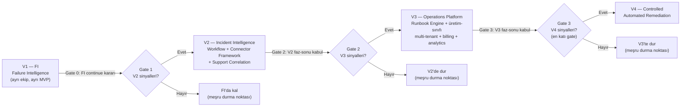

### 3.2 Geçiş Kriterleri Özeti

| Geçiş | Zorunlu sinyal seti (AND) | Kaynak |
|---|---|---|
| FI → V2 | (S1) ≥2 pilot "devam" dedi; (S2) ≥1 imzalı ücretli sözleşme veya 2 pilotun yazılı fiyat onayı; (S3) ≥2 pilottan spontane "workflow'a girsin" talebi; (S4) haftada 3-4 gün aktif kullanım; (S5) ayda 8-10 gerçek incident hacmi | 06 §1.1 |
| V2 → V3 | ≥1 pilot, V2 özelliklerini (support correlation + historical + workflow) ≥4 hafta gerçek kullanımda deneyimlemiş ve devam ediyor | 06 §2 |
| V3 → V4 | ≥3 ödeyen müşteri Stripe üzerinden gerçek ödeme yapıyor; ≥1 müşteri SDK üzerinden kendi/3. taraf connector'ını kullanıyor | 06 §2 |
| V4 GA | ≥1 müşteri gerçek (simülasyon değil) remediation aksiyonuna onay veriyor ve bu incident çözüm süresini ölçülebilir şekilde kısaltıyor | 06 §2 |

Her gate **istisnasızdır**; "bu sefer özel, hemen başlayalım" istisnası disiplinin ilk kırıldığı yerdir (06 §11.2). Detaylı kill/pivot kriterleri Bölüm 28'dedir.

### 3.3 FI Üzerine Eklenen Katmanlar (Kavramsal Özet)

| FI (V1) — sabit temel | V2 ekler | V3 ekler | V4 ekler |
|---|---|---|---|
| Integration Registry, Event Ingestion, Incident Engine (kural+fingerprint), Root Cause Intelligence (evidence-only, confidence, human review) | Incident Workflow (state machine), Connector Framework (plugin), Support Correlation (ticket↔incident) | Runbook Engine (RAG), üretim-sınıfı multi-tenancy (self-servis, billing-bağlı), Connector SDK (3. tarafa açık), Analytics/Reporting, Billing | Controlled Remediation (proposal→approval→dry-run→execute→rollback) |

### 3.4 API Versiyonlama İlkesi

`/api/v1/*` hiçbir fazda bozulmaz. Yeni alanlar opsiyonel/geriye-uyumlu eklenir; tenant çözümlemesi V1'de implicit kalır (`apiKey` → örtük tek tenant). Gerçek breaking change yalnızca var olan bir alanın anlamının değişmesi durumunda ve yalnızca etkilenen kaynak için yeni versiyon (`/v2/incidents` gibi) açılarak yapılır; `Deprecation`/`Sunset` header'ları ile 6-12 aylık geçiş penceresi zorunludur (03 §10).

---

## 4. Target Users (Platform Ölçeğinde)

FI'nin persona'ları (entegrasyonu yöneten mühendis) OP'ta bir üst organizasyonel katmana genişler:

| Persona | JTBD | İlgili faz |
|---|---|---|
| **Platform / Integration Team Lead** | "Ekibimin sahip olduğu tüm entegrasyonların sağlığını tek yerden görmek, yeni connector'ı standardize çerçevede eklemek istiyorum." | V2 (Connector Framework) |
| **Support Engineering Manager** | "40 ticket'ın tek teknik incident'a bağlı olduğunu erken fark edip tutarlı müşteri mesajı vermek istiyorum." | V2 (Support Correlation) |
| **Yazılım Ajansı CTO'su** | "10 müşterinin entegrasyonlarını tek panelden, izole şekilde izlemek; kurumsal öğrenmeyi (runbook) paylaşmak istiyorum." | V3 (multi-tenant, cross-tenant runbook) |
| **SaaS Ürün Ekibi Lideri (FI'dan miras)** | V1: "Neden bozuldu?" → V3: "Geçmişte nasıl çözüldü?" → V4: "Düşük riskli düzeltmeyi onayla otomatikleştireyim." | V1→V4 |
| **Engineering Manager / CTO (bütçe sahibi)** | V3'ten itibaren self-servis fiyatlandırma ile alıcı personaya eklenir. | V3 |

Hedef kitle genişlemesi kademelidir (V2: + support ekibi liderleri; V3: + ajanslar/entegrasyon ortakları; detay Bölüm 23).

---

## 5. Platform Modules Overview

| Modül | Görev | Faz | Kaynak |
|---|---|---|---|
| Integration Registry | Servis, owner, endpoint, environment, credential reference, SLA | V1 (FI) | HTML master plan |
| Event Ingestion | Webhook, API response, deployment, log alımı | V1 (FI) | HTML master plan |
| Incident Engine | Event sınıflandırma, fingerprint, severity | V1 (FI) | HTML master plan |
| Root Cause Intelligence | Evidence-only AI analiz, confidence, human review | V1 (FI) | HTML master plan |
| **Incident Workflow** | assign/acknowledge/resolve/reopen/postmortem/audit | **V2** | 01, 02, 03 |
| **Connector Framework (first-party)** | Standardize connector plugin modeli; Stripe/GitHub/SES/SendGrid/HubSpot | **V2** | 01, 02, 03 |
| **Support Correlation** | Ticket kümesi ↔ teknik incident eşleştirme | **V2** | 01, 02, 03, 04 |
| **Tenancy Foundation** | `TenantId` şema temeli, query filter, temel izolasyon (dahili pilot ölçeği) | **V2 (temel)** | Çözülen çelişki, bkz. §11 |
| **Runbook Engine** | Geçmiş incident/postmortem/doküman üzerinden RAG tabanlı öneri | **V3** | 01, 02, 03, 04 |
| **Multi-Tenancy (üretim-sınıfı)** | Self-servis onboarding, RLS sertleştirme, billing-bağlı plan | **V3** | Çözülen çelişki, bkz. §11 |
| **Connector SDK (3. tarafa açık)** | Kod-tabanlı SDK, conformance test kiti, ayrı NuGet paketi | **V3** | 06 |
| **Analytics/Reporting** | CQRS-vari okuma modeli, trend/pattern raporları | **V3** | 02, 06 |
| **Billing** | Stripe Checkout/Billing Portal, plan/kullanım limiti | **V3** | 06 |
| **Controlled Remediation** | Proposal → approval → dry-run → execute → rollback | **V4** | 01, 02, 03, 04, 05 |

---

## 6. Functional Scope per Phase

### 6.1 V2 — Incident Intelligence (organizasyonel koordinasyon katmanı)

- **Incident Workflow:** Durum makinesi `new → acknowledged → assigned → in_progress → resolved → (reopened) → closed`; FI'nin `resolve`/`reopen` uçları korunur, üzerine `assign`, `acknowledge`, `postmortem` eklenir.
- **Connector Framework (first-party):** `IConnector` arayüzü, connector registry, credential reference (secret manager), connector-özel rate limit/retry. İlk sürümde yalnızca platformun kendi ekibi connector yazar (derleme-zamanı assembly referansı, runtime plugin loading YOK).
- **Support Correlation:** Katman A (deterministik: zaman penceresi, entegrasyon eşleşmesi, hacim anomalisi) + Katman B (semantik, embedding, yalnızca zenginleştirme). Deterministik sinyal her zaman AI sinyalinden önce ve daha yüksek ağırlıkla çalışır.
- **Tenancy foundation:** `TenantId` şema temeli, EF Core global query filter, RLS taban katmanı (bkz. Bölüm 11 — bu dokümanın çözdüğü kilit çelişki).
- **Similar Historical Incident (V2 kapsamına dahil, Runbook Engine'in öncüsü):** pgvector tabanlı "bu duruma daha önce rastladık mı" listesi — henüz öneri üretmez, sadece listeler.

### 6.2 V3 — Operations Platform (kurumsal hafıza + üretim-sınıfı platform katmanı)

- **Runbook Engine:** V3.0 basit kNN + metadata filtre + LLM özetleme (RAG'ın retrieval ağırlıklı, minimal-generation hali); V3.1+ kanıtlanmış ihtiyaçla chunking/reranking/feedback-loop.
- **Multi-tenancy (üretim-sınıfı):** Self-servis tenant onboarding (<1 iş günü), RLS + query filter defense-in-depth sertleştirilmiş test paketiyle, Tenant Management modülü (plan/limit/tenant-kullanıcı ilişkisi).
- **Connector SDK:** V2'nin first-party connector arayüzü, dokümante edilmiş, ayrı NuGet paketi olarak dağıtılan, conformance test kitiyle 3. tarafa açılır.
- **Billing:** Stripe Checkout/Billing Portal, webhook-tabanlı subscription senkronizasyonu, self-servis fiyatlandırma sayfası.
- **Team Workflows + Analytics:** RBAC (≥2 rol), tenant/connector sağlığı dashboard'u, MTTR trendi.
- **Cross-tenant runbook paylaşımı (ajans senaryosu):** Anonimleştirilmiş runbook'ların müşteriler arası paylaşımı.

### 6.3 V4 — Controlled Automated Remediation

- **Remediation Proposal (AI çıktısı, salt-okunur, executable değil):** `suggestion_id`, kaynak atıflı öneri metni, risk_category (bilgilendirici, yetkilendirici değil).
- **Remediation Action (insan tarafından oluşturulan, ayrı API):** Sabit action_type kataloğu, `approved_by` zorunlu, `linked_suggestion_id` yalnızca audit amaçlı.
- **Approval Workflow:** State machine `PROPOSED → PendingApproval → APPROVED → EXECUTING → COMPLETED/FAILED/ROLLED_BACK`; four-eyes kuralı yüksek riskli aksiyonlarda.
- **Dry-Run/Sandbox:** Gerçek icra öncesi zorunlu simülasyon; onay ekranı dry-run'ın gerçek hesaplanmış diff'ini gösterir.
- **Rollback:** Otomatik / manuel / geri-alınamaz (bu sınıf katalogda hiç bulunmaz) sınıflandırması.
- **Blast Radius Sınırlama:** Tek-tenant kuralı varsayılan; kaynak/tenant/hacim üst sınırları.

---

## 7. Explicitly Not Now (Bugün Kesinlikle Geliştirilmeyecekler)

Bu bir vizyon dokümanı olduğu için kapsam dışı bırakmak, kapsam içi bırakmaktan daha önemlidir. **Bugün (FI MVP aşamasında) geliştirilmeyecek:**

- Connector Framework'ün kendisi (herhangi bir "resmi" connector SDK'sı).
- Incident workflow durumları (assign/acknowledge/resolve/reopen resmi state machine'i).
- Postmortem şablonları/otomasyonu.
- Support ticket entegrasyonu (Zendesk/Intercom/Freshdesk) ve korelasyon mantığı.
- Runbook öneri motoru.
- Herhangi bir otomatik remediation (insan onaylı dahi).
- Multi-tenant mimarisi (ajans senaryosu, self-servis onboarding, billing).
- SLA takibi/ihlal bildirimleri.
- Aktif Credential Reference yönetimi (secrets vault entegrasyonu, rotasyon takibi) — bugün en fazla referans-düzeyinde bir alan.
- Herhangi bir "genel AIOps" iddiası (metrik/log anomali tespiti, altyapı seviyesi korelasyon).
- Genel amaçlı workflow/otomasyon motoru (Zapier/Workato/n8n benzeri).

**Platform ölçeğinde, her fazda bilinçli olarak dışarıda bırakılanlar (ADR-P10 disiplini):**

| Faz | Bilinçli olarak dışarıda bırakılan |
|---|---|
| V2 | Çoklu dil desteği, runtime plugin loading (MEF/AssemblyLoadContext), schema/database-per-tenant, 3. tarafa açık SDK |
| V3 | On-prem deploy seçeneği, tam RAG pipeline'ı (reranking/feedback-loop V3.1+'a ertelenir), otonom/onaysız herhangi bir aksiyon |
| V4 | Otomatik (onaysız) execution — **platformun hiçbir fazında bu açılmaz**; geri alınamaz aksiyon tipleri (kataloga asla girmez); AI'ın yeni action_type "icat edebilmesi" |

---

## 8. Domain Model Extensions (FI Üzerine V2-V4 Entity'leri)

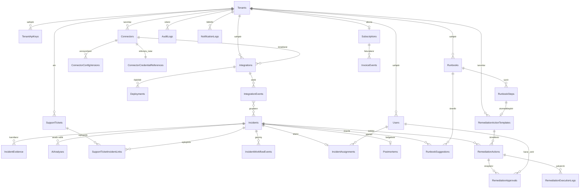

**Kritik kural:** `Integrations`, `IntegrationEvents`, `Deployments`, `Incidents`, `IncidentEvidence`, `AIAnalyses` FI'da tanımlıdır, şeması değişmez; yalnızca `TenantId` FK eklenir. Yüksek yazım hacimli, sık filtrelenen tablolarda (`IntegrationEvents`, `Incidents`) `TenantId` **denormalize** edilir (join'siz filtreleme ve composite index için); düşük hacimli, her zaman parent üzerinden erişilen tablolarda implicit ilişki yeterlidir (03 §3.1).

Ana yeni tablo grupları (özet, ayrıntı kaynak `03-data-api-integrations.md`): `Tenants/Users/TenantApiKeys` (V2), `Connectors/ConnectorConfigVersions/ConnectorCredentialReferences` (V2), `SupportTickets/SupportTicketIncidentLinks` (V2), `IncidentWorkflowEvents/IncidentAssignments/Postmortems` (V2), `Runbooks/RunbookSteps/RunbookSuggestions` (V3), `RemediationActionTemplates/RemediationActions/RemediationApprovals/RemediationExecutionLogs` (V4).

---

## 9. System Architecture Evolution (V1 → V4)

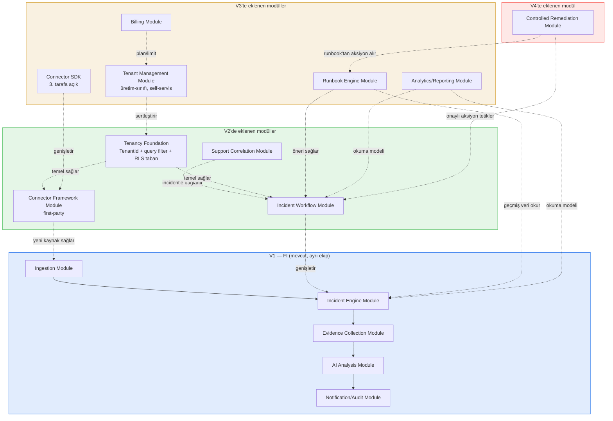

### 9.1 Container Diyagramı — V2

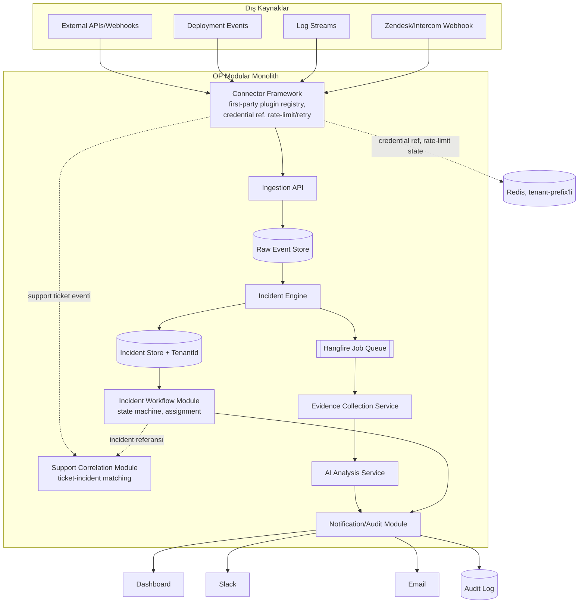

### 9.2 Deployment Topolojisi Zaman Çizelgesi

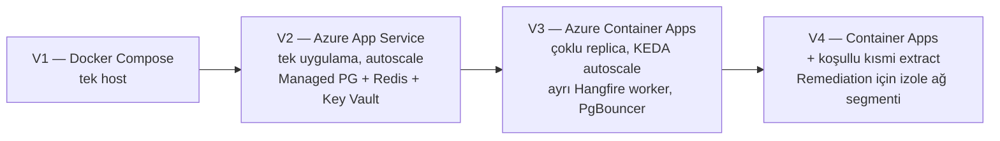

Detaylı topoloji tablosu Bölüm 19'dadır.

---

## 10. Module Boundaries and Bounded Contexts

**Mimari evrim ilkeleri (bağlayıcı):**

1. **Eklemleme, yeniden yazma değil.** FI'nin Ingestion → Raw Event Store → Incident Engine → Incident Store omurgası V4'e kadar değişmeden kalır.
2. **Bounded context'ler baştan ayrışık tasarlanır, deploy birimi olarak değil.** Modular Monolith içinde her modül kendi PostgreSQL şemasına, kendi public interface'ine (C# interface + DTO), kendi Hangfire job'larına sahiptir. Modüller birbirine doğrudan repository/DbContext üzerinden değil, **application service interface'leri** üzerinden erişir.
3. **Veri sahipliği nettir.** Her modül kendi tablolarının tek sahibidir; cross-module okuma event (Outbox/MediatR notification) veya explicit query service üzerinden olur.
4. **Genişletici noktalar önceden bırakılır.** Incident Engine'in kural motoru plugin'lenebilir, Ingestion API'nin auth katmanı kaynak-tipine göre strateji seçebilir.
5. **Senkron çağrı sayısı düşük tutulur.** Modüller arası iletişim tercihen event-driven (in-process domain event + Hangfire async iş).

**Yeni bounded context'ler ve gerekçeleri:**

| Modül | Faz | Neden ayrı context |
|---|---|---|
| Incident Workflow | V2 | FI'de incident salt-okunur bir kayıt; V2 ile "durum yönetimi" sorumluluğu kazanır — Incident Engine'in "tespit" sorumluluğundan tamamen farklı. |
| Connector Framework | V2 | "N farklı sistemle konuşan, credential yöneten, rate-limit'e uyan" bir soyutlama; kendi yaşam döngüsü olan plugin sistemi. |
| Support Correlation | V2 | Olasılıksal, ikinci bir domain nesnesiyle (ticket) ilişki kurar; Incident Engine'in deterministik tespit mantığından farklı hızda evrilir. Connector Framework üzerine kurulur ama ayrı context'tir. |
| Runbook Engine | V3 | Retrieval + öneri üreten bir "bilgi motoru"; Incident Engine'in kural tabanlı tespit mantığından ayrı. |
| Tenant Management | V3 | Çapraz kesen concern; tenant/plan/kullanıcı-tenant ilişkisi/ayarları yönetir, tüm modüllere `TenantId` sağlar. |
| Analytics/Reporting | V3 | Yazma-ağır operasyonel modüllerden ayrı, okuma-ağır CQRS-vari okuma modeli, kendi denormalize şeması. |
| Billing | V3 | Subscription/plan/usage-limit; Integration/Incident modellerinden bağımsız yeni domain. |
| Controlled Remediation | V4 | Aksiyon **yürütme** yetkisi, tespit/analiz modüllerinden radikal biçimde farklı risk profiline sahip (approval, sandbox, rollback, audit zorunlu) → izole, sıkı kontrollü ayrı context. |

---

## 11. Multi-Tenancy Strategy

> **ÇÖZÜLEN ÇELİŞKİ:** Kaynak dokümanlar arasında multi-tenancy'nin hangi fazda "gerçek" hale geldiği konusunda çelişki vardı. `03-data-api-integrations.md` ve `05-security-reliability-observability.md`, tenancy'i **V2'nin zorunlu ön koşulu** olarak ele alıyor ("Connector Framework ve Support Correlation, birden fazla müşteriyi izole edebilen bir temel gerektirir"). `06-delivery-testing-validation.md` ise "gerçek multi-tenancy"i **V3.1** milestone'u olarak konumlandırıyor ve V2'de "her pilot kendi izole ortamında/veritabanında" modelinin yeterli olduğunu varsayıyor. `02-system-architecture.md` bu ikisi arasında belirsiz kalıyor ("V2/V3'te" diyor ama Tenant Management modülünü V3'e koyuyor).
>
> **Karar:** Bu doküman iki kademeli bir model benimser ve bunu kesin platform kararı olarak kayıt altına alır:
> - **V2 — Tenancy Foundation (zorunlu, dar kapsamlı):** `TenantId` şema temeli tüm yeni V2 tablolarına (Connectors, SupportTickets, IncidentWorkflowEvents vb.) baştan eklenir; EF Core global query filter + RLS taban katmanı kurulur (bkz. §11.2). Ama bu, **self-servis onboarding, billing-bağlı plan yönetimi veya "ajans senaryosu" ölçeğinde üretim-sınıfı bir multi-tenancy değildir** — V2'de tenant sayısı azdır (birkaç pilot), tenant oluşturma hâlâ yarı-manuel/operasyon ekibi eliyledir. Gerekçe: Connector Framework ve Support Correlation'ın veri modeli baştan tenant-scoped tasarlanmazsa, V3'te bu iki modülü sonradan tenant'a taşımak (03 §3'ün "backfill" riskiyle) çok daha pahalı bir migrasyon olur — 03 ve 05'in gerekçesi teknik olarak haklıdır.
> - **V3 — Multi-Tenancy (üretim-sınıfı, "gerçek"):** Self-servis tenant onboarding (<1 iş günü), RLS politikalarının sertleştirilmiş test paketiyle (izolasyon fuzzing, chaos/pentest ritüeli) doğrulanması, Tenant Management modülü (plan/limit/feature flag), billing-bağlı tenant yaşam döngüsü. 06'nın "V3.1 Gerçek Multi-Tenancy" milestone'u bu kademeye karşılık gelir.
>
> Bu, hem 03/05'in "V2'den itibaren tenant-scoped veri modeli" gerekliliğini hem de 06'nın "gerçek/üretim-sınıfı multi-tenancy V3'te olgunlaşır" gözlemini çelişkisiz şekilde birleştirir.

### 11.1 V1'de Neden Yok

FI (V1) tek-kiracılı varsayımıyla çalışır — MVP teslim süresini hızlandırmak için bilinçli bir kapsam daraltmasıdır; henüz ikinci bir tenant yoktur.

### 11.2 İzolasyon Modeli Seçimi

> **ÇÖZÜLEN ÇELİŞKİ:** `02-system-architecture.md` yalnızca "Shared schema + `TenantId` + EF Core Global Query Filter" öneriyor ve RLS'i "V3'te ölçek büyüdükçe değerlendirilecek" ikincil bir sertleştirme adımı olarak konumlandırıyor. `05-security-reliability-observability.md` ise RLS'i **V2'den itibaren zorunlu taban katman** olarak talep ediyor ("Sadece A (query filter) tek başına kabul edilemez").
>
> **Karar: 05'in güvenlik-öncelikli duruşu benimsenir.** RLS, tenant-scoped veri modelinin kurulduğu andan (V2 Tenancy Foundation) itibaren zorunlu taban katmandır; query filter ikinci savunma katmanı olarak eklenir. **Gerekçe:** Tek bir izolasyon hatası platformun var oluş amacını (müşteri incident/support verisiyle güvenle çalışmak) doğrudan baltalar; bu risk sınıfı için "sonra sertleştiririz" yaklaşımı kabul edilemez — RLS'in DB-seviyesi ek maliyeti (session variable yönetimi, connection pooling disiplini), tek bir sızıntı olayının yaratacağı güven kaybına kıyasla orantısız derecede düşüktür. V3'te "sertleşen" şey RLS'in kendisinin varlığı değil, **test/pentest/chaos-engineering olgunluğudur** (bkz. Bölüm 17, Bölüm 19 İncident Response Olgunluk Yol Haritası).

| Model | V2 Tenancy Foundation'da rolü | V3 üretim-sınıfı'ta rolü |
|---|---|---|
| **A. EF Core Global Query Filter** | Zorunlu, ikinci katman (defense-in-depth) | Aynı, korunur |
| **B. PostgreSQL Row-Level Security (RLS)** | **Zorunlu taban katman** (bu dokümanın kararı — 05'i benimser) | Sertleştirilmiş: fuzzing testi, migration regression testi, chaos/pentest ritüeli |
| **C. Schema/database-per-tenant** | Yapılmaz | Yapılmaz (varsayılan değil); yalnızca sözleşmesel fiziksel izolasyon talep eden münferit kurumsal müşteri için opsiyonel "dedicated tenant" katmanı, V4+ sonrası roadmap notu |

**Uygulama notları:**
- Her tenant-scoped tabloda `tenant_id` kolonu zorunlu (NOT NULL + FK); RLS policy `USING (tenant_id = current_setting('app.tenant_id')::uuid)`.
- Uygulama her request başında (middleware, auth'tan hemen sonra) DB session'a `app.tenant_id`'yi set eder; bu adım atlanırsa RLS **fail-closed** davranır (hiçbir satır dönmez), fail-open değil.
- Background job/worker'lar için de aynı disiplin; "sistem seviyesi" job'lar yalnızca whitelisted, denetlenen bir "superuser" bağlam üzerinden RLS bypass eder.
- Connection pooling: her connection checkout'ta `app.tenant_id` reset zorunlu (sızıntı önleme).
- Yüksek yazım hacimli tablolarda (`IntegrationEvents`, `Incidents`) `TenantId` denormalize edilir, composite index'in ilk sütunudur.

### 11.3 Geçiş Adımları (V2 içinde, V3'e kadar sertleşerek)

1. V2'de yeni oluşturulan tüm tablolara `TenantId` (uuid, not null) baştan eklenir.
2. FI'nin mevcut tablolarına (`Integrations`, `IntegrationEvents` vb.) migration ile `TenantId` FK eklenir, geriye dönük dolgu (backfill) tek-tenant varsayılan değerle yapılır.
3. `ICurrentTenantProvider` (request-scoped) — HTTP isteğinde JWT claim'inden, background job'da job argümanından tenant çözümlenir.
4. Redis anahtarları tenant-prefix'li hale getirilir (`{tenantId}:ratelimit:...`).
5. V3'te Tenant Management modülü eklenir: tenant kaydı, plan/limit, tenant-kullanıcı ilişkisi, self-servis onboarding akışı, billing entegrasyonu.

### 11.4 Test Stratejisi (Bağlayıcı)

Her yeni tenant-scoped entity/endpoint için **her PR'da otomatik** çalışan bir izolasyon test paketi zorunludur: negatif erişim testi (Tenant A → Tenant B kaynağına erişim denemesi → 403/404), RLS policy regression testi, count-based side-channel fuzzing, ve V3 GA öncesi chaos/pentest ritüeli (detay Bölüm 17, Bölüm 21).

---

## 12. Connector Framework Architecture

### 12.1 Amaç ve Sınırlar

Connector Framework, "dış bir sistemle nasıl konuşulacağını" platformdan izole eden bir **plugin çerçevesidir**. Yeni bir kaynak eklemek, çekirdek Ingestion/Incident mantığına dokunmadan yeni bir connector paketi eklemek anlamına gelmelidir.

### 12.2 Kademeli Olgunlaşma: V2 First-Party → V3 SDK

| | V2 | V3 |
|---|---|---|
| Kim yazar | Yalnızca platform ekibi | Platform ekibi + 3. taraf geliştiriciler |
| Dağıtım | Derleme-zamanı assembly referansı (`OP.Connectors.Zendesk` gibi ayrı proje, monorepo içinde) | Ayrı NuGet paketi (`OP.Connectors.Sdk`), semantic versioning |
| Test | Contract test seti (cassette/fixture) | SDK ile birlikte dağıtılan conformance test suite; 3. taraf kendi CI'ında çalıştırır |
| Runtime plugin loading (MEF/AssemblyLoadContext) | **Yapılmaz** — gereksiz karmaşıklık | Yapılmaz (varsayılan); yalnızca somut ihtiyaç doğarsa değerlendirilir |

### 12.3 Connector Plugin Modeli

- **`IConnector` arayüzü:** `ConnectorType`, `Capabilities` (webhook-receiver/poller/both), `ValidateConfigAsync`, `HandleInboundAsync`, `PullAsync`, `MapToRawEventAsync` (kanonik Raw Event şemasına dönüşüm).
- **Connector Registry** (`connectors` tablosu): kurulu connector tipleri, versiyon, capability flag'leri, JSON Schema config şeması.
- **Connector Instance** (`connector_instances` tablosu): bir tenant'ın kurduğu somut bağlantı — `TenantId`, `ConnectorType`, `ConfigJson` (hassas olmayan), `CredentialReferenceId`, `Status`, `LastSyncAt`.

### 12.4 Credential Reference Yönetimi

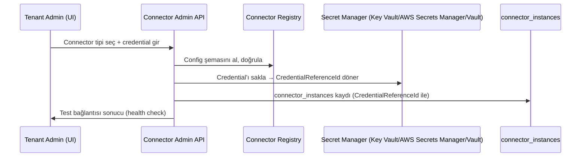

**Değişmez kural:** API katmanı ve DB gerçek secret'ı asla görmez/saklamaz — yalnızca `secretPath` + `secretVersion` + rotasyon politikası tutulur. Çalışma zamanında secret manager'dan kısa ömürlü, cache'lenmeyen okuma yapılır; disk/log/DB'ye asla yazılmaz.

**Prod:** Harici secret manager zorunlu bağımlılık (Azure Key Vault / AWS Secrets Manager / HashiCorp Vault). **Dev/Compose:** Key Vault yoksa AES-256 application-level encryption, yalnızca local geliştirme, prod'da feature flag ile devre dışı.

### 12.5 Minimum Ayrıcalık ve Rate Limit

- Her connector türü bir **capability manifest** ile kayıtlıdır: hangi işlemleri yapabileceği deklare edilir (V2'de yalnızca `read:*` — V2 salt-okunur gözlem yapar, aksiyon almaz).
- Rate limit/retry **connector tipi bazında** tanımlanır (Redis token bucket + Polly circuit breaker); circuit açıldığında `Status = "error"`, admin bildirimi.
- Poller connector'lar Hangfire recurring job olarak instance başına ayrı job id ile zamanlanır.
- Dead-letter: parse edilemeyen event `raw_events_dead_letter` tablosuna yazılır.

### 12.6 Component Diyagramı

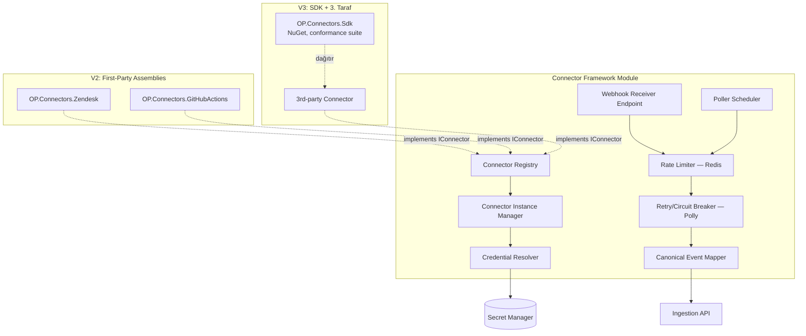

---

## 13. Support Correlation Architecture

### 13.1 Yaklaşım ve Katman Ayrımı

Support Correlation, `SupportTickets` (Zendesk/Intercom/Freshdesk, Connector Framework üzerinden ingest edilir) ile `Incidents` arasında **olasılıksal eşleştirme** yapar. Eşleştirme mantığı Incident Engine'in DEĞİL, Support Correlation'ın kendi application service katmanında yaşar (farklı sorumluluk, farklı evrim hızı).

**Katman A — Deterministik (birincil, açıklanabilir, AI'sız çalışabilir):** zaman penceresi çakışması, entegrasyon/servis eşleşmesi, hacim anomalisi, müşteri etki listesi çakışması.

**Katman B — Semantik (ikincil, embedding destekli, yalnızca zenginleştirme):** ticket + incident özet metni embedding'e çevrilir, cosine similarity ile sıralanır. **Asla otomatik olarak Katman A'nın "confirmed" statüsüne yükselmez.**

```
correlation_status(ticket, incident) =
  DETERMINISTIC_MATCH   -> otomatik "linked" (yüksek güven)
  DETERMINISTIC_PARTIAL -> "suggested", insan onayı ile "linked"
  AI_SEMANTIC_ONLY       -> "suggested (AI)", her zaman insan onayı ile "linked"
  NO_MATCH                -> gösterilmez
```

### 13.2 Veri Gizliliği (V2 Yeni Risk Sınıfı)

Destek ticket'ları FI'nin yapılandırılmış event verisinden niteliksel olarak daha riskli bir kaynaktır (serbest metin, PII, bazen yapıştırılmış secret). **İki geçişli redaction-at-ingestion** zorunludur: (1) yapılandırılmış PII sınıflandırıcı, (2) secret/credential desen tarayıcı. Ham metin redaction'dan geçmeden hiçbir downstream sisteme (AI dahil) iletilmez. Düşük güvenle işaretlenen segmentler **fail-closed** maskelenir ve insan gözden geçirme kuyruğuna düşer. Ham (redaksiyon öncesi) metin platformda saklanmaz. Support verisi erişimi ayrı bir RBAC sınıfıdır (detay Bölüm 17).

### 13.3 Component Diyagramı

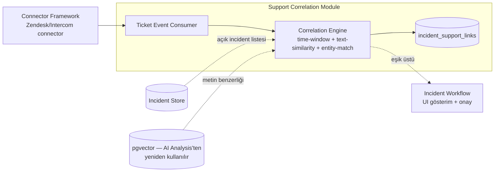

---

## 14. Runbook Engine Architecture (RAG Yaklaşımı)

### 14.1 Karar: pgvector Yeterli, Ayrı Vector Store Gerekmez

**Gerekçe:** OP zaten işlemsel veriyi PostgreSQL'de tutar; embedding'i ayrı sisteme taşımak senkronizasyon sorunu + operasyonel yük yaratır. Beklenen ölçek (tenant başına yüzlerce-binlerce incident/yıl, milyonlarca değil) pgvector'ın HNSW/IVFFlat performansı için yeterlidir. Tek veritabanı, tenant izolasyonunu (RLS) embedding araması için de bedava sağlar. **Ne zaman yeniden değerlendirilmeli:** Tenant başına milyonlarca doküman veya alt-saniye çok yüksek eşzamanlı arama yükü oluşursa (V3-V4 ölçeğinde bu eşik aşılmaz).

### 14.2 Kademeli RAG: V3.0 Sade → V3.1+ Kanıtlanmış İhtiyaçla Büyüt

**V3.0 (başlangıç):** Resolved incident kayıtları + postmortem'ler + elle yüklenen dokümanlar pgvector'da indekslenir; öneri basit kNN + metadata filtresi (kategori/severity) ile üretilir; LLM yalnızca "bul + özetle" yapar.

**V3.1+ (kanıtlanmış ihtiyaçla):** Chunking iyileştirme, reranking, outcome-feedback loop.

**Neden tam RAG'ı baştan kurmuyoruz:** RAG pipeline karmaşıklığı (chunk tuning, reranking, evaluation) belirsiz getiri karşısında yüksek mühendislik maliyeti — Modular Monolith disipliniyle tutarlı olarak önce en basit çözüm, sonra ölçülüp büyütülür.

### 14.3 Hallucination Kontrolü — Çok Katmanlı

| Kontrol | Nasıl |
|---|---|
| Kaynak zorunluluğu | Her öneri adımı `source_chunk_id[]` taşımak zorunda; boş/eksikse adım çıktıdan düşürülür (kod tarafında validasyon). |
| Retrieval tabanlı sınırlama | Prompt'a "genel bilgiye dayanarak öner" izni asla verilmez. |
| Düşük-güven reddi | En iyi eşleşme skoru eşiğin altındaysa (<0.65) sistem öneri üretmez, "yeterli geçmiş kayıt yok" der. |
| Outcome geri beslemesi | İnsan "işe yaradı/yaramadı" işaretler; `outcome_confidence` güncellenir, düşük başarılı chunk'lar retrieval'da geriler. |
| Human review zorunluluğu | Runbook önerisi hiçbir zaman "otomatik uygulanabilir adım" olarak işaretlenmez — her zaman insan okur, uygular. |
| Prompt/model versiyon izlenebilirliği | Her öneri, üretildiği `task_key + prompt_version + model_id` üçlüsünü saklar. |

### 14.4 Component Diyagramı

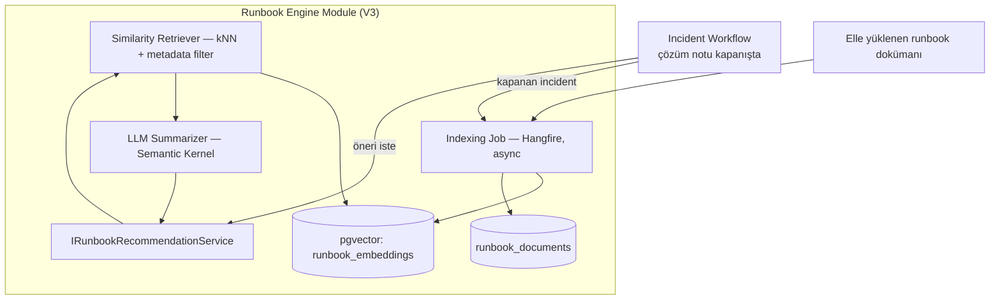

---

## 15. Controlled Remediation Architecture (Approval/Dry-Run/Rollback)

### 15.1 Temel İlke

Remediation modülü, "AI bir aksiyon önerir → insan onaylar → dry-run → gerçek ortama uygulanır → izlenir → gerekirse geri alınır" akışını her adımda **durdurulabilir ve denetlenebilir** şekilde yürütür. Hiçbir aksiyon açık onay olmadan prod'a dokunmaz.

### 15.2 Şema Seviyesinde AI/Execution Ayrımı (Mimari Garanti, Politika Değil)

AI'ın ürettiği çıktı şeması (**Remediation Suggestion**) ile execution'ı tetikleyen şema (**Remediation Action**) kasıtlı olarak farklı, birbirine dönüştürülemeyen iki nesnedir:

- **Remediation Suggestion:** `suggestion_id`, `incident_id`, `suggested_step_description`, `source_chunk_ids[]`, `risk_category` (bilgilendirici), `model_version`. **`executable`, `action_type`, `target_resource`, `execute_endpoint` gibi çalıştırılabilirlik ifade eden HİÇBİR alan yoktur.**
- **Remediation Action:** `action_id`, `action_type` (önceden tanımlı sabit enum — AI çalışma zamanında yeni bir action_type icat edemez), `linked_suggestion_id` (yalnızca audit/izlenebilirlik, yetkilendirmeye girmez), `approved_by` (zorunlu, null olamaz), `approved_at`, `executed_by_system`, `execution_result`.

`POST /api/v1/incidents/{id}/remediation-actions` yalnızca `action_type` (kataloğa dahil olmalı) ve `approved_by` zorunlu alanlarıyla çağrılır; AI çıktısı doğrudan kabul edilmez.

### 15.3 State Machine ve Approval

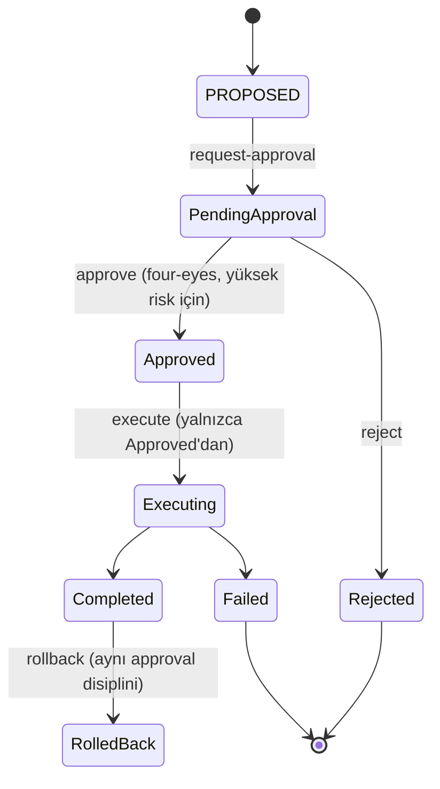

**Teknik garantiler:**
- `EXECUTING`'e geçiş yalnızca ayrı bir approval kaydı + onaylayan kimliğin execution'ı tetikleyenden **farklı** olması (four-eyes) durumunda mümkündür; bu API/servis katmanında, DB transaction seviyesinde zorlanır.
- Onay, remediation talebinin **tam parametrelerine** bağlıdır (parametre bağlama) — onay sonrası parametre değişirse onay geçersizleşir.
- Zaman aşımlı onay (örn. 15 dakika).

### 15.4 Dry-Run / Sandbox

Her aksiyon, gerçek icra öncesi zorunlu dry-run fazından geçer: etkilenecek kaynak listesi + mevcut→hedef durum diff'i hesaplanır, **hiçbir yazma işlemi** üçüncü taraf servise gönderilmez. Dry-run ve gerçek çalıştırma **aynı kod yolunu paylaşır** (ADR-P6, Bölüm 26) — ayrı, senkron tutulması gereken iki implementasyon riskini önler.

### 15.5 Rollback Sınıflandırması

| Sınıf | Tanım |
|---|---|
| Otomatik geri alınabilir | Sistem execution öncesi durumu kaydeder, tersini otomatik uygulayabilir (örn. rate limit değeri). |
| Manuel geri alınabilir | Sistem geri alma adımlarını üretir, insan onayı/icra gerekir. |
| Geri alınamaz | **V4 katalogda hiç bulunmaz** — kasıtlı kapsam sınırı. |

Execution öncesi pre-state snapshot zorunlu; rollback aynı approval state machine'inden geçer (istisna: otomatik geri alınabilir sınıf için post-execution health check kötüye giden bir durumu durdurmak amacıyla otomatik/onaysız rollback tetikleyebilir — ayrı P1 alarmıyla, insan sonradan bilgilendirilir).

### 15.6 Blast Radius Sınırlama

- Her talep, execution öncesi blast radius hesaplamasından geçer (kaç kaynak, kaç tenant, ne kadar trafik).
- Sabit üst sınırlar katalog seviyesinde konfigüre edilir; sınır aşılırsa sistem talebi **otomatik parçalara böler** veya reddeder.
- **Tek-tenant kuralı varsayılan** — cross-tenant remediation ayrı, çok daha kısıtlı bir yetki sınıfı gerektirir.
- Rate-limited execution: zaman bazlı sınır (örn. saatte en fazla M execution).

### 15.7 Component Diyagramı

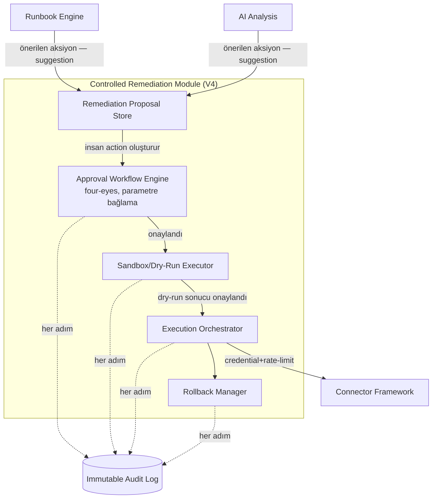

---

## 16. AI Strategy Evolution (V1 → V4 Güven/Otomasyon Olgunluk Modeli)

**Miras kural (platform genelinde bağlayıcı, FI'dan devralınır):**
1. AI hiçbir zaman incident oluşturmanın/sınıflandırmanın tek sorumlusu değildir — deterministik kurallar her zaman önce çalışır, AI yalnızca zenginleştirir.
2. Otomatik remediation her zaman human approval gerektirir — bu **mimari olarak zorlanır**, politika olarak değil (Bölüm 15.2).
3. Hassas veri (secrets, credential, PII, tam request/response body) AI'a gönderilmeden maskelenir/redakte edilir.

| Faz | Güven seviyesi | İnsan-döngüsü modeli | Otomatik execution |
|---|---|---|---|
| **V1 — FI** | Başlangıç: yok/düşük | Her incident'ta insan review mümkün/varsayılan; AI yalnızca analiz üretir. | Yok. |
| **V2 — Incident Intelligence** | Sınıflandırılmış güven: deterministik sinyal AI sinyalinden ayrıştırılır. | AI-suggested correlation'lar her zaman öneri kuyruğuna düşer; "linked" statüsü insan kararı. | Yok. |
| **V3 — Operations Platform** | Kaynak-atıflı güven: her öneri hangi kayda dayandığını gösterir; outcome-feedback ile kaynak güvenilirliği zamanla ölçülür. | Runbook önerisi her zaman insan tarafından okunur, yorumlanır, elle uygulanır. | Yok — Runbook Engine hiçbir eylemi tetiklemez. |
| **V4 — Controlled Remediation** | Kanıtlanmış güven: yalnızca sabit action_type kataloğunda, geçmişte defalarca onaylı başarıyla uygulanmış, düşük riskli aksiyonlar için "hızlandırılmış onay" (tek tık) sunulabilir. | Her Remediation Action `approved_by` dolu olmadan var olamaz. "Otomatik execution" yalnızca "insan onayından sonra sistemin mekanik çalıştırması" demektir. | **Yalnızca insan onaylı**, hiçbir zaman AI-tetikli. |

**V4 hızlandırılmış onay kriterleri (hepsi zorunlu):** (1) aynı action_type+kategori kombinasyonu ≥N (örn. 20) kez manuel onaylanmış; (2) başarı oranı ≥%95; (3) geri alınabilir/yan etkisiz (geri alınamaz mali etkili aksiyonlar risk_category'den bağımsız sabit kısıtlı listeyle engellenir); (4) periyodik yeniden gözden geçirme; (5) tek tık dahi olsa `approved_by` + tam audit izi zorunlu.

**Özet cümle:** V1'den V4'e ilerledikçe değişen şey AI'ın yetkisi değil, **insanın ne kadar hızlı ve iyi bilgilendirilmiş karar verebildiğidir** — güven arttıkça devredilen şey "karar" değil, "kararı destekleyen kanıtın kalitesi ve onay sürtünmesi"dir.

### 16.1 AI Maliyet Kontrolü (V3, Çoklu Tenant Ölçeği)

| Analiz türü | Zamanlama |
|---|---|
| Root-cause analizi (V1 miras) | Gerçek zamanlı |
| Ticket-incident deterministik korelasyon | Gerçek zamanlı (AI değil, ucuz) |
| Ticket-incident semantik korelasyon | Batch, 2-5 dk'da bir |
| Similar historical incident arama | Gerçek zamanlı ama önbelleklenmiş |
| Runbook önerisi üretimi | Yarı-gerçek zamanlı, talep bazlı ("öneri getir" butonu) |
| Batch trend/pattern analizi | Tamamen batch, günlük/haftalık |

Mekanizmalar: embedding cache (fingerprint hash), kategori-öncelikli daraltma, prompt/response caching, tenant/plan bazlı hız sınırlama, model tiering (ucuz model embedding'te, pahalı model yalnızca son adım generation'da), batch API kullanımı.

### 16.2 Prompt/Model Registry (Görev Bazlı İzolasyon)

Her AI görevi (`root_cause_analysis`, `ticket_correlation_embedding`, `runbook_suggestion`, ...) ayrı `task_key` ile versiyonlanır (`prompt_version`, `model_id` sabitlenir — "en güncel model" gibi kaymalı referans kullanılmaz). Yaşam döngüsü: offline eval → `shadow` → `canary` (%5) → `active`; önceki versiyon `deprecated` işaretlenir, silinmez. Bir görevin prompt'unu değiştirmek başka görevi etkilemez.

---

## 17. Security and Multi-Tenant Isolation

### 17.1 Risk Ekseni Genişlemesi (FI'dan Farkı)

FI tek-tenant, tek yönlü, aksiyon almayan bir sistemdir. Platform (V2-V4) üç eksende niteliksel olarak farklı bir risk profiline geçer: (1) multi-tenancy — izolasyon hatası = veri sızıntısı; (2) connector ekosistemi — her yeni connector yeni saldırı yüzeyi; (3) remediation execution — yanlış aksiyon gerçek dünyada, potansiyel geri alınamaz hasar verir.

### 17.2 Fazlar Arası Risk/Kontrol Matrisi

| Faz | Yeni risk | Ana kontrol |
|---|---|---|
| V2 — Tenancy Foundation | Tenant'lar arası veri sızıntısı | RLS (taban, bkz. §11.2) + query filter (ek katman) + otomatik izolasyon test paketi |
| V2 — Connector Framework | 3. taraf credential ifşası, aşırı geniş yetki | Secret manager + minimum scope manifest + rotation-farkında health check |
| V2 — Support Correlation | Serbest metinde yoğun PII/secret | İki geçişli redaction + confidence-tabanlı insan gözden geçirme + ayrı RBAC sınıfı |
| V3 — Multi-Tenancy (üretim) | Ölçekte izolasyon açığı, self-servis onboarding kötüye kullanımı | Sertleştirilmiş test paketi + fuzzing + chaos/pentest ritüeli |
| V3 — Runbook Engine | Yanlış/tehlikeli önerinin körü körüne uygulanması | Sabit aksiyon kataloğu (serbest metin değil) + risk etiketleme + tenant/rol bazlı izin ayrımı |
| V4 — Controlled Remediation | Yetkisiz/hatalı gerçek dünya aksiyonu, geri alınamaz hasar | State machine zorunlu onay + dry-run + rollback sınıflandırması + blast radius sınırı + immutable audit trail |
| Platform geneli | Noisy neighbor, alarm yorgunluğu | Tenant-adil kuyruklama + tenant bazlı circuit breaker + tenant-etki-ağırlıklı alerting |

### 17.3 Connector Credential Güvenliği

Üçüncü taraf credential'ları hiçbir zaman düz metin/uygulama-seviyesi simetrik şifreleme ile saklanmaz; harici secret manager zorunlu. Tenant başına ayrı secret path/namespace. "Secret redaction" PII redaction'dan ayrı bir sınıf olarak aynı pipeline'da çalışır — hiçbir credential log/exception/AI prompt'una dahil edilmez.

### 17.4 Rate Limiting (Çok Boyutlu)

Tenant bazlı, connector bazlı (giriş + çıkış yönü — üçüncü taraf servisin kendi rate limit'ini aşmamak için client-side throttling), plan bazlı (kademeli degradasyon, sert kesme değil), remediation'a özel ayrı bütçe (V4).

### 17.5 Noisy Neighbor Önlemi

Tenant-adil kuyruklama (fair scheduling), kaynak kotası izolasyonu (partition edilmiş worker pool), tenant bazlı circuit breaker, erken uyarı eşiği (soft throttle).

### 17.6 Compliance Hazırlığı (SOC2/GDPR — İleriye Dönük Farkındalık)

V2+'ta gerçek müşteri verisiyle çalışılacağı için şimdiden mimariye gömülmesi ucuz, sonradan pahalı olacak noktalar: veri envanteri/sınıflandırma, silme hakkı için tasarım desteği, erişim denetimi altyapısı ("audit'i denetleyen audit"), şifreleme standartları (in-transit + at-rest), alt işlemci şeffaflığı (her connector bir "sub-processor"dır), incident bildirim yükümlülüğü hazırlığı (72 saat GDPR penceresi). Bu bir sertifikasyon programı değildir; amaç mimarinin sertifikasyon yolunu tıkamamasıdır.

### 17.7 Connector Onboarding Güvenlik Checklist'i (V2+, Her Yeni Connector İçin Zorunlu)

Credential modeli tanımlı mı; minimum scope doğrulandı mı; rate limit davranışı dokümante edildi mi; hata sınıflandırması tanımlı mı; redaction kapsamı genişletildi mi; remediation kataloğu gözden geçirildi mi (V4+); izolasyon testi eklendi mi; rotation/expiry davranışı doğrulandı mı; 3. taraf servisin güvenlik geçmişi değerlendirildi mi; offboarding/silme yolu tanımlı mı.

---

## 18. Microservice Migration Criteria (Ne Zaman, Hangi Sinyalle)

**Varsayılan cevap V4'e kadar "hayır"dır.** Aşağıdaki sinyallerden **en az biri somut ve sürdürülebilir şekilde** gerçekleşmeden extract başlatılmaz. Sinyaller kanıt gerektirir (metrik, organizasyonel gerçeklik), varsayım değil.

| # | Sinyal | Somut eşik | Aday modül |
|---|---|---|---|
| 1 | Bağımsız deploy zorunluluğu | Ayrı release kadansı (haftalık model güncellemesi, ayrı canary), ayrı ekip yönetimi | AI Analysis Service |
| 2 | Organizasyonel ayrışma | Farklı takım, ayrı backlog/on-call (Conway's Law) | Connector Framework |
| 3 | Connector ölçeği | Kayıtlı connector sayısı ~20'yi geçer VE her biri farklı release cycle talep eder | Connector Framework |
| 4 | Kaynak profili uyumsuzluğu | GPU/yüksek bellek gereksinimi ölçülebilir maliyet-verimsizliğe yol açar | AI Analysis Service |
| 5 | Hata izolasyonu ihtiyacı | Bir modülün hatası tüm monolith'i tehdit ettiği prod insidanlarıyla kanıtlanır | Controlled Remediation |
| 6 | Ölçek asimetrisi | Ingestion hacmi, incident işleme hacminden mertebe farkıyla ayrışır, contention ölçülür | Ingestion API |
| 7 | Uyumluluk/izolasyon zorunluluğu | Sözleşmesel fiziksel izolasyon zorunluluğu | Tenant-specific deployment |

**Karar süreci:** Sinyal gerçekleşse bile önce modül-içi optimizasyon (kaynak limiti, ayrı Hangfire kuyruğu) denenir; yetersizse extract yapılır — toptan değil, **her seferinde tek bir modül**. En olası ilk aday: AI Analysis Service.

**Bilinçli olarak microservice'e geçilmeyen gerekçeler:** "Mikroservisler ölçeklenebilir" genellemesi tek başına yeterli değildir — disiplinli Modular Monolith zaten yatay ölçeklenebilir. Takım küçükken servis sınırları hayali gelecek ihtiyacı yansıtır; dağıtık sistem karmaşığı erken ödenir, geç kazanılır.

---

## 19. Deployment Topology Evolution

| Faz | Ortam | Ölçekleme birimi | Not |
|---|---|---|---|
| V1 | Docker Compose, tek host | Yok/manuel | Basitlik önceliklidir; single point of failure kabul edilir (MVP riski). |
| V2 | Azure App Service (tek uygulama) | Instance sayısı (autoscale) | Managed PostgreSQL + Redis; Key Vault entegrasyonu (Connector Framework credential'ları için zorunlu hale gelir). |
| V3 | Azure Container Apps, Hangfire worker'ları API'den ayrı replica seti | Web + worker replica'sı bağımsız ölçeklenir (KEDA) | Multi-tenant yükü nedeniyle PgBouncer devreye girer; pgvector indeks boyutu izlenir; staging ortamı zorunlu hale gelir. |
| V4 | Container Apps; §18 kriterleri karşılanmışsa AI Analysis ve/veya Remediation ayrı container app | Modül bazlı bağımsız ölçekleme | Remediation execution, ayrı ağ segmentinde (güvenlik gerekçesiyle, "microservice" olduğu için değil). |

**Ölçeklenebilirlik varsayım değişimi (V1→V3):** Tenant sayısı 1 → onlarca-yüzlerce; connector/kaynak sayısı az-sabit → platform genelinde 10-30+ tip; event hacmi tek kaynak → tenant×connector çarpımıyla büyüyen (noisy neighbor riski); arka plan iş yükü Evidence+AI → + connector polling + runbook indeksleme + (V4) remediation execution (Hangfire öncelik kuyrukları: `critical`/`default`/`background-index`); veri saklama tek şema → TenantId ile partition edilebilir büyüme, retention politikası V3'te değerlendirilir; observability tek uygulama → tenant+connector+modül boyutlu etiketleme.

---

## 20. Delivery Plan per Phase (Milestone, Acceptance Criteria)

Granülerlik FI'dakinden farklıdır (hafta/ay bazında, takvim değil sinyal bazlı sıra):

### V2 — Support Correlation + Connector Framework + Workflow (tahmini 8-12 hafta)

| Milestone | Kapsam | Acceptance Criteria |
|---|---|---|
| V2.1 Connector Framework İskeleti (Hafta 1-3) | İlk gerçek (mock değil) connector: pilotun fiilen kullandığı destek aracı | AC1: connector arayüzü mock'lardaki gibi kod değişikliği gerektirmeden ekleniyor. AC2: en az 1 ticket türü normalize event olarak ingestion'a giriyor, FI'nin classifier'ından geçiyor. |
| V2.2 Support Ticket Correlation (Hafta 4-6) | Zaman aralığı eşleştirmesi | AC1: ilişkili ticket incident detail ekranında görünür. AC2: yanlış eşleştirme oranı ilk sürümde ≥%70 isabet hedefi (ADR ile kalibre edilir). |
| V2.3 Similar Historical Incident (Hafta 6-8) | pgvector tabanlı benzer geçmiş incident listesi | AC1: ≥5 geçmiş kaydı olan fingerprint için öneri gösterilir. AC2: benzerlik yöntemi ADR'de gerekçelendirilmiş. |
| V2.4 Workflow (Hafta 8-11) | Durum makinesi + bildirim + atama | AC1: durum geçmişi (audit trail) tutulur. AC2: ≥1 bildirim kanalı (Slack) tetiklenir. AC3: pilot ekip workflow'u gerçekten on-call sürecine entegre ediyor. |

**V2 Faz Sonu Kabul Kriteri:** ≥1 pilot, V2 özelliklerini ≥4 hafta gerçek kullanımda deneyimlemiş ve devam ediyor.

### V3 — Multi-Tenancy + Connector SDK + Billing + Team Workflows + Analytics (tahmini 4-6 ay)

| Milestone | Kapsam | Acceptance Criteria |
|---|---|---|
| V3.1 Üretim-Sınıfı Multi-Tenancy (Ay 1-2) | Paylaşımlı altyapı, izole veri (RLS sertleştirme) | AC1: tenant A verisi hiçbir API/log/hata mesajında tenant B'ye sızmaz (izolasyon test paketiyle kanıtlı). AC2: yeni tenant onboarding'i <1 iş günü. |
| V3.2 Connector SDK (Ay 2-3) | Dokümante SDK + reference connector + test kiti | AC1: SDK dokümantasyonu + reference connector yayında. AC2: ≥1 harici/bağımsız geliştirici, sadece dokümana bakarak yeni connector yazabiliyor. |
| V3.3 Billing (Ay 3-4) | Stripe Checkout/Billing Portal, webhook senk. | Bkz. Bölüm 22. |
| V3.4 Team Workflows + Analytics (Ay 4-6) | RBAC, dashboard/rapor | AC1: ≥2 rol farklı yetki setiyle çalışıyor. AC2: analytics dashboard gerçek pilot verisiyle doğru sayı üretiyor. |

**V3 Faz Sonu Kabul Kriteri:** ≥3 ödeyen müşteri Stripe üzerinden gerçek ödeme yapıyor; ≥1 müşteri SDK üzerinden connector kullanıyor.

### V4 — Controlled Remediation (tahmini 3-5 ay)

| Milestone | Kapsam | Acceptance Criteria |
|---|---|---|
| V4.1 Dry-Run Runbook Motoru (Ay 1-2) | Aksiyon gerçekte uygulanmadan simüle edilir | AC1: dry-run gerçek dış sistem çağrısı yapmadan diff raporu üretir. AC2: dry-run/gerçek çalıştırma aynı kod yolunu paylaşır. |
| V4.2 Approval Akışı (Ay 2-3) | Onaysız aksiyon çalışmaz | AC1: onaylanmamış hiçbir aksiyon dış sisteme etki etmez (negatif test). AC2: onaylayan+zaman+gerekçe kayıtlı. |
| V4.3 Gerçek Çalıştırma + Rollback (Ay 3-5) | Onaylanan aksiyon uygulanır, geri alınabilir | AC1: her aksiyon tipi için tanımlı rollback prosedürü. AC2: ≥1 kontrollü ortamda uçtan uca aksiyon+rollback test edilmiş. |

**V4 Faz Sonu Kabul Kriteri:** ≥1 müşteri gerçek remediation aksiyonuna onay veriyor ve bu incident çözüm süresini ölçülebilir şekilde kısaltıyor.

---

## 21. Testing Strategy Evolution

FI'nin test piramidi (unit/integration/contract/e2e) temel iskelet olarak kalır; her faz **yeni bir test kategorisi ekler, var olanı kaldırmaz.**

| Faz | Yeni test kategorisi |
|---|---|
| V2 | **Connector contract testleri** (cassette/fixture tabanlı normalize şema doğrulama + hata sınıflandırması). **Workflow state machine testleri** (geçerli/geçersiz durum geçiş matrisi). |
| V3 | **SDK conformance test suite** (3. taraf geliştiricinin kendi CI'ında çalıştırdığı soyut test sınıfı). **Multi-tenant izolasyon testleri**: negatif erişim testi (her yeni endpoint'te otomatik/parametrik), log/hata mesajı sızıntı testi, kaynak paylaşım (noisy neighbor) yük testi. |
| V4 | **Remediation dry-run doğruluğu testi** (tahmin vs gerçek sonuç eşleşmesi). **Yetkisiz çalıştırma negatif testi.** **Rollback testi** (uygula→doğrula→geri al→doğrula döngüsü; rollback'i olmayan aksiyon tipi prod'a çıkamaz). **Kısmi başarısızlık testi.** Bu katman gerçek dış servislere karşı CI'da asla otomatik koşulmaz — sandbox/mock kullanılır. |

**CI/CD evrimi:** V1→V2'de pipeline yapısal olarak aynı kalır (test job'ı büyür). V3'te connector contract test **matrisi** (glob/convention-based otomatik keşif, yeni connector eklendiğinde CI otomatik büyür); test veritabanı **her zaman ≥2 sentetik tenant** ile seed edilir (tek-tenant test hatasını yapısal olarak imkânsız kılar). V4'te remediation testleri ayrı, izole bir CI job'ı (ana pipeline'ı bloklamaz ama remediation release'ini bloklar). **Staging ortamı V3'ten itibaren zorunlu** (V1/V2'de doğrudan prod deploy kabul edilebilirdi).

---

## 22. Billing and Monetization (V3)

### 22.1 Teknik Etki

Yeni domain: Subscription, plan (tier), usage-based limit. Mevcut Integration/Incident modellerinden bağımsız yeni bir Billing modülü (Modular Monolith sınırlarına uygun). Stripe Checkout/Billing Portal kullanılır (kendi ödeme UI'ı yeniden inşa edilmez — PCI kapsamını daraltır). Webhook-tabanlı senkronizasyon (`subscription.created`, `invoice.paid`, `subscription.canceled`).

**Kritik test alanı:** Webhook idempotency (aynı event 2 kez işlenirse çift faturalama olmamalı — FI'nin kendi idempotency ADR'sinin platforma genişlemiş hali), plan downgrade/upgrade sırasında limit uygulaması, dunning (ödeme başarısız olduğunda nazik kısıtlama, ani kesme değil).

**Faz sırası:** Billing, multi-tenancy'den (V3.1) **sonra** gelir — plan/limit tenant kavramına bağımlıdır.

### 22.2 GTM Etkisi

Fiyatlandırma modeli, elle anlaşılan sabit fiyattan (FI/V2 dönemi) self-servis fiyatlandırma sayfasına kayar. Önerilen plan yapısı (pilot geri bildirimiyle kalibre edilecek): **Başlangıç** (tek connector, sınırlı hacim) → **Büyüme** (çoklu connector, support correlation+workflow) → **Platform** (SDK, analytics, remediation). Bu üçlü yapı V2→V3→V4 özellik sırasını fiyatlandırma katmanlarına doğal eşler. Mevcut pilot müşterilere geçiş, sürpriz olmadan, "erken destekçi" kilitli fiyatıyla iletilir.

---

## 23. GTM Evolution (FI Mesajından OP Mesajına)

| Boyut | FI (V1) mesajı | OP (V2+) mesajı |
|---|---|---|
| Konumlandırma | "Entegrasyon hatası neden oldu, kanıta dayalı hızlı teşhis" | "Entegrasyon operasyonlarının merkezi katmanı — tespit, ilişkilendirme, çözüm tek yerde" |
| Alıcı personası | Backend/platform mühendisi | + destek ekibi lideri (V2) + engineering manager/CTO — bütçe sahibi (V3) |
| Kanıt türü | Tek senaryo demo'su | Çoklu senaryo + gerçek müşteri vaka çalışması (ölçülebilir MTTR kazanımı) |
| Duygusal çekiş | Bireysel zaman tasarrufu ("30 dk'yı 30 saniyeye indirir") | Organizasyonel verimlilik (ekipler arası koordinasyon maliyeti düşer) |

**Segment genişlemesi (değiştirilmez, genişletilir):** V2'de support-heavy SaaS ekipleri (destek ekibi liderleri yeni alıcı persona); V3'te ajanslar/entegrasyon ortakları (multi-tenant'ın doğal alıcı segmenti). İçerik stratejisi iki katmana ayrılır: ürün derinliği içeriği (mühendis kitlesi, devam eder) + sonuç/vaka odaklı içerik (karar vericiler için, yeni). V3'ten itibaren self-servis dönüşüm hunisi (içerik→fiyatlandırma→kayıt→deneme→ödeme) GTM'e eklenir; elle outreach bitmez ama tek giriş noktası olmaktan çıkar.

---

## 24. Competitive Positioning (Rakip Analizine Dayalı)

| Kategori | Temsilci oyuncular | Ne yapıyorlar | OP ile farkı |
|---|---|---|---|
| Genel gözlemlenebilirlik + AIOps | Datadog (Watchdog, Bits AI), PagerDuty (AIOps, Rundeck) | Metrik/log/APM anomali tespiti, alert korelasyonu, genel runbook otomasyonu | OP entegrasyon-özel semantiği (hangi connector, hangi credential) yerleşik bilir; Datadog'da bu bağlamı siz kurarsınız. OP genel altyapı izleme iddiasında değildir, tamamlayıcıdır. |
| Incident yaşam döngüsü | Rootly, incident.io, FireHydrant | Slack-native declare/coordinate/postmortem, AI destekli RCA (confidence-scored, PR-citation) | Genel mühendislik incident'ları için optimize; entegrasyon domain modeli (Integration Registry, Credential Reference) yok. OP'un Incident Workflow'u (V2) bu kadar zengin olmayı hedeflemez — derinlik connector/root-cause tarafında. |
| Unified API / connector | Merge.dev, Nango, Unified.to, Apideck | Bağlantıyı kurar, şemayı normalize eder | Bu platformlar bağlantıyı *kurar*; OP bağlantı *bozulduğunda* ne olacağını yönetir (incident, kök neden, runbook, remediation). Kendi unified API'sini satmayı hedeflemez. |
| iPaaS / workflow otomasyon | Workato, Tray.ai, Zapier, n8n | Trigger→action orkestrasyon, "workflow run failed" seviyesi hata görünürlüğü | Kök neden/postmortem/runbook kavramı yok. OP genel amaçlı workflow motoru inşa etmeyi hedeflemez — yalnızca kontrollü, onaylı, dar kapsamlı remediation (V4). |

**Net konumlandırma:** OP'un boşluğu, hiçbirinin "üçüncü taraf entegrasyon hatası" özelinde uçtan uca zinciri (kayıt→olay→incident→kök neden→runbook→kontrollü remediation) tek bir domain modeliyle kapatmamasıdır.

---

## 25. Platform-Level Risks and Mitigations

| # | Risk | Mitigasyon |
|---|---|---|
| 1 | **"Kitchen sink" ürün riski** — her fazda "madem X yapıyoruz Y de ekleyelim" kapsam sürünmesi | Her yeni özellik "entegrasyon-özel bağlamı güçlendiriyor mu" testinden geçer; ADR-P10 "hayır listesi" disiplini (Bölüm 7); tek-müşteri özelleştirme yasağı (≥2 kaynaktan spontane talep şartı). |
| 2 | **Connector ekosistemi genişletme maliyeti** — her connector kalıcı bakım yükü, süper-doğrusal büyür | Connector sayısı ayrı bir yatırım kararı olarak görülür ("yan iş" değil); onboarding checklist (§17.7) zorunlu. |
| 3 | **Çoklu tenant karmaşıklığı** — izolasyon hatası = güvenlik açığı | RLS taban katman V2'den itibaren (§11.2), her PR'da otomatik izolasyon testi, V3 GA öncesi chaos/pentest ritüeli. |
| 4 | **Runbook güven yanılgısı** — yanlış bağlamda uygulanan öneri sorunu büyütür | Sabit aksiyon kataloğu (serbest metin değil), düşük-güven reddi, outcome-feedback loop, human review zorunluluğu. |
| 5 | **"Controlled" kalması** — iş baskısı approval gate'lerini zayıflatma yönünde | Otomatik/onaysız execution platformun hiçbir fazında mimari olarak açılmaz (şema seviyesi garanti, §15.2); bu kurumsal politika seviyesinde de korunur. |
| 6 | **Rakiplerin AI-native ivmesi** — Rootly/incident.io hızla RCA özellikleri ekliyor | Geçiş kararında (her gate'te) rakip taraması tekrarlanır; "hız için derinlikten ödün verme" tuzağına düşülmez. |
| 7 | **Doğrulanmamış talep riski** — V2-V4 özellikleri için henüz gerçek kullanıcı talebi doğrulanmamış | Zorunlu faz-öncesi validasyon gate'leri (Bölüm 3.2, Bölüm 28); roadmap taahhüt değil olasılıklar listesi. |
| 8 | **Süre şişmesi** — "8-12 hafta" tahmini sinyalsiz eklemelerle 6 aya çıkar | Zaman kutulama: tahminin 1.5 katını aşan faz otomatik "devam mı, daralt mı" karar noktası tetikler. |

---

## 26. Architecture Decision Records

Bu bölüm hem platform seviyesi ADR listesini (06 kaynağından) hem de bu sentez dokümanının çözdüğü çelişkileri ADR formatında kayıt altına alır.

### 26.1 Bu Dokümanın Çözdüğü Kilit Çelişkiler (Yeni ADR'ler)

**ADR-S1: Multi-tenancy'nin iki kademeli modeli (V2 foundation / V3 üretim-sınıfı)**
- **Bağlam:** 03/05 tenancy'i V2'nin zorunlu ön koşulu sayarken, 06 "gerçek multi-tenancy"i V3.1 milestone'u olarak tanımlıyordu; 02 ikisi arasında belirsizdi.
- **Karar:** V2'de `TenantId` şema temeli + RLS taban katman kurulur (dar kapsamlı, yarı-manuel onboarding); V3'te self-servis onboarding + billing-bağlı + sertleştirilmiş test paketiyle üretim-sınıfı hale gelir.
- **Sonuç:** Connector Framework/Support Correlation'ın V2'de tenant-scoped tasarlanmaması riskini (pahalı sonradan migrasyon) ortadan kaldırır; aynı zamanda V2'de tam multi-tenant SaaS altyapısı kurma erken-yatırım riskinden kaçınır. Detay: Bölüm 11.

**ADR-S2: RLS, V2'den itibaren zorunlu taban katman (query filter değil)**
- **Bağlam:** 02 yalnızca EF Core query filter öneriyor, RLS'i V3+ opsiyonel sertleştirme sayıyordu; 05 RLS'i V2'den itibaren zorunlu istiyordu.
- **Karar:** 05'in güvenlik-öncelikli duruşu benimsendi — RLS taban katman, query filter ikinci savunma katmanı.
- **Sonuç:** DB seviyesi ek operasyonel maliyet kabul edilir; karşılığında "geliştirici WHERE'i unuttu" sınıfı sızıntılar veritabanı seviyesinde engellenir. Detay: Bölüm 11.2.

**ADR-S3: Connector Framework'ün kademeli açılımı (V2 first-party → V3 SDK)**
- **Bağlam:** 02 Connector Framework'ü tek parça V2 özelliği olarak sunarken, 06 "connector arayüzü" (V2.1) ile "3. tarafa açık SDK" (V3.2) arasında zımni bir olgunlaşma öngörüyordu.
- **Karar:** Bu aşamalandırma açıkça benimsendi ve modül tablosuna yansıtıldı (Bölüm 5, Bölüm 12.2). V2'de yalnızca platform ekibi connector yazar; SDK paketleme ve 3. taraf açılımı V3'e ertelenir.
- **Sonuç:** V2'de gereksiz erken bir "genel amaçlı SDK" yatırımından kaçınılır; SDK yatırımı yalnızca V3 gate'i (≥1 harici geliştirici bağımsız connector yazabiliyor) geçildiğinde meşrulaşır.

### 26.2 Platform Seviyesi ADR Listesi (06 Kaynağından, Bu Dokümanla Tutarlı)

| ADR | Konu |
|---|---|
| ADR-P1 | V2'ye geçiş tetikleyicisi — hangi sinyaller, hangi tarihte mevcut veri |
| ADR-P2 | Gerçek multi-tenancy'ye ne zaman/neden geçildi — bu dokümanla ADR-S1 olarak somutlaştırıldı |
| ADR-P3 | Connector SDK plugin modeli — kod-tabanlı (V3 başlangıç) vs manifest-tabanlı (gelecekte düşük-kodlu talep doğarsa) |
| ADR-P4 | Normalize event şeması versiyonlama stratejisi (additive-only, deprecation penceresi) |
| ADR-P5 | Remediation approval mimarisi — tek-kişi vs four-eyes, hangi aksiyon hangi seviye |
| ADR-P6 | Dry-run ve gerçek çalıştırma arasında kod paylaşımı kararı (aynı kod yolu — Bölüm 15.4) |
| ADR-P7 | Self-servis fiyatlandırma ve Stripe Billing modeli seçimi |
| ADR-P8 | Repo ayrışma kriterleri (deploy bağımsızlığı, 3. taraf sözleşmesi, takım sahipliği — monorepo varsayılan) |
| ADR-P9 | Analytics veri modeli — gerçek zamanlı mı batch mi |
| ADR-P10 | "Kitchen sink" karşıtı kapsam disiplini — her fazın "hayır listesi" |

Her ADR, FI'deki formatla tutarlı (bağlam, karar, sonuç/trade-off), `/docs/adr/` altında `P` (platform) öneki ile FI ADR'lerinden ayrı tutulur.

---

## 27. Open Decisions

Aşağıdaki kararlar bu doküman tarafından **bilinçli olarak açık bırakılmıştır** — gerçek sinyal/veri gelmeden kilitlenmemelidir:

1. **RLS'in tam sertleştirme takvimi:** V2'de RLS taban katman kurulur ama fuzzing/chaos-pentest ritüelinin V2 sonunda mı yoksa V3 başında mı zorunlu hale geleceği açık — pilot sayısı ve veri hassasiyetine göre kalibre edilmeli.
2. **Connector SDK plugin modeli (ADR-P3):** Kod-tabanlı mı, manifest/konfigürasyon-tabanlı mı? İlk sürüm kod-tabanlı öneriliyor ama düşük-kodlu entegratör talebi doğarsa yeniden değerlendirilecek.
3. **Dedicated tenant (fiziksel izolasyon) katmanının tetikleyicisi:** Hangi somut kurumsal sözleşme talebi bu opsiyonel katmanı açar — henüz tanımlı değil, V4+ sonrası not.
4. **Runbook Engine V3.1+ genişleme eşiği:** Basit kNN'in ne zaman "yetersiz" sayılacağı (öneri kalitesi metriği, kullanıcı geri bildirim eşiği) henüz sayısallaştırılmadı.
5. **V4 hızlandırılmış onay listesindeki N ve başarı oranı eşikleri:** Örnek değerler (N=20, %95) ilk teklif; gerçek risk iştahı müşteri/tenant bazlı farklılaşabilir, ADR-P5'te kesinleştirilecek.
6. **Repo ayrışma zamanlaması (Connector SDK NuGet paketi):** V3.2'de mi yoksa SDK olgunlaştıktan sonra mı ayrı repo'ya taşınacağı — "somut sürtünme" sinyaline bağlı, önceden tarih verilmiyor.
7. **Envelope encryption (KMS ikinci katman) zorunluluğu:** Yalnızca yüksek hassasiyetli (finans/ödeme) connector türleri için mi, yoksa tüm connector'lar için mi — maliyet/karmaşıklık dengesi netleşmedi.
8. **Hash-chain audit trail sertleştirmesi:** V4 GA'da zorunlu değil, "V4 sonrası sertleştirme adımı" olarak not edildi — ne zaman zorunlu hale geleceği açık.

---

## 28. Kill/Pivot Criteria per Phase

Her faz, kendi başına **satılabilir, tam bir artefakt** üretir; önceki fazın üzerine "bitmemiş" bir katman olarak kalmaz. Bu, "durabilir platform" ilkesidir — herhangi bir fazda durmak mimari veya iş açısından bir başarısızlık değildir.

```
FI (V1) "continue" kararı
        │
        ▼
Gate 1: S1-S5 sinyalleri karşılanıyor mu? (Bölüm 3.2)
   ┌────┴────┐
  Hayır      Evet
   │          │
   ▼          ▼
FI'da kal   V2 başlar (8-12 hafta)
(meşru durma noktası)
             ▼
        V2 faz-sonu gate: ≥1 pilot 4+ hafta kalıcı kullanımda mı?
   ┌────┴────┐
  Hayır      Evet
   │          │
   ▼          ▼
V2'de dur   V3 başlar (4-6 ay: tenancy sertleşme→SDK→billing→analytics)
(meşru durma noktası)
             ▼
        V3 faz-sonu gate: ≥3 ödeyen müşteri + ≥1 SDK kullanımı?
   ┌────┴────┐
  Hayır      Evet
   │          │
   ▼          ▼
V3'te dur   V4 başlar (3-5 ay: dry-run→approval→execution+rollback)
(meşru durma noktası)
             ▼
        V4 faz-sonu gate: ≥1 müşteri gerçek remediation'a onay veriyor mu?
   ┌────┴────┐
  Hayır      Evet
   │          │
   ▼          ▼
V4'te (dry-run  Platform olgunlaşmış,
seviyesinde) dur  sonraki genişleme sinyale bağlı
```

**"FI'da kal" tetikleyicileri (V2'ye hiç geçmeme):** Bölüm 3.2'deki sinyallerden 2+'si, 2 ek pilot turundan sonra hâlâ karşılanmıyor; pilotlar FI'nin dar kapsamından memnun ("daha fazlasını istemiyoruz" — bu meşru bir konumlanma sinyalidir, her B2B araç platform olmak zorunda değildir); FI'nin kendisi V2 mühendisliğine ayrılacak kaynakla kıyaslandığında yeterince kârlı değilse.

**Disiplin mekanizmaları (özet, detay Bölüm 25 madde 1,8):** Zorunlu faz-öncesi gate (istisnasız); her milestone'da "hayır listesi"; tek-müşteri özelleştirme yasağı; zaman kutulama (1.5× aşım → otomatik karar noktası); V4 için ekstra fren — gate yalnızca kullanım sinyaliyle değil **güven sinyaliyle** de ölçülür ("bir müşteri gerçek onaya razı oluyor" teknik hazır olmaktan daha yüksek bir çıtadır); roadmap'in ekibe "yapılacaklar listesi" değil "sinyal gelirse hazır olunacak olasılıklar listesi" olarak çerçevelenmesi.

**V4'e hiç girilmemesi** (platformun V3'te "yeterince iyi" olarak durması) tamamen kabul edilebilir bir sonuçtur — remediation, geri dönüşü en zor fazdır ve gate'i kasıtlı olarak en katı olanıdır.

---

## Kaynaklar

- `docs/analysis/operations-platform/01-product-domain-analysis.md`
- `docs/analysis/operations-platform/02-system-architecture.md`
- `docs/analysis/operations-platform/03-data-api-integrations.md`
- `docs/analysis/operations-platform/04-incident-ai-intelligence.md`
- `docs/analysis/operations-platform/05-security-reliability-observability.md`
- `docs/analysis/operations-platform/06-delivery-testing-validation.md`
- `ai-integration-operations-platform-master-plan-v3.html` ("Operations Platform" bölümü)
