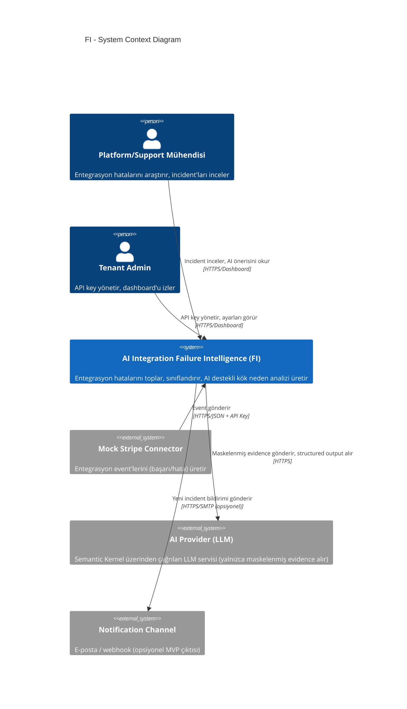
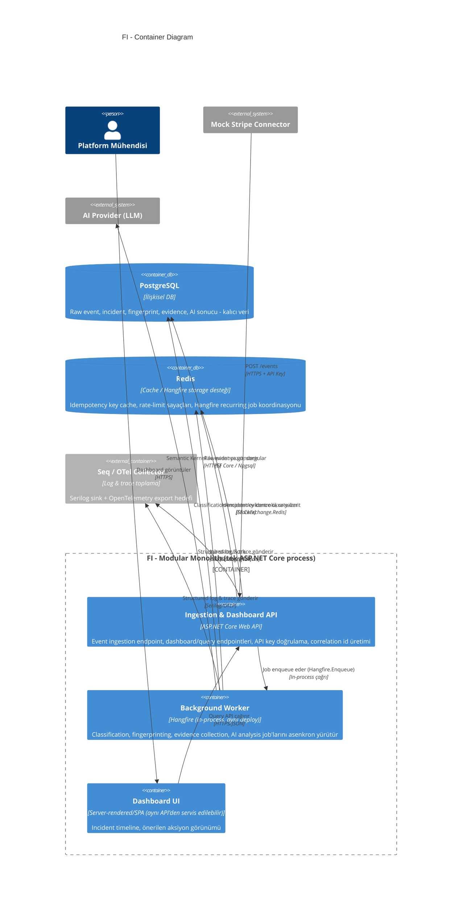
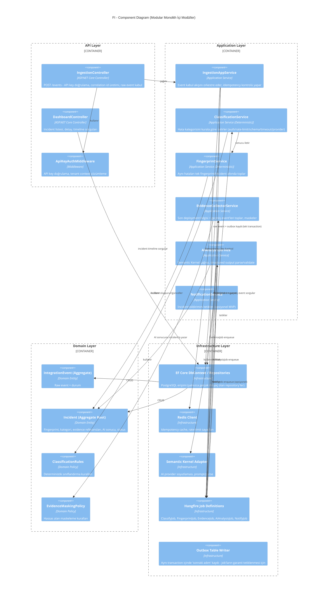
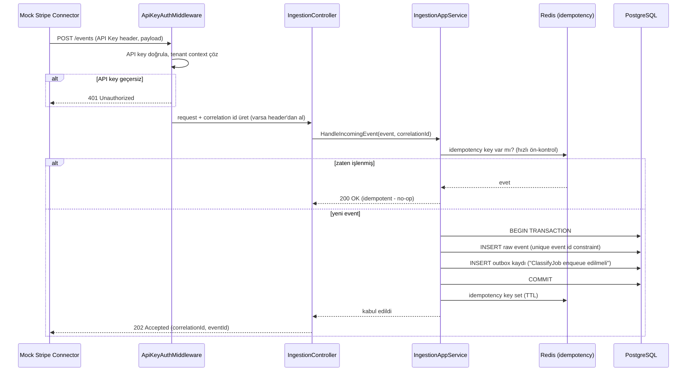
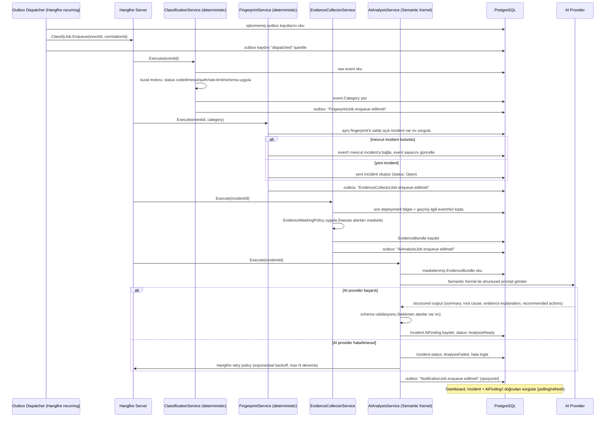
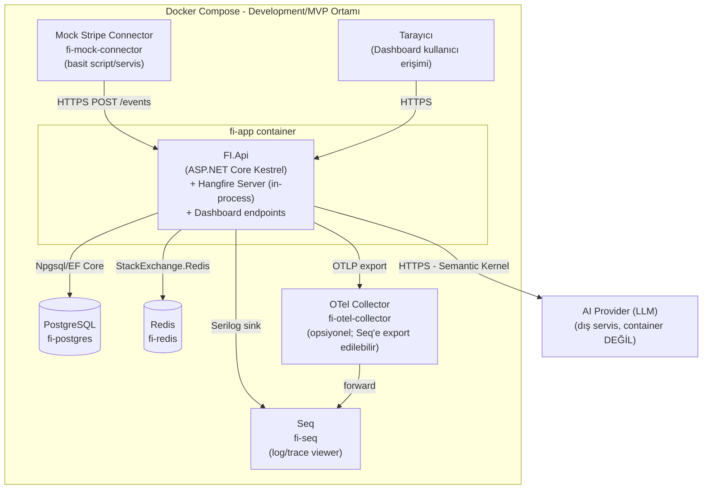

# Sistem Mimarisi — AI Integration Failure Intelligence (FI)

**Doküman türü:** System Architecture Design
**Kapsam:** MVP
**İlişkili doküman:** `01-*` (varsa) ürün/keşif dokümanları

---

## 1. Yüksek Seviyeli Mimari Yaklaşım: Modular Monolith

### 1.1 Karar

FI'nin ilk sürümü tek bir deploy edilebilir ASP.NET Core sürecinde çalışan bir **Modular Monolith** olarak inşa edilecek. Sistem, net modül sınırlarına sahip olacak (Ingestion, Classification, Fingerprinting, Evidence, AI Analysis, Notification, Dashboard/API) ancak bu modüller ayrı süreçler veya ayrı deploy birimleri olarak çalışmayacak. Modüller arası iletişim in-process (aynı .NET process içinde method call + in-process mediator/event) olacak; ağ üzerinden RPC veya mesaj kuyruğu (Kafka/RabbitMQ) kullanılmayacak.

### 1.2 Neden Microservice Değil

| Gerekçe | Açıklama |
|---|---|
| **Domain sınırları henüz olgunlaşmadı** | MVP'de "incident nedir, evidence nasıl toplanır, AI çıktısı nasıl kullanılır" gibi temel domain kararları hâlâ şekilleniyor. Servisler arası sözleşmeleri (API contract) donduracak kadar erken; microservice sınırları yanlış çizilirse maliyeti dağıtık sistemde çok daha yüksek olur. |
| **Tek yazma modeli, güçlü tutarlılık ihtiyacı** | Event → classification → fingerprint → incident zinciri sıkı sıralı ve transactional bütünlük gerektiriyor (aynı event'in iki kez incident açması, ya da fingerprint'in yanlış incident'a bağlanması kabul edilemez). Tek PostgreSQL + tek process üzerinde ACID transaction ile bu triviald; dağıtık sistemde saga/compensating transaction karmaşıklığı gerektirirdi. |
| **Operasyonel yük MVP bütçesini aşar** | Microservice; service discovery, dağıtık tracing, ayrı CI/CD hatları, ayrı health check/alerting, network latency/retry/circuit breaker matrisi getirir. Ekip küçük, ilk hedef "çalışan bir MVP ile gerçek entegrasyon hatalarını doğru teşhis etmek" — altyapı mühendisliğine yatırım yapmak değil. |
| **Ölçek ihtiyacı henüz yok** | Bölüm 6'da gerekçelendirildiği gibi, ilk aşama event hacmi (saniyede birkaç event, düşük tenant sayısı) tek process + Hangfire worker kapasitesinin çok altında. Microservice'in tek gerekçesi olan "bağımsız ölçeklenme ihtiyacı" MVP'de mevcut değil. |
| **Deploy ve debug basitliği** | Tek binary, tek log stream, tek correlation-id akışı; bir hatayı uçtan uca izlemek tek process içinde stack trace ile mümkün. Dağıtık sistemde bu iz sürme OpenTelemetry + distributed tracing altyapısı gerektirir — MVP'de bu yatırımın getirisi maliyetine değmez. |
| **Modülerlik microservice'in ön koşulu, sonucu değil** | Modular monolith, ileride servis ayrıştırmasını **ucuzlaştıran** bir ara adımdır: modül sınırları net C# namespace/proje sınırlarıyla zaten çizilmiş olacağından, gelecekte gerçek bir ölçek/organizasyon ihtiyacı doğduğunda (bkz. Bölüm 8) ilgili modül nispeten düşük risk ile ayrı servise taşınabilir. |

### 1.3 Context Diagram (C4 - Seviye 1)



### 1.4 Container Diagram (C4 - Seviye 2)



### 1.5 Component Diagram (C4 - Seviye 3, FI process içi modüller)



---

## 2. Katman ve Modül Sınırları

### 2.1 Katmanlar

FI, klasik **Clean/Onion Architecture** prensiplerine göre 4 katmana ayrılır; her katman kendi .NET projesinde (class library) yaşar, tek solution içinde derlenir ve tek process olarak deploy edilir.

| Katman | Proje adı (örnek) | Sorumluluk |
|---|---|---|
| **Domain** | `FI.Domain` | Entity, Value Object, Aggregate, domain event, deterministik iş kuralları (ClassificationRules, EvidenceMaskingPolicy, FingerprintPolicy). Dışa bağımlılık yok. |
| **Application** | `FI.Application` | Use case orkestrasyonu (IngestionAppService, ClassificationService, FingerprintService, EvidenceCollectorService, AiAnalysisService, NotificationService). Interface'ler burada tanımlanır (`IEventRepository`, `IAiAnalysisClient`, `IEvidenceStore` vb.), implementasyon Infrastructure'da. |
| **Infrastructure** | `FI.Infrastructure` | EF Core DbContext + migration, PostgreSQL erişimi, Redis client, Semantic Kernel adapter, Hangfire job tanımları, Serilog/OTel konfigürasyonu, outbox implementasyonu. |
| **API (+ Worker Host)** | `FI.Api` (composition root) | ASP.NET Core controller'lar, middleware (auth, correlation id, error handling), DI kayıtları, Hangfire dashboard/server host, dashboard endpoint'leri. Worker ayrı bir process/proje DEĞİL — aynı host içinde Hangfire server olarak çalışır (bkz. 2.3). |

### 2.2 Modül Sınırları (Application/Domain içinde dikey dilimler)

Katmanların yanında, her katman kendi içinde **modüle göre klasörlenir** (vertical slice), ör:

```
FI.Domain/
  Ingestion/        (IntegrationEvent)
  Classification/    (ClassificationRules, FailureCategory)
  Fingerprinting/     (Fingerprint, IncidentAggregate)
  Evidence/           (EvidenceBundle, MaskingPolicy)
  AiAnalysis/          (AiFinding, RecommendedAction)

FI.Application/
  Ingestion/
  Classification/
  Fingerprinting/
  Evidence/
  AiAnalysis/
  Notification/
```

Bir modül başka bir modülün **internal** implementasyon detayına doğrudan erişemez; yalnızca o modülün public application service interface'i veya domain event'i üzerinden konuşur. Bu, C# `internal` erişim belirleyicisi + proje-içi klasör disiplini ile MVP'de yeterince zorlanır; ayrı assembly'lere bölmek (her modül kendi .csproj'u) gelecekte ayrıştırma ihtiyacı netleşirse yapılabilir — MVP'de gereksiz overhead'dir.

### 2.3 Worker'ın Konumu

Worker, ayrı bir deploy birimi değildir. Hangfire server, `FI.Api` host process'i içinde `AddHangfireServer()` ile başlatılır. Böylece:
- Tek Docker image, tek container.
- Tek process içinde hem HTTP isteklerini karşılar hem de background job'ları işler.
- MVP ölçeğinde (bkz. Bölüm 6) bu paylaşım kaynak açısından sorun yaratmaz.
- İleride gerekirse (job yükü API yükünü etkilemeye başlarsa) Hangfire server'ı ayrı bir process/container'a taşımak **kod değişikliği gerektirmeden**, sadece deploy konfigürasyonuyla mümkündür (`AddHangfireServer()` çağrısının hangi process'te yapıldığını değiştirmek yeterli) — bu, modular monolith'in sağladığı düşük maliyetli ölçekleme opsiyonudur.

### 2.4 Bağımlılık Kuralları (Dependency Rule)

```
API  ──depends on──>  Application  ──depends on──>  Domain
API  ──depends on──>  Infrastructure  ──depends on──>  Application (interfaces), Domain
Infrastructure  ──implements──>  Application interfaces
Domain  ──depends on──>  (hiçbir şey; framework-free)
```

Kesin kurallar:
1. **Domain**, Application/Infrastructure/API'ye asla bağımlı olamaz. Domain, EF Core, Semantic Kernel, ASP.NET Core gibi hiçbir framework paketine referans vermez.
2. **Application**, Infrastructure'a bağımlı olamaz — yalnızca kendi tanımladığı interface'lere bağımlıdır (Dependency Inversion). Örn: `IAiAnalysisClient` Application'da tanımlanır, `SemanticKernelAiClient` Infrastructure'da implemente edilir.
3. **Infrastructure**, Application ve Domain'e bağımlı olabilir (interface implementasyonu ve entity mapping için), ama API'ye bağımlı olamaz.
4. **API**, tüm katmanlara bağımlı olabilir (composition root); iş mantığı barındırmaz, yalnızca orkestrasyon/adaptasyon (controller → application service çağrısı).
5. Modüller arası (ör. Classification → Fingerprinting) çağrı, doğrudan somut sınıf yerine **interface veya domain event** üzerinden yapılır; bu, ileride bir modülü ayrı servise çıkarmayı (Bölüm 8) ucuzlaştırır.

---

## 3. Senkron vs Asenkron Süreçler

### 3.1 Senkron (HTTP Request/Response) — Sadece "hızlı ve garanti" işler

| Adım | Neden senkron |
|---|---|
| API key doğrulama | Milisaniyeler sürer, caller'a hemen 401/200 dönmek gerekir. |
| Correlation id üretimi | Basit GUID/ULID üretimi, gecikme maliyeti yok. |
| Raw event'in PostgreSQL'e yazılması + idempotency kontrolü | Caller'a "event kabul edildi mi" garantisi senkron transaction içinde verilmelidir; aksi halde connector aynı event'i tekrar gönderebilir ve idempotency riski oluşur. |
| Outbox kaydının aynı transaction'da yazılması | Event + "işlenecek iş" kaydı atomik olmalı (bkz. 3.3). |

Bu adımların tamamı **tek DB transaction** içinde yapılır; ingestion endpoint yalnızca bunlar tamamlandıktan sonra 202 Accepted döner.

### 3.2 Asenkron (Hangfire Job) — "Yavaş, hataya toleranslı, retry edilebilir" işler

| Job | Tetikleyici | Neden asenkron |
|---|---|---|
| `ClassifyJob` | Outbox/enqueue (ingestion sonrası) | Kural motoru hızlı olsa da, ingestion response'unu bu adıma bağımlı kılmak caller'ı gereksiz bekletir; ayrıca retry/backoff gerekebilir. |
| `FingerprintJob` | ClassifyJob tamamlanınca | Var olan incident'larla eşleştirme sorgu maliyetlidir, kritik path dışında tutulmalı. |
| `EvidenceCollectorJob` | Yeni/güncellenen incident | Deployment bilgisi + geçmiş event sorgusu I/O ağırlıklı, dış çağrı içerebilir (deployment kaynağı). |
| `AiAnalysisJob` | Evidence hazır olunca | **Dış AI provider çağrısı** — değişken gecikme (saniyeler), geçici hata riski (timeout, rate limit) yüksek; retry/backoff ve circuit breaker gerektirir. Kesinlikle senkron request path'te olmamalı. |
| `NotificationJob` | AI analiz tamamlanınca (opsiyonel MVP) | E-posta/webhook gönderimi dış sisteme bağımlı, gecikme kabul edilebilir. |

### 3.3 Neden Outbox Pattern (Kafka/RabbitMQ Değil)

MVP'de "event işlendi ama sıradaki job hiç tetiklenmedi" riskini ortadan kaldırmak için **transactional outbox** kullanılır:

1. Ingestion isteği geldiğinde, raw event **ve** "ClassifyJob enqueue edilmeli" kaydı **aynı PostgreSQL transaction**'ında yazılır (outbox tablosu).
2. Ayrı bir hafif "outbox dispatcher" (kendisi de bir Hangfire recurring job, saniyede bir çalışan) outbox tablosundaki işlenmemiş kayıtları okuyup gerçek Hangfire job'unu enqueue eder ve kaydı işlendi olarak işaretler.
3. Bu, "DB'ye yazıldı ama process crash oldu, Hangfire.Enqueue çağrısı hiç yapılamadı" senaryosunu önler — çünkü outbox kaydı DB transaction'ının bir parçasıdır, Hangfire enqueue çağrısı değil.

Bu yaklaşım, Kafka/RabbitMQ gibi ayrı bir mesajlaşma altyapısı kurmadan "en az bir kez teslim" garantisini tek PostgreSQL + Hangfire ile sağlar. MVP ölçeğinde (bkz. Bölüm 6) bu yeterlidir; gerçek bir dağıtık event bus'ın getirisi (çoklu tüketici, çapraz servis yayını) henüz yok çünkü tek process var.

Job'lar arası zincirleme (ClassifyJob → FingerprintJob → ...) için ayrıca hafif bir **in-process mediator** (ör. basit `IDomainEventDispatcher` veya MediatR benzeri, dış bağımlılık gerekmeden de yazılabilir) kullanılabilir: bir job tamamlandığında bir domain event (`EventClassifiedDomainEvent`) yayınlar, dinleyici bir sonraki job'u outbox'a yazar. Bu, modüller arası doğrudan çağrı yerine gevşek bağlılık sağlar ve ileride modül ayrıştırmasını kolaylaştırır.

### 3.4 Idempotency ve Correlation

- Her gelen event, connector tarafından üretilen (veya yoksa FI tarafından üretilen) bir **event id** taşır; PostgreSQL'de bu id üzerinde unique constraint vardır → aynı event iki kez işlenmez (DB seviyesinde garanti, Redis idempotency cache ise hızlı ön-kontrol için kullanılır, DB constraint son güvence).
- Her HTTP isteği ve her job, aynı **correlation id**'yi taşır (ingestion sırasında üretilir, outbox kaydına, job parametresine ve tüm loglara/trace'lere iliştirilir). Serilog `LogContext` + OpenTelemetry `Activity` bu id'yi otomatik taşır; Seq/OTel collector'da tek correlation id ile ingestion'dan AI sonucuna kadar tüm zinciri sorgulamak mümkündür.

---

## 4. Lifecycle Akışları

### 4.1 Request Lifecycle (Ingestion → Response)



### 4.2 Background Job Lifecycle (Event → Classify → Fingerprint → Incident → Evidence → AI → Sonuç)



---

## 5. Deployment Topology (Docker Compose)



**docker-compose.yml bileşenleri (özet):**

| Servis | İmaj/Base | Not |
|---|---|---|
| `fi-app` | Custom (Dockerfile, .NET SDK build → runtime) | API + Hangfire server aynı container'da |
| `fi-postgres` | `postgres:16` | Volume ile kalıcı veri, migration `fi-app` başlangıcında EF Core migration olarak uygulanır |
| `fi-redis` | `redis:7` | Idempotency cache + Hangfire'ın bazı koordinasyon ihtiyaçları için (job storage yine PostgreSQL üzerinde tutulabilir — Hangfire.PostgreSql) |
| `fi-seq` | `datalust/seq` | Serilog structured log görüntüleme |
| `fi-otel-collector` | `otel/opentelemetry-collector` | Opsiyonel; MVP'de doğrudan Seq'e Serilog ile de gidilebilir, OTel collector trace toplama için eklenir |
| `fi-mock-connector` | Custom küçük servis/script | Test amaçlı sentetik event üretici |

Not: Hangfire storage backend'i olarak PostgreSQL (`Hangfire.PostgreSql`) tercih edilir; bu, Redis'i yalnızca cache/idempotency amaçlı basit tutar ve tek bir "gerçek veri kaynağı" (PostgreSQL) ilkesini korur.

---

## 6. Scalability Varsayımları

| Varsayım | Değer (MVP hedefi) | Gerekçe |
|---|---|---|
| Event hacmi | ~1–10 event/saniye (tenant başına çok daha düşük, patlamalarda kısa süreli 50/sn'ye kadar tolerans) | MVP'de gerçek trafik yok; mock connector + birkaç pilot entegrasyon senaryosu. |
| Tenant sayısı | 1–5 (gerçek multi-tenancy yok, mantıksal ayrım yeterli) | Görev tanımında "MVP'de gerçek multi-tenancy ve billing yok" belirtilmiş; tenant kavramı yalnızca API key/tanımlayıcı seviyesinde. |
| Eşzamanlı incident sayısı | Onlarca–yüzlerce (fingerprint sayesinde event patlaması incident patlamasına dönüşmez) | Fingerprinting'in temel amacı budur. |
| AI çağrısı sıklığı | Incident başına birkaç çağrı (yeni incident + belirgin durum değişikliğinde) | Her event için değil, yalnızca yeni/değişen incident için tetiklenir — maliyet ve gecikme kontrolü. |

**İlk darboğaz nerede olur:**

1. **AI provider çağrısı (en olası ilk darboğaz).** LLM çağrıları saniyeler sürebilir, dış sağlayıcı rate-limit uygulayabilir. Bu adım zaten asenkron (Hangfire job) olduğu için API'yi bloklamaz, ama job kuyruğu birikebilir. MVP'de kabul edilebilir çünkü incident başına çağrı sayısı düşük.
2. **PostgreSQL yazma yükü değil, sorgu deseni.** Fingerprint eşleştirmesi (mevcut açık incident arama) doğru indeksleme (tenant_id + fingerprint_hash + status) olmadan yük altında yavaşlayabilir. MVP hacminde risk düşük ama index tasarımı baştan doğru yapılmalı.
3. **Hangfire tek process worker kapasitesi.** Tüm job'lar aynı process'te çalıştığı için, AI job'ları uzun sürerse classification/fingerprint job'ları için worker slotu azalabilir. Hangfire queue önceliklendirmesi (ayrı queue: `classification`, `ai-analysis`) ile MVP'de hafifletilir.
4. **Redis ve API katmanı MVP hacminde darboğaz olmaz** — bu bileşenler bu ölçekte pratik olarak sınırsız kapasiteye sahiptir.

Sonuç: MVP mimarisi, tahmin edilen yükün onlarca kat üzerini tek process + tek DB ile karşılayabilecek şekilde fazlasıyla yeterlidir; erken optimizasyon gereksizdir.

---

## 7. Failure Points ve MVP Seviyesi Önlemler

| Failure Point | Etki | MVP Önlemi |
|---|---|---|
| **AI provider down/timeout/rate-limit** | AI analiz job'u başarısız olur, incident "AnalysisFailed" durumunda kalır | Hangfire otomatik retry (exponential backoff, sınırlı deneme sayısı, ör. 5); son denemede incident `AnalysisFailed` + insan tarafından "yeniden dene" tetikleyebileceği manuel buton; kural tabanlı sınıflandırma zaten AI'dan bağımsız çalıştığı için incident kendisi kaybolmaz, sadece AI zenginleştirmesi eksik kalır (graceful degradation). |
| **DB (PostgreSQL) down** | Ingestion isteği transaction atamaz → 5xx döner; job'lar DB'ye erişemez → job'lar retry ile bekler | Ingestion endpoint'i açık ve hızlı başarısız olur (fail-fast, connector'ın kendi retry mekanizmasına güvenilir); Hangfire job'ları DB tekrar erişilebilir olduğunda otomatik devam eder (job storage da DB'de olduğu için, DB geri geldiğinde job kuyruğu kendiliğinden devam eder); health check endpoint (`/health/ready`) DB bağlantısını kontrol eder, orkestrasyon katmanı (Docker healthcheck) buna göre restart/alert üretir. |
| **Job queue backlog (job'lar birikirse)** | Incident'lar geç "AnalysisReady" durumuna geçer, dashboard gecikmiş görünür | Queue başına ayrı worker sayısı (Hangfire `WorkerCount` + queue önceliklendirme: `classification` > `evidence` > `ai-analysis`); Seq/OTel üzerinde queue derinliği metriği izlenir; MVP'de otomatik ölçekleme yok, manuel gözlem + alert yeterli (bkz. Bölüm 6, hacim düşük olduğu için pratik risk sınırlı). |
| **Redis down** | Idempotency ön-kontrolü çalışmaz | Redis yalnızca **hızlandırıcı** cache'tir; asıl idempotency garantisi PostgreSQL unique constraint'te olduğu için Redis down olduğunda sistem doğru çalışmaya devam eder (yalnızca performans/erken-reddetme avantajı kaybolur). Bu bilinçli bir "Redis olmadan da doğruluk garantisi" tasarım kararıdır. |
| **Duplicate/replay event'ler** | Aynı incident'ın yanlışlıkla iki kez oluşması, event'in iki kez sayılması | Event id üzerinde DB unique constraint + Redis idempotency cache (çift katmanlı savunma); her adım idempotent yazılır (ör. fingerprint eşleştirme "varsa güncelle, yoksa oluştur" upsert mantığı). |
| **Correlation id kaybı / iz sürülemeyen hata** | Bir incident'ın hangi event zincirinden geldiği izlenemez | Correlation id, ingestion'dan itibaren tüm outbox kayıtlarına, job parametrelerine ve log/trace context'ine zorunlu alan olarak taşınır; middleware seviyesinde eksikse üretilir, asla null geçmez. |
| **Hassas veri sızıntısı (AI'a maskesiz payload gitmesi)** | Güven/uyumluluk riski | `EvidenceMaskingPolicy` domain katmanında merkezi, tek noktadan uygulanır; `AiAnalysisService` yalnızca maskelenmiş `EvidenceBundle` tipini kabul eder (raw event tipini asla parametre olarak almaz) — tip sisteminde bu ayrım zorlanır, yanlışlıkla ham veri geçirilmesi derleme zamanında engellenir. |

---

## 8. Gelecek Opsiyonu: Servis Ayrıştırma (MVP Kapsamı Dışı)

Aşağıdaki modüller, **ancak belirtilen koşullar gerçekleştiğinde** ayrı servise çıkarılması değerlendirilebilir. Bu, MVP'nin bir parçası değildir; modular monolith'in modül sınırları bu geçişi ucuzlaştırmak için baştan bu şekilde tasarlanmıştır.

| Modül | Ayrı servise çıkarma koşulu | Neden bu modül önce |
|---|---|---|
| **AI Analysis** | (a) AI çağrı hacmi/gecikmesi API/worker process'inin genel kaynak kullanımını gözle görülür şekilde etkilemeye başlarsa, veya (b) birden fazla iç sistemin (ör. başka bir ürün) aynı AI analiz yeteneğini paylaşması gerekirse | En doğal ayrıştırma adayı — zaten dış bir sisteme (LLM) HTTP ile bağımlı, stateless'e yakın, kendi ölçeklenme profiline (I/O bound, burst) sahip. |
| **Evidence Collection** | Evidence toplama kaynakları çoğalır (deployment sistemleri, log sağlayıcıları, üçüncü parti API'ler) ve bu entegrasyonların kendi release/versiyon döngüsü gerekirse | Dış sistem entegrasyon noktası arttıkça bağımsız deploy edilebilirlik değer kazanır. |
| **Ingestion** | Gerçek çoklu connector tipi (Stripe dışında başka sağlayıcılar) ve yüksek event hacmi (saniyede binlerce) gerçekleşirse, bağımsız yatay ölçekleme ihtiyacı doğar | Ingestion, en "stateless ve yatay ölçeklenebilir" adaydır ama MVP hacminde gerek yok. |
| **Notification** | Bildirim kanalı sayısı artar (email, Slack, webhook, SMS) ve bunların hata/retry izolasyonu gerekirse | Düşük risk, düşük öncelik — kolayca en son ayrıştırılabilir. |

**Genel koşul:** Ayrıştırma yalnızca "bağımsız ölçeklenme", "bağımsız deploy hızı" veya "farklı ekiplerin sahiplenmesi" ihtiyaçlarından biri **somut ve ölçülebilir** hale geldiğinde yapılmalıdır — yalnızca "daha temiz görünür" gerekçesiyle yapılmamalıdır. Modüller arası zaten interface/domain event üzerinden konuştuğu için, ayrıştırma; ilgili modülün implementasyonunu bir HTTP/queue adaptörü ile değiştirmekten ibaret olacak, domain/application mantığı büyük ölçüde korunacaktır.

---

## 9. Mimari Trade-off Özeti

| Karar | Ne kazanılıyor | Neden feragat ediliyor / risk |
|---|---|---|
| Modular Monolith (microservice değil) | Basit deploy, güçlü transaction tutarlılığı, düşük operasyonel yük, hızlı geliştirme, kolay debug/tracing | Tek process'in tamamı birlikte ölçeklenir (bileşen bazında bağımsız ölçekleme yok); tek process çökerse API + worker birlikte etkilenir (MVP hacminde kabul edilebilir risk) |
| Deterministik kural motoru (AI değil) sınıflandırma | Öngörülebilir, test edilebilir, hızlı, hallucinasyon riski yok, incident oluşturma güvenilirliği yüksek | Yeni/bilinmeyen hata türlerini otomatik öğrenemez; kural setinin elle genişletilmesi gerekir |
| AI yalnızca evidence üzerinden structured output üretir, incident oluşturmaz | Güven, açıklanabilirlik, hatalı AI çıktısının sistemin çekirdek doğruluğunu bozmaması | AI'nın değer katkısı "zenginleştirme" ile sınırlı kalır; kök neden tespitinde AI'nın potansiyel gücünden MVP'de tam yararlanılmaz (bilinçli tercih) |
| Outbox pattern + Hangfire (Kafka/RabbitMQ değil) | Ayrı mesajlaşma altyapısı kurulum/işletim maliyeti yok, tek veri kaynağı (PostgreSQL) ile "en az bir kez" garanti | Çoklu bağımsız tüketici / yüksek hacimli event yayını senaryosunda (gelecekte gerekirse) yetersiz kalır; o noktada gerçek bir message broker gerekebilir |
| Redis yalnızca cache/hızlandırıcı, asıl garanti PostgreSQL'de | Redis down olsa da doğruluk bozulmaz (defense in depth) | Redis'in performans avantajından tam yararlanmak için ek karmaşıklık (iki katmanlı kontrol) gerekir |
| Otomatik remediation yok, human review zorunlu | Güven inşası, yanlış otomatik aksiyon riskinin sıfırlanması, uyumluluk | Kullanıcı MVP'de daha fazla manuel işlem yapmak zorunda; "otomatik çözüm" değer önerisi ileri sürülemiyor (bilinçli MVP kapsamı) |
| Repository pattern yalnızca somut ihtiyaçta | Gereksiz soyutlama/boilerplate yok, EF Core'un kendi yeteneklerinden (DbContext, LINQ) doğrudan yararlanılır | Bazı yerlerde EF Core'a doğrudan bağımlılık oluşur; ileride DB değişikliği gerekirse (düşük ihtimal, MVP'de öncelik değil) daha fazla refactor gerekir |
| Evidence maskeleme zorunlu, tip sisteminde ayrıştırılmış | Hassas veri sızıntısı riski derleme zamanında büyük ölçüde engellenir | Maskeleme kapsamının eksik/hatalı tanımlanması hâlâ mümkün — bu, maskeleme politikasının kapsamlı test edilmesini gerektirir (mimari değil, doğrulama sorumluluğu) |

---

## 10. Özet

FI'nin MVP mimarisi, kasıtlı olarak "erken dağıtıklaşmama" prensibine dayanır: tek process, tek veritabanı, tek doğruluk kaynağı. Deterministik iş mantığı (classification, fingerprinting, masking) domain katmanında, AI ise yalnızca evidence-sınırlı bir zenginleştirme katmanında tutulur. Senkron yol yalnızca "hızlı ve garanti gerektiren" ingestion adımlarını kapsar; her şey diğeri Hangfire + outbox pattern ile asenkron ve idempotent yürütülür. Modül sınırları, gelecekte gerçek bir ölçek/organizasyon ihtiyacı doğduğunda servis ayrıştırmasını ucuzlaştıracak şekilde baştan disiplinli çizilmiştir, ancak bu ayrıştırma MVP kapsamının bilinçli olarak dışında tutulmuştur.
