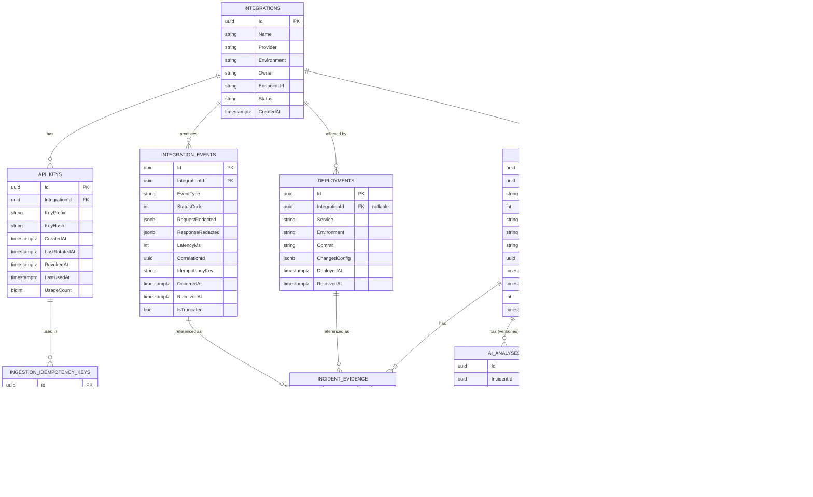

# AI Integration Failure Intelligence — Data, API & Integration Mimarisi

**Doküman amacı:** Bu doküman, "AI Integration Failure Intelligence" (FI) ürününün veri modelini, PostgreSQL şemasını, index stratejisini, retention politikasını, public/internal API kontratlarını, idempotency/API-key/webhook-verification/retry tasarımlarını ve connector interface'ini tanımlar. Kod yazılmaz; C# imzaları ve SQL şeması *contract seviyesinde* sözde-koddur.

**Kapsam dışı (MVP):** Gerçek multi-tenancy (organizasyon/tenant izolasyonu row-level security ile), billing/subscription, generic repository pattern, mikroservis ayrımı. Tek-tenant (tek şirket/kendi kullanımımız) varsayımıyla tasarlanmıştır; ileride tenant_id kolonu eklemeye açık bırakılmıştır (bkz. §14).

---

## 1. Entity Listesi ve İlişkiler

### 1.1 Taslağa göre yapılan düzeltmeler/genişletmeler

| Taslak | Sorun | Düzeltme |
|---|---|---|
| `Integrations.ApiKeyHash` tek kolon | Rotation, çoklu key, expiry desteklenemiyor | `ApiKeys` ayrı tablo olarak çıkarıldı (1-N) |
| `IntegrationEvents.Request/Response` çıplak | PII/secret sızıntısı riski, boyut sınırı yok | `RequestRedacted`/`ResponseRedacted` JSONB + `PayloadSizeBytes` + `IsTruncated` |
| `Deployments` tek başına | Hangi entegrasyonu etkilediği belirsiz | `IntegrationId` (nullable, FK) + `Service` string olarak korunuyor (deployment entegrasyon-agnostik de olabilir, örn. tüm servis restart) |
| `Incidents.Fingerprint` var ama üretim kuralı yok | Gruplama mantığı tanımsız | `FingerprintAlgorithmVersion` eklendi, hesaplama kuralı §1.3'te tanımlandı |
| `Incidents` içinde assignee/owner yok | Triage iş akışı eksik | `AssigneeId`, `Status` enum genişletildi (OPEN/ACKNOWLEDGED/RESOLVED/REOPENED/IGNORED) |
| `IncidentEvidence.SourceId` tipsiz | Hangi tabloya işaret ettiği belirsiz | `SourceTable` enum (EVENT/DEPLOYMENT/AI_ANALYSIS/MANUAL_NOTE) + `SourceId` (nullable, tipe göre) |
| `AIAnalyses` incident'a bağlı ama versiyon geçmişi yok | Reanalyze sonrası eski analiz kaybolur | `IsLatest` flag + append-only tasarım (yeni satır, eski satır silinmez) |
| `AuditLogs`/`NotificationLogs` taslakta kolonsuz | — | Aşağıda tam şema verildi |
| Eksik: idempotency izleme | Duplicate event/deployment kaydı riski | `IngestionIdempotencyKeys` tablosu eklendi |
| Eksik: API key kullanım izleme | Rotation kararı için veri yok | `ApiKeys.LastUsedAt`, `UsageCount` eklendi |

### 1.2 Tam Entity Listesi

1. **Integrations** — kayıtlı entegrasyon (Stripe, GitHub, SES...) tanımı
2. **ApiKeys** — bir Integration'a bağlı, ingestion authentication için kullanılan anahtarlar
3. **IntegrationEvents** — ham event kaydı (HTTP call, webhook delivery, vs.)
4. **Deployments** — deployment/config-change kayıtları (root-cause korelasyonu için)
5. **Incidents** — event'lerden türetilmiş, fingerprint ile gruplanmış olay
6. **IncidentEvidence** — bir incident'ı destekleyen kanıt referansları
7. **AIAnalyses** — AI tarafından üretilen açıklama/kök-neden (versiyonlu)
8. **AuditLogs** — kullanıcı/sistem aksiyonlarının değişmez kaydı
9. **NotificationLogs** — giden bildirimlerin (Slack/email/webhook) kaydı
10. **IngestionIdempotencyKeys** — idempotency-key → sonuç eşlemesi (events/deployments için ortak)

### 1.3 Fingerprint Hesaplama Kuralı (netleştirme)

Taslakta `Incidents.Fingerprint` var ama nasıl üretileceği tanımsız. Kural:

```
fingerprint = SHA256(
  integrationId + "|" +
  category +               // örn. AUTHENTICATION_ERROR
  normalizedErrorSignature  // statusCode aralığı + response.error.code (varsa) + endpoint path template
)
```

`normalizedErrorSignature` üretimi: `statusCode` 4xx/5xx bucket'a indirgenir (örn. 401→"401", 500-599→"5XX"), response body'den (varsa) `error.type`/`error.code` alanı çıkarılır, path'teki değişken segmentler (`/charges/{id}`) template'e indirgenir. Bu sayede "Stripe 401 auth hatası" tek fingerprint altında toplanır, farklı charge ID'leri ayrı incident açmaz.

`FingerprintAlgorithmVersion` kolonu ile algoritma değiştiğinde eski incident'lar bozulmadan yeni event'ler yeni versiyonla gruplanabilir (geriye dönük fingerprint yeniden hesaplama yapılmaz, sadece yeni versiyon damgalanır).

### 1.4 ER Diyagramı (Mermaid)



---

## 2. PostgreSQL Şema Önerisi

Not: EF Core migration'ları ile üretilecek gerçek DDL bu tasarımın kabaca karşılığıdır; burada amaç kolon/tip/constraint kararlarını netleştirmektir.

```sql
-- =========================================================
-- Integrations
-- =========================================================
CREATE TABLE integrations (
    id                  uuid PRIMARY KEY DEFAULT gen_random_uuid(),
    name                varchar(200) NOT NULL,
    provider            varchar(100) NOT NULL,        -- 'stripe' | 'github' | 'ses' | 'sendgrid' | ...
    environment         varchar(50)  NOT NULL,        -- 'production' | 'staging' | 'development'
    owner               varchar(200) NOT NULL,        -- takım/kişi (MVP'de free-text, ileride user FK)
    endpoint_url        varchar(500),
    status              varchar(30)  NOT NULL DEFAULT 'ACTIVE', -- ACTIVE | PAUSED | ARCHIVED
    created_at          timestamptz  NOT NULL DEFAULT now(),
    updated_at          timestamptz  NOT NULL DEFAULT now(),
    CONSTRAINT uq_integrations_name_env UNIQUE (name, environment)
);

-- =========================================================
-- ApiKeys  (taslaktaki Integrations.ApiKeyHash buradan çıkarıldı)
-- =========================================================
CREATE TABLE api_keys (
    id                  uuid PRIMARY KEY DEFAULT gen_random_uuid(),
    integration_id      uuid NOT NULL REFERENCES integrations(id) ON DELETE CASCADE,
    key_prefix          varchar(12)  NOT NULL,        -- örn. "fi_live_ab12" — loglarda güvenle gösterilebilir
    key_hash            varchar(200) NOT NULL,        -- Argon2id veya SHA-256+pepper hash, ham key asla saklanmaz
    created_at          timestamptz  NOT NULL DEFAULT now(),
    last_rotated_at     timestamptz,
    revoked_at          timestamptz,
    last_used_at        timestamptz,
    usage_count         bigint       NOT NULL DEFAULT 0,
    CONSTRAINT uq_api_keys_hash UNIQUE (key_hash)
);
CREATE INDEX ix_api_keys_integration_active
    ON api_keys (integration_id)
    WHERE revoked_at IS NULL;

-- =========================================================
-- IntegrationEvents  (en yüksek hacimli tablo)
-- =========================================================
CREATE TABLE integration_events (
    id                  uuid PRIMARY KEY DEFAULT gen_random_uuid(),
    integration_id      uuid NOT NULL REFERENCES integrations(id) ON DELETE CASCADE,
    event_type          varchar(50)  NOT NULL,        -- 'API_CALL' | 'WEBHOOK_IN' | 'WEBHOOK_OUT'
    status_code         int          NOT NULL,
    request_redacted    jsonb,
    response_redacted   jsonb,
    latency_ms          int,
    correlation_id      uuid         NOT NULL,
    idempotency_key     varchar(200),
    api_key_id          uuid REFERENCES api_keys(id),
    payload_size_bytes  int          NOT NULL DEFAULT 0,
    is_truncated        boolean      NOT NULL DEFAULT false,
    occurred_at         timestamptz  NOT NULL,
    received_at         timestamptz  NOT NULL DEFAULT now(),
    CONSTRAINT ck_events_status_code CHECK (status_code BETWEEN 100 AND 599),
    CONSTRAINT ck_events_occurred_not_future CHECK (occurred_at <= received_at + interval '5 minutes'),
    CONSTRAINT ck_events_latency_nonneg CHECK (latency_ms IS NULL OR latency_ms >= 0)
);
-- Partition (bkz. §5) önerisi: PARTITION BY RANGE (occurred_at)

-- =========================================================
-- Deployments
-- =========================================================
CREATE TABLE deployments (
    id                  uuid PRIMARY KEY DEFAULT gen_random_uuid(),
    integration_id      uuid REFERENCES integrations(id) ON DELETE SET NULL, -- nullable: platform-geneli deploy
    service             varchar(200) NOT NULL,
    environment         varchar(50)  NOT NULL,
    commit              varchar(100) NOT NULL,
    changed_config      jsonb,                         -- {"key": "STRIPE_SECRET", "changed": true} gibi diff özeti
    deployed_at         timestamptz  NOT NULL,
    received_at         timestamptz  NOT NULL DEFAULT now(),
    CONSTRAINT ck_deploy_not_future CHECK (deployed_at <= received_at + interval '5 minutes')
);

-- =========================================================
-- Incidents
-- =========================================================
CREATE TABLE incidents (
    id                          uuid PRIMARY KEY DEFAULT gen_random_uuid(),
    integration_id              uuid NOT NULL REFERENCES integrations(id) ON DELETE CASCADE,
    fingerprint                 varchar(64) NOT NULL,  -- sha256 hex
    fingerprint_algorithm_version int       NOT NULL DEFAULT 1,
    category                    varchar(50) NOT NULL,  -- AUTHENTICATION_ERROR | RATE_LIMIT | SCHEMA_MISMATCH | ...
    severity                    varchar(20) NOT NULL,  -- LOW | MEDIUM | HIGH | CRITICAL
    status                      varchar(20) NOT NULL DEFAULT 'OPEN', -- OPEN|ACKNOWLEDGED|RESOLVED|REOPENED|IGNORED
    assignee_id                 uuid,                   -- MVP'de nullable free reference, kullanıcı tablosu yoksa text de olabilir
    first_seen                  timestamptz NOT NULL,
    last_seen                   timestamptz NOT NULL,
    event_count                 int         NOT NULL DEFAULT 1,
    resolved_at                 timestamptz,
    created_at                  timestamptz NOT NULL DEFAULT now(),
    updated_at                  timestamptz NOT NULL DEFAULT now(),
    CONSTRAINT uq_incidents_open_fingerprint
        UNIQUE (integration_id, fingerprint, fingerprint_algorithm_version)
        -- Not: incident RESOLVED olsa bile aynı fingerprint tekrar açılırsa
        -- yeni satır yerine status=REOPENED update edilir (bkz. §8 idempotency mantığı ile tutarlı)
);
CREATE INDEX ix_incidents_status_lastseen ON incidents (status, last_seen DESC);

-- =========================================================
-- IncidentEvidence
-- =========================================================
CREATE TABLE incident_evidence (
    id                  uuid PRIMARY KEY DEFAULT gen_random_uuid(),
    incident_id         uuid NOT NULL REFERENCES incidents(id) ON DELETE CASCADE,
    source_table        varchar(30) NOT NULL,          -- 'EVENT' | 'DEPLOYMENT' | 'AI_ANALYSIS' | 'MANUAL_NOTE'
    source_id           uuid,                           -- source_table='MANUAL_NOTE' ise NULL olabilir
    description         text NOT NULL,
    timestamp           timestamptz NOT NULL,
    created_at          timestamptz NOT NULL DEFAULT now()
);

-- =========================================================
-- AIAnalyses (append-only, versioned)
-- =========================================================
CREATE TABLE ai_analyses (
    id                  uuid PRIMARY KEY DEFAULT gen_random_uuid(),
    incident_id         uuid NOT NULL REFERENCES incidents(id) ON DELETE CASCADE,
    summary             text NOT NULL,
    root_cause          text NOT NULL,
    actions             jsonb NOT NULL,                -- string[] recommendedActions
    evidence_refs       jsonb,                          -- AI çıktısındaki "evidence" string listesi (ham)
    confidence          numeric(3,2) NOT NULL CHECK (confidence BETWEEN 0 AND 1),
    prompt_version      varchar(30) NOT NULL,
    needs_human_review  boolean NOT NULL DEFAULT false,
    is_latest           boolean NOT NULL DEFAULT true,
    created_at          timestamptz NOT NULL DEFAULT now()
);
CREATE UNIQUE INDEX uq_ai_analyses_latest
    ON ai_analyses (incident_id) WHERE is_latest;

-- =========================================================
-- AuditLogs
-- =========================================================
CREATE TABLE audit_logs (
    id                  uuid PRIMARY KEY DEFAULT gen_random_uuid(),
    actor_type          varchar(20) NOT NULL,           -- 'USER' | 'SYSTEM' | 'AI'
    actor_id            varchar(200),
    action              varchar(100) NOT NULL,          -- 'INCIDENT_RESOLVED' | 'API_KEY_ROTATED' | ...
    entity_type         varchar(50) NOT NULL,
    entity_id           uuid,
    changes             jsonb,
    created_at          timestamptz NOT NULL DEFAULT now()
);

-- =========================================================
-- NotificationLogs
-- =========================================================
CREATE TABLE notification_logs (
    id                  uuid PRIMARY KEY DEFAULT gen_random_uuid(),
    incident_id         uuid NOT NULL REFERENCES incidents(id) ON DELETE CASCADE,
    channel             varchar(30) NOT NULL,           -- 'SLACK' | 'EMAIL' | 'WEBHOOK'
    target              varchar(300) NOT NULL,
    status              varchar(20) NOT NULL,           -- 'SENT' | 'FAILED' | 'RETRYING'
    error_message        text,
    sent_at             timestamptz,
    created_at          timestamptz NOT NULL DEFAULT now()
);

-- =========================================================
-- IngestionIdempotencyKeys
-- =========================================================
CREATE TABLE ingestion_idempotency_keys (
    id                  uuid PRIMARY KEY DEFAULT gen_random_uuid(),
    integration_id      uuid NOT NULL REFERENCES integrations(id) ON DELETE CASCADE,
    idempotency_key     varchar(200) NOT NULL,
    request_hash        varchar(64) NOT NULL,           -- sha256(body) — key+hash uyuşmazsa 409
    resource_type       varchar(30) NOT NULL,           -- 'EVENT' | 'DEPLOYMENT'
    resource_id         uuid NOT NULL,
    created_at          timestamptz NOT NULL DEFAULT now(),
    CONSTRAINT uq_idempotency UNIQUE (integration_id, idempotency_key)
);
```

---

## 3. Index Stratejisi

| Tablo | Index | Amaç |
|---|---|---|
| `integration_events` | `(integration_id, occurred_at DESC)` | Entegrasyon bazlı timeline sorguları |
| `integration_events` | `(correlation_id)` | Tek isteğin uçtan uca izlenmesi (Product API `GET /incidents/{id}` timeline) — B-tree, yüksek kardinalite |
| `integration_events` | `(status_code) WHERE status_code >= 400` (partial) | Sadece hata event'lerini tarayan job'lar için (incident detection worker) |
| `integration_events` | `(occurred_at)` | Retention temizliği ve partition pruning |
| `integration_events.request_redacted` / `response_redacted` | GIN (opsiyonel, sadece gerekirse) | JSONB içi arama nadiren gerekiyorsa; MVP'de **eklenmiyor** çünkü yazma maliyeti yüksek ve şu an içerik arama use-case'i yok |
| `incidents` | `UNIQUE (integration_id, fingerprint, fingerprint_algorithm_version)` | Idempotent incident gruplama (upsert anchor) |
| `incidents` | `(status, last_seen DESC)` | Liste ekranı varsayılan sıralama+filtre |
| `incidents` | `(severity, status)` | Dashboard/filtreleme |
| `incident_evidence` | `(incident_id, timestamp)` | Timeline render |
| `ai_analyses` | `UNIQUE (incident_id) WHERE is_latest` | "En son analiz" O(1) lookup, partial unique index |
| `deployments` | `(integration_id, deployed_at DESC)` | Deployment-correlation sorgusu ("son N dk içindeki deploy var mı?") |
| `deployments` | `(environment, deployed_at DESC)` | Entegrasyona bağlı olmayan platform-geneli deploy sorguları |
| `api_keys` | `UNIQUE (key_hash)` | Auth lookup — O(1), hash zaten yüksek entropi |
| `ingestion_idempotency_keys` | `UNIQUE (integration_id, idempotency_key)` | İdempotency kontrolü |
| `notification_logs` | `(incident_id, created_at DESC)` | Bildirim geçmişi |
| `audit_logs` | `(entity_type, entity_id, created_at DESC)` | Entity bazlı audit trail sorgusu |

**Zaman bazlı sorgular için genel kural:** `integration_events` en yüksek yazma hacmine sahip tablo olduğundan, index sayısı bilinçli olarak sınırlı tutulur (yazma amplifikasyonunu önlemek için). `occurred_at` üzerindeki partition (bkz. §5) zaten zaman filtresini partition pruning ile hızlandırır; ayrıca B-tree index eklemek çoğu sorguda gereksizdir.

---

## 4. JSONB Kullanım Kararları

| Alan | Tip | Gerekçe |
|---|---|---|
| `integration_events.request_redacted` / `response_redacted` | JSONB | Şema sağlayıcıya göre tamamen değişken (Stripe payload'ı ≠ SES payload'ı). Normalize etmek her provider için ayrı tablo/kolon seti gerektirir — MVP hızını öldürür. Sorgu ihtiyacı "görüntüle" seviyesinde, "payload içinde WHERE filtrele" değil. |
| `deployments.changed_config` | JSONB | Değişen config anahtar/değer çiftleri provider'a göre değişken; sabit şema yok. |
| `ai_analyses.actions`, `evidence_refs` | JSONB | AI çıktısı doğrudan dizi/nesne; sabit string[] olsa da PostgreSQL array yerine JSONB tercih edildi çünkü AI çıktı şeması zamanla (`prompt_version` ile) evrilebilir — JSONB şema esnekliği sağlar, array/text[] migration gerektirir. |
| `audit_logs.changes` | JSONB | Değişen alan/eski-yeni değer çiftleri entity tipine göre değişken. |

**Ne zaman normalize edilmiş kolon tercih edilir (JSONB DEĞİL):**

- `integration_events.status_code`, `latency_ms`, `correlation_id`, `occurred_at` — bunlar **her zaman** filtrelenir/sıralanır/index'lenir → normal kolon olmalı. JSONB içine gömülürse index verimsizleşir.
- `incidents.category`, `severity`, `status`, `fingerprint` — liste/filtre API'sinin (`GET /incidents?category=...`) çekirdeği; JSONB'de saklanırsa her filtre `->>'field'` ile expression index gerektirir, gereksiz karmaşıklık.
- `ai_analyses.confidence`, `needs_human_review` — sayısal/boolean filtre ve sıralama ("confidence < 0.7 olanları göster") için normal kolon.

**Genel kural:** *"Bu alana WHERE/ORDER BY/GROUP BY uygulanacak mı?"* sorusu evetse normalize kolon; *"Bu alan sadece görüntülenecek, şeması kaynağa göre değişken"* ise JSONB.

**Boyut kısıtı:** `request_redacted`/`response_redacted` için PostgreSQL TOAST otomatik devreye girer (>2KB), performans sorunu değildir; asıl kısıt §7'deki payload size limiti ile ingestion katmanında uygulanır (DB'ye dev boyutta JSON yazılmasını baştan engellemek için).

---

## 5. Retention Stratejisi

| Veri | Retention | Mekanizma |
|---|---|---|
| `integration_events` (raw) | **90 gün** | Aylık range partition (`integration_events_2026_07` vb.) + Hangfire recurring job ile eski partition `DROP TABLE` (silme değil, partition drop — hızlı, WAL/vacuum yükü yaratmaz) |
| `integration_events` — incident'a evidence olarak bağlanmış event'ler | 90 gün sonunda **özet olarak** korunur | Partition drop öncesi, incident_evidence.description alanına event'in özet metni (statusCode, path, timestamp) zaten yazılmış olur — ham payload gider, iz kalır |
| `deployments` | **1 yıl** | Ayrı partition/scheduled cleanup, düşük hacim |
| `incidents` | **Kalıcı** | Silinmez; `status=IGNORED` ile arşivlenebilir ama satır kalır (compliance/trend analizi için) |
| `incident_evidence` | Kalıcı (incident ile birlikte) | — |
| `ai_analyses` | Kalıcı | Append-only, geçmiş analizler denetim için saklanır |
| `audit_logs` | **Kalıcı, minimum 2 yıl** | Uyum/denetim amaçlı, silinmez |
| `notification_logs` | **180 gün** | Düşük değer, scheduled cleanup |
| `ingestion_idempotency_keys` | **7 gün** | Idempotency penceresi kısa olduğundan (bkz. §8), eski kayıtlar hızlı temizlenir; job her gece çalışır |
| `api_keys` (revoked) | Kalıcı ama `revoked_at` sonrası PII/secret barındırmaz (zaten sadece hash) | — |

**Partition detayı:** `integration_events` `PARTITION BY RANGE (occurred_at)`, aylık partition. Yeni ay başlamadan önce bir job gelecek ayın partition'ını önceden oluşturur (`pg_partman` veya elle Hangfire job). Retention job'u her gün çalışıp 90 günden eski partition'ları drop eder.

---

## 6. Public Ingestion API (v1)

Base path: `/api/v1`. Authentication: `X-Api-Key` header (bkz. §9). Rate limit: entegrasyon başına saniyede N istek (429 + `Retry-After`).

### 6.1 `POST /api/v1/integrations`

Entegrasyon kaydı — bu endpoint **ürün konsolu** tarafından (kullanıcı arayüzünden) çağrılır, farklı auth (session/JWT) kullanır; ingestion API key'i ile korunmaz.

Request:
```json
{
  "name": "Stripe Payments",
  "provider": "stripe",
  "environment": "production",
  "owner": "payments-team"
}
```

Response `201 Created`:
```json
{
  "integrationId": "8a2e...-uuid",
  "apiKey": "fi_live_ab12CD34...",
  "keyPrefix": "fi_live_ab12"
}
```
> `apiKey` **sadece bu yanıtta bir kez** döner; sunucuda hash'lenmiş hali saklanır (bkz. §9).

Validation: `name` 1-200 char zorunlu; `provider` allow-list (`stripe|github|ses|sendgrid|custom`); `environment` allow-list (`production|staging|development`); `(name, environment)` unique — çakışırsa `409 Conflict`.

### 6.2 `POST /api/v1/events`

Headers: `X-Api-Key: fi_live_...`, `Idempotency-Key: <client-generated>` (opsiyonel ama önerilir, bkz. §8).

Request:
```json
{
  "integrationId": "8a2e...-uuid",
  "type": "API_CALL",
  "statusCode": 401,
  "request": { "method": "POST", "path": "/v1/charges", "headers": { "...": "..." } },
  "response": { "error": { "type": "authentication_error", "code": "invalid_api_key" } },
  "latency": 142,
  "occurredAt": "2026-07-12T09:14:03.221Z"
}
```

Response `201 Created`:
```json
{
  "eventId": "c1f0...-uuid",
  "correlationId": "9b77...-uuid"
}
```
Idempotent tekrar (aynı `Idempotency-Key`): `200 OK`, aynı body döner (bkz. §8).

Validation:
- `integrationId`: mevcut ve `X-Api-Key`'in bağlı olduğu integration ile eşleşmeli, aksi halde `403 Forbidden`.
- `type`: `API_CALL | WEBHOOK_IN | WEBHOOK_OUT`.
- `statusCode`: 100–599 aralığı, aksi halde `422 Unprocessable Entity`.
- `occurredAt`: gelecekte olamaz (sunucu saatine göre +5 dk tolerans), aksi halde `422`.
- `request`/`response`: toplam serialize edilmiş boyut **≤ 64 KB** (aşarsa sunucu taraflı redaction+truncation uygulanır, `isTruncated:true` ile kaydedilir; reddedilmez, çünkü hata teşhisinde "olay oldu" bilgisi truncated bile olsa değerlidir — ama tek alanın **256 KB** üstü olması `413 Payload Too Large` ile reddedilir).
- `correlationId`: client göndermezse sunucu üretir; client gönderirse aynı correlation altında ilişkili event'ler gruplanabilir (örn. webhook retry zinciri).

### 6.3 `POST /api/v1/deployments`

Headers: `X-Api-Key`, `Idempotency-Key` (opsiyonel).

Request:
```json
{
  "service": "payments-api",
  "environment": "production",
  "commit": "a1b2c3d",
  "deployedAt": "2026-07-12T09:12:00.000Z",
  "changedConfig": [
    { "key": "STRIPE_SECRET_KEY", "changed": true },
    { "key": "LOG_LEVEL", "changed": false }
  ]
}
```
> Not: `integrationId` opsiyonel eklendi (taslakta yoktu) — belirtilirse deployment doğrudan o entegrasyona bağlanır ve korelasyon sorgusu hızlanır; belirtilmezse `service`+`environment` eşleşmesiyle en yakın entegrasyon(lar) sorgu zamanında eşleştirilir.

Response `201 Created`:
```json
{ "deploymentEventId": "d4e5...-uuid" }
```

Validation: `commit` zorunlu (kısa/uzun hash kabul), `deployedAt` gelecekte olamaz, `changedConfig` **değer içermemeli** (sadece key adı + boolean changed) — secret sızıntısını API sözleşmesi seviyesinde engellemek için.

---

## 7. Public/Internal Product API (v1)

Authentication: kullanıcı session/JWT (ürün konsolu). Bu, ingestion API key'inden **ayrı bir auth mekanizmasıdır**.

### 7.1 `GET /api/v1/incidents`

Query params: `status`, `severity`, `category`, `integrationId`, `from`, `to`, `page`, `pageSize` (max 100).

Response `200 OK`:
```json
{
  "items": [
    {
      "id": "f1a2...-uuid",
      "integrationId": "8a2e...-uuid",
      "integrationName": "Stripe Payments",
      "category": "AUTHENTICATION_ERROR",
      "severity": "HIGH",
      "status": "OPEN",
      "firstSeen": "2026-07-12T09:14:03Z",
      "lastSeen": "2026-07-12T09:20:11Z",
      "eventCount": 83
    }
  ],
  "page": 1,
  "pageSize": 20,
  "totalCount": 47
}
```

### 7.2 `GET /api/v1/incidents/{id}`

Response `200 OK`:
```json
{
  "id": "f1a2...-uuid",
  "integration": { "id": "8a2e...-uuid", "name": "Stripe Payments", "provider": "stripe" },
  "category": "AUTHENTICATION_ERROR",
  "severity": "HIGH",
  "status": "OPEN",
  "assigneeId": null,
  "firstSeen": "2026-07-12T09:14:03Z",
  "lastSeen": "2026-07-12T09:20:11Z",
  "eventCount": 83,
  "timeline": [
    { "type": "DEPLOYMENT", "timestamp": "2026-07-12T09:12:00Z", "summary": "Deploy a1b2c3d — STRIPE_SECRET_KEY changed" },
    { "type": "EVENT", "timestamp": "2026-07-12T09:14:03Z", "summary": "401 authentication_error on POST /v1/charges" }
  ],
  "evidence": [
    { "sourceTable": "DEPLOYMENT", "sourceId": "d4e5...-uuid", "description": "Secret version changed 2 min before first failure", "timestamp": "2026-07-12T09:12:00Z" }
  ],
  "latestAnalysis": {
    "id": "aa11...-uuid",
    "summary": "Stripe authentication failures after deployment",
    "rootCause": "Production API secret changed during the latest deployment.",
    "actions": ["Verify the current production secret", "Compare it with the previous secret version", "Rollback configuration if mismatch is confirmed"],
    "confidence": 0.92,
    "promptVersion": "v3",
    "needsHumanReview": true,
    "createdAt": "2026-07-12T09:21:00Z"
  }
}
```
`404 Not Found` incident yoksa.

### 7.3 `POST /api/v1/incidents/{id}/reanalyze`

Mevcut AI analizini yeniler; yeni `ai_analyses` satırı eklenir, eskisi `is_latest=false` yapılır. Body boş olabilir veya `{"reason": "new evidence added"}` opsiyonel.

Response `202 Accepted` (analiz asenkron kuyruğa alınır):
```json
{ "analysisJobId": "job-556...-uuid", "status": "QUEUED" }
```
Rate limit: incident başına 5 dk'da 1 (spam/maliyet koruması), aksi halde `429`.

### 7.4 `POST /api/v1/incidents/{id}/resolve`

Body:
```json
{ "resolutionNote": "Rotated Stripe secret, verified in prod." }
```
Response `200 OK` — `status=RESOLVED`, `resolvedAt` set, `audit_logs`'a `INCIDENT_RESOLVED` kaydı düşer. Zaten `RESOLVED` ise `409 Conflict`.

### 7.5 `POST /api/v1/incidents/{id}/reopen`

Body: `{ "reason": "Recurred after 2 hours" }`. `status=REOPENED`. Sadece `RESOLVED`/`IGNORED` durumdan geçerli, aksi halde `409`.

### 7.6 Ek endpoint'ler (taslağa eklenenler)

**`GET /api/v1/integrations/{id}/errors`** — belirli bir entegrasyonun ham hata event listesini (incident'a henüz gruplanmamış olanlar dahil) sayfalı döner; debug/triage için.

**`POST /api/v1/integrations/{id}/api-keys/rotate`** — yeni key üretir, eski key'i `revoked_at` ile 24 saat grace-period sonrası pasif eder (bkz. §10). Response yeni `apiKey`'i bir kez döner.

**`POST /api/v1/integrations/{id}/api-keys/{keyId}/revoke`** — anında iptal (grace-period yok), sızıntı senaryosu için.

**`GET /api/v1/integrations/{id}`** ve **`GET /api/v1/integrations`** — entegrasyon listeleme/detay (CRUD tamamlığı için, taslakta implicit ama eksikti).

---

## 8. Validation Kuralları (özet tablo)

| Kural | Uygulandığı alan | Hata kodu |
|---|---|---|
| `statusCode` 100–599 | events | 422 |
| `occurredAt`/`deployedAt` gelecekte olamaz (+5 dk tolerans) | events, deployments | 422 |
| `request`/`response` toplam ≤ 64 KB (aşarsa truncate+kaydet), tek alan ≤ 256 KB (reddet) | events | 413 (aşırı durumda) |
| `integrationId` var olmalı ve API key sahibiyle eşleşmeli | events, deployments | 403 |
| `(name, environment)` unique | integrations | 409 |
| `provider`/`environment`/`type` allow-list değerleri | integrations, events | 422 |
| `changedConfig` değer içeremez, sadece key+boolean | deployments | 422 |
| `Idempotency-Key` + body hash uyuşmazlığı → aynı key farklı body | events, deployments | 409 |
| Rate limit (entegrasyon başına) | tüm ingestion | 429 + `Retry-After` |
| `confidence` 0.0–1.0 | AI analyses (internal) | 422 |

---

## 9. Idempotency Stratejisi

**Amaç:** Network retry'ları (client-side veya webhook gönderen sağlayıcının kendi retry'ı) nedeniyle aynı event'in iki kez kaydedilmemesi.

**Mekanizma — iki katmanlı:**

1. **Client-supplied `Idempotency-Key` header (önerilen, opsiyonel):**
   - Client (mock connector veya gerçek entegrasyon) her isteğe benzersiz bir key üretir (örn. UUID veya kaynak sistemin kendi event ID'si — Stripe webhook'ları zaten `evt_...` ID'si taşır, bu doğrudan kullanılabilir).
   - Sunucu: `ingestion_idempotency_keys` tablosunda `(integration_id, idempotency_key)` var mı bakar.
     - Yoksa: işler, sonucu (resource_id) bu tabloya yazar, `201` döner.
     - Varsa ve `request_hash` (SHA-256 of body) eşleşiyorsa: işlemez, önceki sonucu `200 OK` ile aynen döner (retry-safe).
     - Varsa ama `request_hash` farklıysa: aynı key farklı body → `409 Conflict` (client hatası, key'i yanlış kullanıyor).
   - Pencere: 7 gün (bkz. retention §5) — bu süre sonrası aynı key tekrar kullanılabilir, kabul edilebilir risk çünkü kaynak sistemlerin retry pencereleri genelde çok daha kısa.

2. **Content-hash fallback (header verilmezse):** `Idempotency-Key` gönderilmezse sunucu event için `SHA256(integrationId + type + statusCode + occurredAt + requestHash + responseHash)` hesaplar ve bunu implicit idempotency key olarak kullanır (**5 dakikalık** dar pencere — sadece art arda gelen ağ-retry'larını yakalamak için, aynı statusCode/occurredAt'e sahip meşru farklı event'leri yanlışlıkla birleştirmemek için).

**Incident seviyesinde idempotency:** `incidents` tablosundaki `UNIQUE (integration_id, fingerprint, fingerprint_algorithm_version)` constraint'i incident detection worker'ının "upsert" mantığını garanti eder: yeni bir hata event'i geldiğinde worker `INSERT ... ON CONFLICT (integration_id, fingerprint, fingerprint_algorithm_version) DO UPDATE SET last_seen=..., event_count=event_count+1` çalıştırır — aynı hata paterni tekrar incident açmaz, mevcut olanı günceller. `RESOLVED` durumdaki bir incident'a yeni event gelirse, `DO UPDATE` içinde `status='REOPENED'` da set edilir (koşullu CASE).

**Deployment idempotency:** Aynı mekanizma (`Idempotency-Key` header) `POST /deployments` için de geçerlidir; ek olarak `(service, environment, commit)` kombinasyonu 1 dakika içinde tekrar gelirse duplicate sayılıp mevcut kayıt döndürülür (CI/CD sistemlerinin retry davranışı için pratik güvenlik ağı).

---

## 10. API Key Lifecycle

**Oluşturma:**
1. `POST /api/v1/integrations` çağrısında sunucu kriptografik olarak güçlü rastgele key üretir: `fi_{env}_{32-byte-base62}` (örn. `fi_live_ab12CD34...`).
2. Key'in ilk 12 karakteri (`key_prefix`) düz metin saklanır — log/UI'da "hangi key" tanıma amaçlı, ama tek başına auth'a yetmez.
3. Tam key **Argon2id** (veya minimum HMAC-SHA256 + sunucu-tarafı pepper) ile hash'lenir, `key_hash` kolonuna yazılır.
4. Ham key **sadece response body'de bir kez** döner; sunucu tarafında hiçbir yerde plaintext saklanmaz, loglanmaz (§ log redaction kuralı: `X-Api-Key` header'ı tüm request logging middleware'inde maskelenir).

**Kullanım/doğrulama:**
- Her ingestion isteğinde `X-Api-Key` header'ı hash'lenip `api_keys.key_hash` ile eşleştirilir (`revoked_at IS NULL` filtresiyle).
- Eşleşirse `last_used_at=now()`, `usage_count+=1` güncellenir (async/batched olabilir, her istekte senkron update yazma yükü yaratmasın diye Hangfire ile 1 dk'lık batch de düşünülebilir — MVP'de senkron başlanır, gerekirse optimize edilir).
- Eşleşmezse `401 Unauthorized`.

**Rotation:**
- `POST /integrations/{id}/api-keys/rotate` çağrılır.
- Yeni key üretilir ve aktif olur.
- Eski key **hemen iptal edilmez** — 24 saatlik grace period boyunca hem eski hem yeni key kabul edilir (client'ların config güncellemesi için zaman tanır). Grace period sonunda scheduled job eski key'i `revoked_at=now()` yapar.
- `audit_logs`'a `API_KEY_ROTATED` kaydı düşer.

**Revoke (acil iptal):**
- `POST /integrations/{id}/api-keys/{keyId}/revoke` — grace period yok, anında `revoked_at=now()`. Sızıntı/güvenlik olayı senaryosu için.

**Çoklu key desteği:** Bir entegrasyonun aynı anda birden fazla aktif key'i olabilir (örn. staging deploy sırasında iki servis paralel gönderim yapıyorsa) — taslaktaki tekil `ApiKeyHash` kolonu bu yüzden ayrı tabloya çıkarıldı.

---

## 11. Connector Interface (contract-seviyesi, kod yazılmadı)

Amaç: Mock Stripe / Mock GitHub Deployment / Mock AWS SES-SendGrid connector'larının hepsinin aynı sözleşmeye uyarak `IntegrationEvents`/`Deployments` üretmesi, FI çekirdek mantığının provider'a bağımlı olmaması.

```
// Pseudo-signature — gerçek .cs dosyası değildir.

interface IIntegrationConnector
{
    string ProviderKey { get; }                 // "stripe" | "github" | "ses" | "sendgrid"

    // Gelen webhook/API payload'ını FI'nin kanonik event modeline çevirir.
    // Provider-spesifik alan adlarını (Stripe'ın "error.type", GitHub'ın
    // "deployment_status.state" gibi) normalize eder.
    NormalizedEvent Normalize(RawInboundPayload payload, IntegrationContext context);

    // Webhook imza doğrulaması (bkz. §12). Connector kendi HMAC şemasını bilir,
    // FI çekirdeği sadece bool sonucu görür.
    bool VerifySignature(RawInboundPayload payload, string secret);

    // Bu event'in hangi FI kategorisine düştüğünü belirler
    // (AUTHENTICATION_ERROR, RATE_LIMIT, SCHEMA_MISMATCH, DELIVERY_FAILURE, ...).
    // Provider'a özgü kural seti burada yaşar (örn. Stripe 401 → AUTH,
    // SES "Bounce" event type → DELIVERY_FAILURE).
    string Classify(NormalizedEvent event);

    // Redaction kuralları provider'a göre değişir (Stripe'ta "client_secret",
    // SES'te "smtpCredentials" gibi farklı alanlar maskelenmeli).
    JsonNode Redact(JsonNode rawPayload);
}

interface IDeploymentConnector
{
    string ProviderKey { get; }                  // "github"

    NormalizedDeployment Normalize(RawInboundPayload payload);
    bool VerifySignature(RawInboundPayload payload, string secret);
}
```

**Mock Stripe connector'ın implementasyon davranışı (özet, kod değil):**
- `ProviderKey = "stripe"`.
- `Normalize`: Stripe event zarfındaki `type` (`charge.failed`, `charge.succeeded`, webhook signature-invalid senaryosu vb.) → `NormalizedEvent.EventType`; `data.object.status`/HTTP status → `StatusCode`.
- `VerifySignature`: Stripe'ın gerçek şemasını taklit eder — `Stripe-Signature` header'ı `t=timestamp,v1=hmac` formatında; connector bunu parse edip HMAC-SHA256 doğrular (bkz §12).
- `Classify`: 401/403 → `AUTHENTICATION_ERROR`; imza doğrulaması başarısızsa → `SIGNATURE_ERROR`; 429 → `RATE_LIMIT`; 5xx → `PROVIDER_OUTAGE`; response şeması beklenenden farklıysa (örn. beklenen `id` alanı yok) → `SCHEMA_MISMATCH`.
- `Redact`: `client_secret`, `api_key`, kart PAN benzeri alanları maskeler.

**Mock GitHub Deployment connector:** `IDeploymentConnector` implement eder; GitHub'ın `deployment_status` webhook payload'ını `Deployments` kanonik modeline çevirir (`commit_sha`→`Commit`, `environment`, `created_at`→`DeployedAt`), imza doğrulamasında GitHub'ın `X-Hub-Signature-256` (HMAC-SHA256, `sha256=` prefix) şemasını kullanır.

**Mock AWS SES/SendGrid connector:** `IIntegrationConnector` implement eder; SES'in SNS-tabanlı bildirim zarfını veya SendGrid'in event webhook dizisini (`bounce`, `complaint`, `dropped`, `delivered`) normalize eder. `Classify`: `bounce`(hard) → `DELIVERY_FAILURE`; `complaint` → `DELIVERY_FAILURE` (alt-kategori `complaint`); auth hatası (SES IAM/SMTP credential reddi) → `AUTHENTICATION_ERROR`.

**Connector registry:** FI çekirdeği bir `IIntegrationConnector`/`IDeploymentConnector` koleksiyonunu `ProviderKey`'e göre çözümler (basit dictionary lookup, DI ile kayıtlı) — generic repository pattern'e benzer bir soyutlama katmanı **eklenmez**; her connector kendi somut sınıfıdır, sadece ortak arayüzü paylaşır.

---

## 12. Webhook Verification (HMAC İmza Doğrulama)

**Genel akış (tüm provider'lar için ortak iskelet, imza şeması provider'a özgü):**

1. Gelen webhook isteğinde imza header'ı okunur (`Stripe-Signature`, `X-Hub-Signature-256`, SES için SNS mesaj imzası vb.).
2. İlgili entegrasyonun webhook secret'ı (integration kaydına bağlı, ayrı `webhook_secret_hash` — API key'den farklı bir secret, ama aynı prensiplerle hash'lenip saklanır) alınır.
3. Ham request body (**parse edilmeden önceki byte dizisi**, çünkü JSON serialize/deserialize round-trip imzayı bozar) üzerinden connector'ın `VerifySignature` metodu HMAC-SHA256 hesaplar.
4. **Timestamp tolerance kontrolü:** Stripe tarzı şemalarda imzaya gömülü `t=` timestamp'i sunucu saatiyle karşılaştırılır; **5 dakikadan** eski/ileri imzalar reddedilir (replay attack koruması).
5. Hesaplanan HMAC ile gelen imza **sabit-zamanlı karşılaştırma** (`CryptographicOperations.FixedTimeEquals` benzeri) ile kıyaslanır — timing attack'ı önlemek için `==` kullanılmaz.
6. Doğrulama başarısızsa: event **reddedilmez tamamen** — `SIGNATURE_ERROR` kategorisiyle yine de kaydedilir (bu bilginin kendisi bir incident sinyalidir: "birisi geçersiz imzayla webhook gönderiyor" tespit edilmeli) ama `IsVerified=false` flag'i ile işaretlenir ve normal iş akışına (incident detection dışında) dahil edilmez.

**Secret yönetimi:** Webhook secret'ları `integrations` tablosuna değil, `api_keys`'e benzer ayrı bir `webhook_secrets` tablosuna (aynı hash-only prensibiyle) konur — bu doküman kapsamını genişletmemek için şema burada detaylandırılmadı, ama tasarım notu olarak: API key (ingestion auth) ile webhook secret (imza doğrulama) **karıştırılmamalıdır**, farklı amaçlar ve farklı rotasyon döngüleri vardır.

---

## 13. Retry Stratejisi ve Dead-Letter Handling

**Kapsam:** (a) Ingestion API'nin kendi HTTP retry'ı client sorumluluğundadır (idempotency zaten güvenli hale getirir, §8). (b) Asıl retry tasarımı, **FI'nin kendi arka plan işleri** için: incident detection worker, AI analiz job'u, notification gönderimi.

**Hangfire job'ları ve retry policy:**

| Job | Tetikleyici | Retry sayısı | Backoff | Dead-letter |
|---|---|---|---|---|
| Incident Detection (event → fingerprint → incident upsert) | Yeni `integration_events` insert sonrası (enqueue) | 5 deneme | Exponential: 10s, 30s, 2dk, 10dk, 30dk | 5 deneme sonrası `FAILED` kuyruğa taşınır + `audit_logs`'a `JOB_FAILED` yazılır + iç Slack alarm |
| AI Analysis (`reanalyze` dahil) | Yeni incident açıldığında veya manuel `reanalyze` | 3 deneme | Exponential: 30s, 5dk, 20dk | 3 deneme sonrası incident `needsHumanReview=true` zorlanır, kullanıcıya "AI analizi başarısız, manuel inceleme gerekiyor" bildirimi |
| Notification (Slack/email) | Incident `OPEN`/`REOPENED` olduğunda | 4 deneme | Exponential: 1dk, 5dk, 15dk, 1sa | 4 deneme sonrası `notification_logs.status=FAILED`, ikinci bir kanaldan (fallback email) tek seferlik deneme |
| Retention Cleanup (partition drop) | Cron (günlük 03:00) | 2 deneme | Sabit: 15dk | Başarısızsa alarm, manuel müdahale (veri kaybı riski olmayan, sadece gecikmeli temizlik) |

**Genel prensipler:**
- Hangfire'ın `AutomaticRetryAttribute` ile `Attempts` + custom `DelaysInSeconds` kullanılır (üstteki tablo bu parametreleri karşılar).
- **Dead-letter kuyruğu:** Hangfire'ın kendi "Failed" state'i dead-letter olarak kullanılır; ayrıca kritik job'lar (Incident Detection) için failed job'lar `SchedulePollingFilter` ile ayrı bir "manual-review" queue'ya taşınır ki UI'dan operatör görüp manuel retry/discard yapabilsin.
- **Idempotency ile retry uyumu:** Tüm job'lar retry-safe olacak şekilde tasarlanır (incident upsert zaten `ON CONFLICT DO UPDATE`, AI analiz `is_latest` flag ile versiyonlanır) — bu yüzden Hangfire retry'ı veri bütünlüğünü bozmaz.
- **Poison message koruması:** Aynı event 5 kez deneme sonrası hep aynı hatayla düşüyorsa (örn. malformed fingerprint input), job devre dışı bırakılır ve event `processing_status=DEAD_LETTER` olarak işaretlenir (bu kolon `integration_events`'e retry mekanizması netleştikten sonra eklenebilir — ileri iyileştirme notu).

---

## 14. API Versiyonlama Stratejisi

- **URL-based versiyonlama:** Tüm endpoint'ler `/api/v1/...` altında. Breaking change gerektiğinde `/api/v2/...` paralel yayınlanır, `v1` en az 6 ay deprecation süresiyle desteklenmeye devam eder (`Sunset` HTTP header ile duyurulur).
- **Non-breaking değişiklikler** (yeni opsiyonel alan ekleme, yeni endpoint ekleme) versiyon artırmadan `v1` içinde yapılır.
- **AI çıktı şeması** (`prompt_version` kolonu) API versiyonundan bağımsız kendi versiyonlama eksenine sahiptir — prompt/model değişse bile API kontratı (`AIAnalyses` response şekli) sabit kalır; sadece `promptVersion` alanı değişir. Bu, AI tarafındaki hızlı iterasyonun API tüketicilerini kırmamasını sağlar.
- **Şema evrimi ile ileri uyumluluk:** Response body'lerine yeni alan eklemek "breaking" sayılmaz (client'lar bilinmeyen alanları yok saymalı); alan kaldırma/tip değiştirme her zaman `v2` gerektirir.

---

## 15. İleri Notlar (MVP Sonrası, Bilinçli Kapsam Dışı)

- **Multi-tenancy:** Şu an tüm tablolar tek-tenant varsayımıyla tasarlandı. İleride `tenant_id` kolonu + Postgres Row-Level Security ile her tabloya eklenebilir; `UNIQUE` constraint'ler `tenant_id` ile birleştirilmeli (örn. `UNIQUE (tenant_id, name, environment)`).
- **Billing:** Kullanım bazlı faturalama (event sayısı, AI analiz sayısı) gerektiğinde `usage_count` benzeri sayaçlar zaten `api_keys`'te mevcut; ayrı bir `UsageRecords` tablosu eklenmesi önerilir, bu dokümanın kapsamında değil.
- **Processing status kolonu:** `integration_events`'e `processing_status` (`PENDING|PROCESSED|DEAD_LETTER`) eklemek, retry/poison-message takibini DB seviyesinde görünür kılar — job kuyruk sistemi olgunlaştıkça eklenmesi önerilir.
