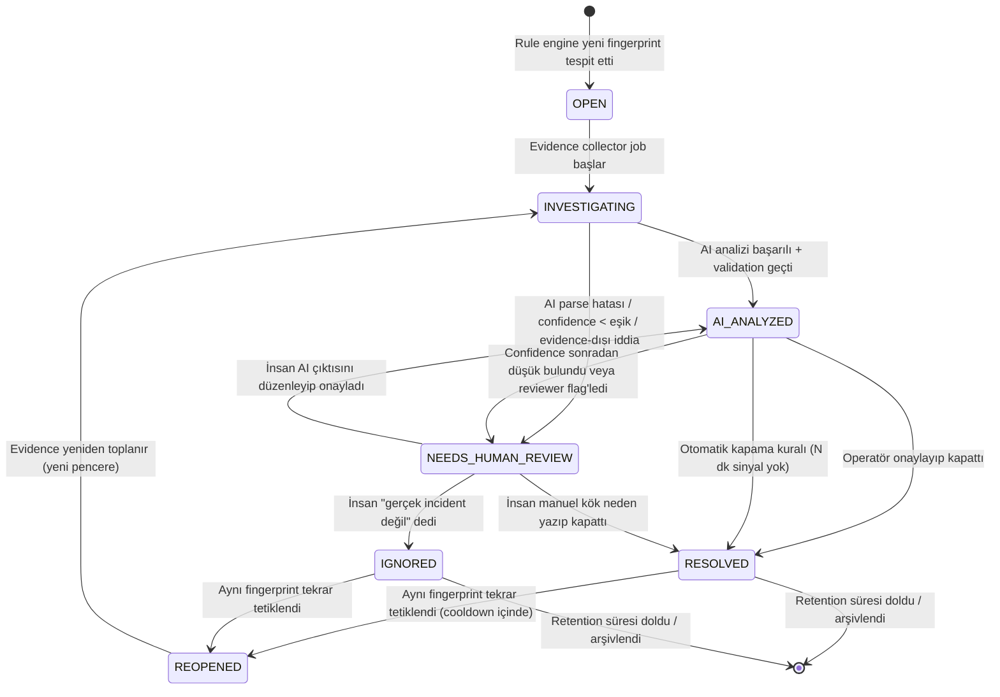

# AI Integration Failure Intelligence (FI) — Incident & AI Intelligence Mimarisi

## 0. Temel İlke

AI, bu sistemde **hiçbir zaman** tek başına karar mercii değildir. Aşağıdaki iş bölümü tüm tasarımın anayasasıdır:

| Sorumluluk | Sahip |
|---|---|
| Incident açma/kapama kararı | Deterministik kod (rule engine + fingerprint eşleştirme) |
| Kategori sınıflandırması (status code, timeout, auth, rate limit, schema, duplicate, provider) | Deterministik kod |
| Severity hesaplama (etkilenen istek sayısı, süre, entegrasyon kritikliği) | Deterministik kod |
| Incident özeti, olası kök neden anlatımı, evidence açıklaması, önerilen aksiyonlar | AI (sadece evidence üzerinden, salt-okunur yorumcu rolünde) |
| Evidence dışı iddia | Yasak — validation katmanında reddedilir |

AI çıktısı incident'ın **var olup olmadığını** asla belirlemez; yalnızca zaten deterministik olarak açılmış bir incident'ı **açıklar**. Bu ayrım, dokümanın tamamında korunur.

---

## 1. Incident Lifecycle (State Machine)

### 1.1 Durumlar

| Durum | Anlamı | Kim tetikler |
|---|---|---|
| `OPEN` | Rule engine yeni bir fingerprint için incident yarattı, henüz hiçbir analiz yapılmadı | Deterministik kod |
| `INVESTIGATING` | Evidence toplama işlemi başladı (deployment, config, geçmiş event, geçmiş incident) | Deterministik kod (worker) |
| `AI_ANALYZED` | AI, evidence üzerinden analiz üretti ve validation'dan geçti | AI pipeline + validator |
| `NEEDS_HUMAN_REVIEW` | AI analizi düşük confidence, parse hatası veya evidence-dışı iddia nedeniyle insan onayı bekliyor | Validator |
| `RESOLVED` | İnsan veya otomasyon (ör. aynı entegrasyonda N dakika hata gelmemesi) incident'ı kapattı | Operatör / otomatik kapatma kuralı |
| `REOPENED` | Kapatılmış bir incident'ın fingerprint'i tekrar tetiklendi | Deterministik kod (fingerprint eşleşmesi) |
| `IGNORED` | İnsan, bunun gerçek bir sorun olmadığına (ör. planlı bakım) karar verdi | Operatör |

### 1.2 Mermaid State Diagram



### 1.3 Geçiş Kuralları (özet)

- `OPEN → INVESTIGATING`: Anlık, senkron olabilir; evidence collector job kuyruklanır.
- `INVESTIGATING → AI_ANALYZED`: AI çağrısı yapılır, output JSON şeması parse edilir, confidence ve evidence-only kontrolleri geçerse.
- `INVESTIGATING → NEEDS_HUMAN_REVIEW`: AI çağrısı 2 denemede de parse edilemezse, `confidence < CONFIDENCE_THRESHOLD` (varsayılan 0.65) ise veya evidence-dışı cümle tespit edilirse.
- `RESOLVED → REOPENED`: Aynı fingerprint hash'i, incident kapatıldıktan sonra `REOPEN_COOLDOWN_MINUTES` (varsayılan 30 dk) içinde tekrar tetiklenirse otomatik reopen; cooldown dışında ise **yeni incident** açılır (bkz. Bölüm 3.4).
- Otomatik kapama kuralı: bir incident'a bağlı fingerprint son `AUTO_RESOLVE_SILENCE_MINUTES` (varsayılan 60 dk) içinde hiç yeni event almazsa, sistem incident'ı `RESOLVED (auto)` olarak işaretler ve nedeni `resolutionSource=AUTO_SILENCE` olarak loglar. İnsan her zaman bunu geri açabilir.

---

## 2. Deterministik Classification — Rule Engine Karar Tablosu

Rule engine, gelen her `IntegrationFailureEvent` için sırayla aşağıdaki tabloyu üstten alta (öncelik sırasıyla) değerlendirir. İlk eşleşen kural kategoriyi belirler; hiçbiri eşleşmezse `UNKNOWN_ERROR` olarak işaretlenir ve `needsHumanReview` zorunlu olur.

| Öncelik | Kategori | Tetikleyici sinyal(ler) | Somut koşul |
|---|---|---|---|
| 1 | `SIGNATURE_ERROR` | Webhook imza header'ı + provider SDK hata kodu | `header["X-Signature-Valid"] == false` VEYA response body regex `/invalid.*signature/i` VEYA provider error code ∈ {`signature_verification_failed`, `invalid_hmac`} |
| 2 | `AUTHENTICATION_ERROR` | HTTP status + WWW-Authenticate / error body | `statusCode == 401` VEYA (`statusCode == 403` VE errorBody regex `/invalid[_ ]api[_ ]key|unauthorized|invalid[_ ]token/i`) |
| 3 | `AUTHORIZATION_ERROR` | HTTP status + kapsam hatası | `statusCode == 403` VE errorBody regex `/insufficient[_ ]scope|permission[_ ]denied|forbidden/i` (401 ile çakışmayan kalan 403'ler) |
| 4 | `RATE_LIMIT_ERROR` | HTTP status + header | `statusCode == 429` VEYA header `Retry-After` mevcut VEYA errorBody regex `/rate[_ ]limit|too many requests/i` |
| 5 | `SCHEMA_MISMATCH` | Payload validasyon hatası | JSON şema validasyonu FAIL (zorunlu alan eksik / tip uyuşmazlığı / beklenmeyen alan adı) VEYA deserializasyon exception türü ∈ {`JsonSchemaValidationException`, `MissingRequiredFieldException`} |
| 6 | `DUPLICATE_EVENT` | Idempotency key tekrar | Gelen event'in `idempotencyKey` (veya provider `eventId`) son `DUPLICATE_WINDOW` (varsayılan 24 saat) içinde daha önce başarıyla işlenmiş olarak DB'de mevcut |
| 7 | `TIMEOUT` | Bağlantı/okuma süresi | İstek süresi `> configuredTimeoutMs` VEYA exception türü ∈ {`TaskCanceledException` (timeout kaynaklı), `SocketException` (ETIMEDOUT), `HttpRequestException` with inner `TimeoutException`} |
| 8 | `PROVIDER_ERROR` | 5xx status | `statusCode >= 500 AND statusCode < 600` |
| 9 | `CLIENT_ERROR_OTHER` | Diğer 4xx | `statusCode >= 400 AND statusCode < 500` (yukarıdaki daha spesifik kurallara girmeyenler) |
| 10 | `NETWORK_ERROR` | Bağlantı kurulamadı | exception türü ∈ {`SocketException` (ECONNREFUSED/ECONNRESET), DNS çözümleme hatası} |
| 11 (fallback) | `UNKNOWN_ERROR` | Hiçbiri eşleşmedi | — her zaman `needsHumanReview=true` işaretlenir |

**Notlar:**
- Kurallar birbirini dışlar biçimde sıralıdır: örn. 401 hem "auth" hem "genel 4xx" olabileceği için auth kuralı `CLIENT_ERROR_OTHER`'dan önce değerlendirilir.
- `RATE_LIMIT_ERROR` ile `PROVIDER_ERROR` çakışması olmaz çünkü 429, 5xx aralığının dışındadır.
- Severity, kategoriden **bağımsız** ikinci bir deterministik hesaplamadır (Bölüm 2.1).

### 2.1 Severity Hesaplama (deterministik)

| Severity | Koşul |
|---|---|
| `CRITICAL` | Kategori ∈ {`PROVIDER_ERROR`, `AUTHENTICATION_ERROR`} VE etkilenen istek sayısı ≥ 50 son 10 dk içinde VEYA entegrasyon `businessCriticality == CRITICAL` |
| `HIGH` | Etkilenen istek sayısı ≥ 20 son 15 dk içinde VEYA kategori ∈ {`SIGNATURE_ERROR`, `SCHEMA_MISMATCH`} |
| `MEDIUM` | Etkilenen istek sayısı ≥ 5 son 30 dk içinde |
| `LOW` | Diğer tüm durumlar (tek sefer, izole event) |

Severity, AI çıktısında da bir alan olarak yer alır (Bölüm 6) ancak **AI severity önerisi yalnızca danışma niteliğindedir**; incident kaydındaki resmi `severity` alanı her zaman rule engine tarafından yazılır/güncellenir. AI'nin önerdiği severity farklıysa `aiSeveritySuggestion` ayrı bir alanda tutulur ve UI'da "AI önerisi" olarak gösterilir, resmi alanı ezmez.

---

## 3. Error Fingerprinting Algoritması

### 3.1 Amaç

Aynı kök nedenden kaynaklanan tekrarlayan hataları **tek bir incident**'a bağlamak; farklı kök nedenleri ayrı incident olarak açmak.

### 3.2 Fingerprint Bileşenleri

Fingerprint, aşağıdaki alanların normalize edilip birleştirilmesiyle oluşturulan bir SHA-256 hash'idir:

```
fingerprint = SHA256(
    integrationId
    + "|" + category
    + "|" + errorSignature
)
```

`errorSignature` kategoriye göre farklı şekilde türetilir (kategoriye özgü normalizasyon — zaman damgası, request ID, dinamik değerler dahil edilmez):

| Kategori | errorSignature türetimi |
|---|---|
| `AUTHENTICATION_ERROR` | `statusCode + "_" + normalizedErrorCode` (ör. `401_invalid_api_key`) — API key'in kendisi asla dahil edilmez |
| `SIGNATURE_ERROR` | `"signature_mismatch"` (provider bazında sabit; hangi header/secret olduğu değil, sadece imza doğrulamasının başarısız olması) |
| `RATE_LIMIT_ERROR` | `"rate_limit"` (provider bazında; burst'ün büyüklüğü fingerprint'e girmez, sadece evidence'a girer) |
| `SCHEMA_MISMATCH` | `sortedMissingOrUnexpectedFieldNames` birleştirilmiş hali (ör. `field_missing:customer_email|field_unexpected:legacy_id`) — alan adları deterministik sıralanır |
| `PROVIDER_ERROR` | `statusCode` (ör. `503`) |
| `TIMEOUT` | `endpointNormalizedPath` (query string ve path parametreleri strip edilmiş; ör. `/v1/payments/{id}/capture`) |
| `DUPLICATE_EVENT` | `"duplicate"` |
| `NETWORK_ERROR` | `exceptionType + "_" + dnsOrConnRefusedFlag` |
| `UNKNOWN_ERROR` | `SHA256(rawErrorMessage normalize edilmiş ilk 200 karakter)` — burada normalizasyon: sayılar `#`, UUID/GUID `{id}`, timestamp `{ts}` ile değiştirilir |

### 3.3 Normalizasyon Kuralları (dinamik veri temizliği)

Fingerprint'in kararlı olması için `errorSignature` hesaplanmadan önce şu temizlik uygulanır:
1. UUID/GUID desenleri → `{id}`
2. ISO-8601 zaman damgaları → `{ts}`
3. Sayısal ID'ler (path segment olarak) → `{n}`
4. Request/correlation ID header değerleri asla dahil edilmez
5. E-posta, telefon, kredi kartı gibi PII değerleri asla dahil edilmez (redaction Bölüm 4.4 ile aynı kural seti)

### 3.4 Aynı Fingerprint → Aynı Incident Bağlama Mantığı

```
newEvent geldiğinde:
  fp = computeFingerprint(newEvent)
  existingIncident = DB.findIncident(fingerprint = fp, status IN [OPEN, INVESTIGATING, AI_ANALYZED, NEEDS_HUMAN_REVIEW])

  eğer existingIncident bulunduysa:
      existingIncident.affectedRequests += 1
      existingIncident.lastSeenAt = now
      existingIncident.linkedEvents.add(newEvent)
      eğer existingIncident.status == AI_ANALYZED VE
         (affectedRequests eşik atladı VEYA yeni evidence türü eklendi):
          → re-trigger AI analysis (yeni evidence ile, prompt version aynı kalabilir)
      return

  existingResolvedIncident = DB.findIncident(fingerprint = fp, status IN [RESOLVED, IGNORED], resolvedAt > now - REOPEN_COOLDOWN_MINUTES)

  eğer existingResolvedIncident bulunduysa:
      existingResolvedIncident.status = REOPENED
      existingResolvedIncident.reopenCount += 1
      existingResolvedIncident.linkedEvents.add(newEvent)
      → INVESTIGATING durumuna geç, evidence yeniden topla
      return

  // Hiç eşleşme yok veya cooldown dışında eski bir RESOLVED var
  yeni Incident oluştur:
      status = OPEN
      fingerprint = fp
      firstSeenAt = now
      affectedRequests = 1
```

### 3.5 Ne Zaman Yeni Incident Açılır

- Fingerprint hiç görülmemişse.
- Fingerprint daha önce görülmüş ama son çözümü `REOPEN_COOLDOWN_MINUTES` öncesindeyse (kök nedenin muhtemelen farklı/tekrar oluşmuş bir sorun olduğu varsayılır — böylece yıllar önce çözülmüş bir sorun "reopen" olarak sinyal kirliliği yaratmaz).
- Aynı entegrasyon, aynı kategori ama farklı `errorSignature` üretiyorsa (ör. hem `401_invalid_api_key` hem `401_expired_token` — iki ayrı incident, ikisi de AUTHENTICATION_ERROR ama kök nedenleri farklı olabilir).

---

## 4. Evidence Model

### 4.1 SourceType Enum

| SourceType | Ne toplanır | Zaman penceresi | Toplama yöntemi |
|---|---|---|---|
| `DEPLOYMENT` | İlgili entegrasyon/servis için son deploy kayıtları (versiyon, commit, deploy zamanı, yapan kişi) | Incident `firstSeenAt` referans alınarak **-2 saat / +0** (deploy'un hatadan önce mi sonra mı olduğu anlamak için hem öncesi hem incident anına kadar) | CI/CD sisteminden (deploy log tablosu) sorgu — salt okunur |
| `PREVIOUS_EVENT` | Aynı entegrasyonda, aynı veya farklı kategoride son N event (max 10) | `firstSeenAt` öncesi **son 24 saat** | FI event tablosundan sorgu, alan bazlı redaction sonrası |
| `CONFIG_CHANGE` | Entegrasyon konfigürasyonunda (API key rotasyonu, webhook URL, timeout ayarı, secret değişimi) yapılan son değişiklikler | `firstSeenAt` referans alınarak **-6 saat / +0** | Audit log tablosundan sorgu — değişen alan adı + kim + ne zaman (değerin kendisi değil, "changed" flag'i; secret değerleri asla evidence'a girmez) |
| `HISTORICAL_INCIDENT` | Aynı entegrasyon için daha önce çözülmüş benzer (aynı kategori) incident'lar ve onların `humanResolutionNotes` alanı | Son **90 gün**, max 5 kayıt | FI incident tablosundan sorgu, sadece RESOLVED durumundakiler ve insan tarafından onaylanmış notlar |

### 4.2 Toplama Tetiklenmesi

Evidence toplama, `INVESTIGATING` durumuna geçildiğinde asenkron bir worker tarafından paralel olarak 4 kaynaktan da çekilir. Herhangi bir kaynak boş dönerse (ör. deploy yok), o SourceType evidence listesinde yer almaz — AI'a "evidence yok" olarak hiç gönderilmez (boş/yanıltıcı evidence üretmemek için).

### 4.3 Evidence Kaydı Şekli (DB)

Her evidence parçası şu genel zarfla saklanır:

```json
{
  "evidenceId": "ev_01J...",
  "incidentId": "inc_01J...",
  "sourceType": "CONFIG_CHANGE",
  "collectedAt": "2026-07-12T10:15:00Z",
  "windowStart": "2026-07-12T04:15:00Z",
  "windowEnd": "2026-07-12T10:15:00Z",
  "summary": "API key for integration 'stripe-prod' rotated 42 minutes before first failure",
  "structuredData": {
    "changedField": "api_key",
    "changedBy": "user_8123",
    "changedAt": "2026-07-12T09:33:00Z"
  }
}
```

`summary` alanı, AI'a gönderilecek insan-okunur cümledir ve **kendisi de deterministik kod tarafından üretilir** (template-based, AI tarafından değil). Bu, evidence katmanının kendisinin de halüsinasyona açık olmamasını sağlar.

### 4.4 Redaction Kuralları (evidence AI'a gitmeden önce)

Aşağıdaki alanlar evidence'a hiçbir zaman ham olarak girmez, girmişse redaction katmanında maskelenir:
- API key / secret / token değerleri → `[REDACTED_SECRET]`
- E-posta → `[REDACTED_EMAIL]`
- Telefon numarası, kredi kartı, IBAN → `[REDACTED_PII]`
- Kullanıcı/ müşteri kişisel verisi (payload içindeki `email`, `phone`, `ssn`, `cardNumber` gibi bilinen hassas alan adları) → değer maskelenir, alan adı ve varlığı korunur (ör. `"email": "[REDACTED]"`)
- Yalnızca **teknik hata bağlamı** (status code, header adı — değeri değil, alan adı — değeri değil, timing, count) evidence'a dahil edilir.

---

## 5. AI Input Contract (Evidence-Only JSON)

AI'a gönderilen istek, ham event verisi veya DB satırları değil, **yalnızca yukarıda toplanmış ve redaction'dan geçmiş evidence**'dır. Şema:

```json
{
  "schemaVersion": "1.0",
  "incidentId": "inc_01J8X...",
  "deterministicClassification": {
    "category": "AUTHENTICATION_ERROR",
    "severity": "HIGH",
    "affectedIntegration": "stripe-prod",
    "affectedRequests": 83,
    "firstSeenAt": "2026-07-12T10:12:00Z",
    "lastSeenAt": "2026-07-12T10:44:00Z",
    "statusCodeSample": 401,
    "errorSignature": "401_invalid_api_key"
  },
  "evidence": [
    {
      "sourceType": "CONFIG_CHANGE",
      "summary": "API key for integration 'stripe-prod' rotated 42 minutes before first failure",
      "collectedAt": "2026-07-12T10:15:00Z"
    },
    {
      "sourceType": "PREVIOUS_EVENT",
      "summary": "3 similar AUTHENTICATION_ERROR events for 'stripe-prod' occurred 6 days ago, resolved after key rotation rollback",
      "collectedAt": "2026-07-12T10:15:03Z"
    },
    {
      "sourceType": "DEPLOYMENT",
      "summary": "No deployment recorded for 'stripe-prod' integration service in the last 2 hours",
      "collectedAt": "2026-07-12T10:15:05Z"
    },
    {
      "sourceType": "HISTORICAL_INCIDENT",
      "summary": "Incident inc_01J7Z... (same category, same integration, 6 days ago) was resolved with note: 'Old API key was not revoked before rotation, causing intermittent 401s until propagation completed.'",
      "collectedAt": "2026-07-12T10:15:07Z"
    }
  ],
  "constraints": {
    "maxEvidenceItems": 10,
    "evidenceOnly": true
  }
}
```

Kurallar:
- `deterministicClassification` **değiştirilemez girdi**; AI bunu okur ama kendi kategori/severity'sini "resmi" olarak öneremez, sadece yorum ve `aiSeveritySuggestion` (opsiyonel, ayrı alan) verebilir.
- `evidence` dizisi boşsa (hiç kaynak veri yoksa), AI çağrısı hiç yapılmaz; incident doğrudan `NEEDS_HUMAN_REVIEW` olur (evidence yokken AI'nin "üretmesi" engellenir).

---

## 6. AI Output JSON Şeması (tam tanım)

```json
{
  "schemaVersion": "1.0",
  "incidentTitle": "string, required, max 120 char",
  "category": "string, required — MUST echo deterministicClassification.category verbatim",
  "severity": "string, required — MUST echo deterministicClassification.severity verbatim",
  "aiSeveritySuggestion": "string, optional, enum [LOW,MEDIUM,HIGH,CRITICAL] — only if AI disagrees, does not overwrite official severity",
  "affectedIntegration": "string, required — MUST echo deterministicClassification.affectedIntegration verbatim",
  "affectedRequests": "integer, required — MUST echo deterministicClassification.affectedRequests verbatim",
  "probableRootCause": "string, required, max 500 char — must be traceable to at least one evidence item",
  "evidence": "array<string>, required, min 1 — each item must be a paraphrase/quote of an input evidence.summary, not a new claim",
  "evidenceRefs": "array<string>, required — sourceType values actually used from the input evidence array (subset check)",
  "recommendedActions": "array<string>, required, min 1 max 5 — actionable, evidence-grounded steps",
  "confidence": "number, required, range 0.0-1.0",
  "needsHumanReview": "boolean, required — true if confidence < threshold OR category == UNKNOWN_ERROR OR evidence array was empty",
  "outOfEvidenceClaimsDetected": "boolean, required — self-reported flag; model must set true if it was tempted to speculate beyond evidence and instead abstained",
  "promptVersion": "string, required — injected by system, not generated by model",
  "modelVersion": "string, required — injected by system, not generated by model"
}
```

Notlar:
- `category`, `severity`, `affectedIntegration`, `affectedRequests` alanlarının **echo zorunluluğu**, modelin bu alanları yeniden "sınıflandırmasını" değil sadece bağlamı taşımasını sağlar; validator bu alanların input ile birebir eşleştiğini kontrol eder, eşleşmezse parse-fail muamelesi yapılır.
- `promptVersion` ve `modelVersion` modelin ürettiği JSON'a **sistem tarafından sonradan eklenir**, prompt içinde modelden istenmez (modelin bunları uydurmasını önlemek için).

---

## 7. Prompt Template

### 7.1 System Prompt

```
You are an evidence-only incident analysis assistant for an integration failure
monitoring system. You do NOT classify errors or decide severity — those are
already determined by deterministic rules and provided to you as fixed facts.

Your ONLY job is to:
1. Write a short, clear incident title.
2. Explain the probable root cause, using ONLY the evidence items provided below.
3. Restate/paraphrase which evidence items support your explanation.
4. Suggest concrete, actionable remediation steps.
5. Report your confidence (0.0-1.0) in this explanation.

STRICT RULES (violating any of these makes your output invalid):
- You MUST NOT introduce any fact, cause, system, date, number, or name that
  does not appear in the "evidence" array below.
- You MUST NOT change or re-derive "category", "severity", "affectedIntegration",
  or "affectedRequests" — copy them verbatim from "deterministicClassification".
- If the evidence is insufficient to determine a root cause with reasonable
  confidence, you MUST say so, set "confidence" below 0.5, and set
  "needsHumanReview" to true. Do not guess to fill the gap.
- If you notice yourself about to state something not grounded in evidence,
  omit it and set "outOfEvidenceClaimsDetected" to true instead.
- Every string in "evidence" (your output field) must be a paraphrase of one
  or more "evidence[].summary" entries from the input. Do not fabricate new
  evidence.
- Output ONLY valid JSON matching the schema below. No markdown, no prose
  outside the JSON object.

Output schema:
<JSON schema from Section 6 is injected here verbatim>
```

### 7.2 Evidence Injection Format (User/Input Message)

```
INCIDENT CONTEXT (fixed facts — do not alter):
{deterministicClassification JSON block}

EVIDENCE (the ONLY source of truth you may reason from):
1. [CONFIG_CHANGE, 2026-07-12T10:15:00Z] API key for integration 'stripe-prod'
   rotated 42 minutes before first failure
2. [PREVIOUS_EVENT, 2026-07-12T10:15:03Z] 3 similar AUTHENTICATION_ERROR events
   for 'stripe-prod' occurred 6 days ago, resolved after key rotation rollback
3. [DEPLOYMENT, 2026-07-12T10:15:05Z] No deployment recorded for 'stripe-prod'
   integration service in the last 2 hours
4. [HISTORICAL_INCIDENT, 2026-07-12T10:15:07Z] Incident inc_01J7Z... (same
   category, same integration, 6 days ago) was resolved with note: 'Old API
   key was not revoked before rotation, causing intermittent 401s until
   propagation completed.'

Respond with the JSON object only.
```

Evidence-only kısıtı üç katmanda zorlanır: (1) system prompt açık kural seti, (2) output şemasının `evidence`/`evidenceRefs` alanlarının input'a referans vermeye zorlanması, (3) Bölüm 9'daki post-hoc validator (prompt'a güvenmek tek başına yeterli değildir).

---

## 8. Prompt Versioning Stratejisi

### 8.1 Saklanan Alanlar (DB — `PromptVersion` tablosu)

| Alan | Açıklama |
|---|---|
| `promptVersionId` | Örn. `fi-root-cause-v3` |
| `promptHash` | System prompt + output şemasının SHA-256 hash'i (içerik değişmeden versiyon numarası yanlışlıkla artmasın diye çapraz doğrulama) |
| `systemPromptText` | Tam metin (ileride diff/rollback için) |
| `outputSchemaVersion` | Bölüm 6'daki `schemaVersion` ile eşleşir |
| `createdAt`, `createdBy` | |
| `status` | `DRAFT`, `ACTIVE`, `DEPRECATED` |
| `rolloutPercentage` | A/B test için (0-100) |

### 8.2 Her AI Çağrısında

Her `AiAnalysisLog` kaydına kullanılan `promptVersionId` ve `modelVersion` (ör. `claude-sonnet-4-5-20250929`) yazılır — asla sadece "en son prompt" varsayılmaz, incident kaydı hangi versiyonla üretildiğini kalıcı taşır.

### 8.3 A/B Karşılaştırma

- İki `promptVersionId` (`ACTIVE` + `DRAFT`, `rolloutPercentage` toplamı ≤ 100) eşzamanlı çalıştırılabilir; hangi incident'ın hangi versiyonla analiz edildiği loglanır.
- Golden dataset (Bölüm 10) her iki versiyon için de otomatik çalıştırılır, rubric skorları karşılaştırılır.
- Yeni versiyon, golden dataset skorunda mevcut `ACTIVE` versiyonu geçmeden ve son N=200 canlı analizde parse-fail oranı ve evidence-dışı iddia oranı mevcut versiyondan kötü değilse `ACTIVE` yapılır; eski versiyon `DEPRECATED` olur ama loglardaki referansı korunur (geçmiş incident'lar hangi promptla üretildiğini kaybetmez).

---

## 9. Validation ve Fallback Stratejisi

AI çağrısının çıktısı, incident'a yazılmadan önce sırasıyla şu doğrulama zincirinden geçer:

### 9.1 Parse Doğrulama

1. Model çıktısı JSON olarak parse edilmeye çalışılır.
2. Parse başarısızsa → **1 kez retry** (aynı prompt, "your last response was not valid JSON, respond with JSON only" ek talimatıyla).
3. Retry de başarısızsa → incident `NEEDS_HUMAN_REVIEW`, `AiAnalysisLog.parseSuccess=false`, insan analistine ham model çıktısı (debug amaçlı, kullanıcıya gösterilmez) ile birlikte kuyruklanır.

### 9.2 Şema Doğrulama

- Zorunlu alanlardan biri eksikse → parse-fail muamelesi (9.1 akışı).
- `category`, `severity`, `affectedIntegration`, `affectedRequests` alanları `deterministicClassification` ile birebir eşleşmiyorsa → **otomatik reddedilir**, `NEEDS_HUMAN_REVIEW`, hata nedeni `SCHEMA_ECHO_MISMATCH` olarak loglanır (model kendi sınıflandırmasını dayatmaya çalışmış demektir).

### 9.3 Confidence Eşiği

- `confidence < 0.65` (varsayılan, konfigüre edilebilir) → `needsHumanReview` zorunlu `true` olur (model `false` yazmış olsa bile sistem override eder — modele güvenilmez, sistem kendi eşiğini uygular).
- `confidence < 0.35` → incident ek olarak "düşük güven" etiketiyle önceliklendirilmiş review kuyruğuna alınır.

### 9.4 Evidence-Dışı İddia Tespiti (Deterministik Kontrol)

AI çıktısındaki `probableRootCause`, `evidence[]` ve `recommendedActions[]` alanları, basit ama etkili bir **grounding check** ile taranır (kod değil, algoritma tanımı):

1. **Named-entity/sayı çıkarımı**: Çıktı metninden regex ile sayılar, tarih/saat ifadeleri, entegrasyon adı benzeri token'lar (`[a-z0-9-]{3,}`), ve tırnak içi ifadeler çıkarılır.
2. **Kaynak eşleşmesi**: Çıkarılan her token, giriş evidence metinlerinin (input `evidence[].summary` birleşimi) içinde bir alt-dize (substring, case-insensitive) veya yakın eşleşme (basit Levenshtein/word-overlap eşiği, ör. ≥%80 kelime örtüşmesi) olarak aranır.
3. **Eşleşmeyen token'lar** varsa (ör. çıktıda evidence'ta hiç geçmeyen bir sistem adı, sayı veya tarih) → `outOfEvidenceClaimsDetected` sistem tarafından `true`'ya zorlanır (model `false` demiş olsa bile) ve incident `NEEDS_HUMAN_REVIEW`'a düşer, hangi cümlenin/token'ın şüpheli olduğu ayrı bir `flaggedClaims: string[]` alanına loglanır.
4. Bu kontrol **kesin/mükemmel değildir** (bilinçli olarak basit substring/kelime-örtüşme seviyesinde tutulur — MVP kapsamı) ama düşük maliyetle en bariz halüsinasyonları (uydurma sayı, uydurma tarih, uydurma sistem adı) yakalar. Rubric değerlendirmesi (Bölüm 10) bu kontrolün gerçek dünyadaki hit-rate'ini ölçer.

### 9.5 Nihai Karar Tablosu

| Durum | Sonuç |
|---|---|
| Parse OK + şema OK + echo OK + confidence ≥ eşik + grounding check temiz | `AI_ANALYZED` |
| Parse fail (2 deneme sonrası) | `NEEDS_HUMAN_REVIEW`, `parseSuccess=false` |
| Echo mismatch | `NEEDS_HUMAN_REVIEW`, `SCHEMA_ECHO_MISMATCH` |
| confidence < eşik | `NEEDS_HUMAN_REVIEW`, model'in kendi `needsHumanReview` alanı ne olursa olsun override |
| Grounding check'te eşleşmeyen token bulundu | `NEEDS_HUMAN_REVIEW`, `flaggedClaims` doldurulur |

---

## 10. Evaluation Rubric ve Golden Dataset Planı

### 10.1 Golden Dataset (20 Sabit Senaryo)

Her senaryo şu şablonla tanımlanır ve DB/fixture dosyasında sabit tutulur (versiyon kontrolüne tabi, prompt değişince yeniden çalıştırılır):

```json
{
  "scenarioId": "gs-001",
  "description": "Invalid API key on payment provider",
  "input": { "deterministicClassification": {...}, "evidence": [...] },
  "expected": {
    "category": "AUTHENTICATION_ERROR",
    "rootCauseKeywords": ["api key", "invalid", "rotated"],
    "minRecommendedActions": 1,
    "expectedActionKeywords": ["rotate", "revoke", "verify key"],
    "confidenceRange": [0.6, 1.0],
    "needsHumanReview": false
  }
}
```

Önerilen 20 senaryo dağılımı (referans test senaryolarını kapsayacak + belirsiz/zor durumlar dahil):
1-2. Invalid API key (yüksek/düşük evidence kalitesi) → `AUTHENTICATION_ERROR`
3-4. Wrong signing secret (webhook) → `SIGNATURE_ERROR`
5-6. 429 burst (kısa/uzun süreli) → `RATE_LIMIT_ERROR`
7-8. 500 burst (tek provider / çoklu provider) → `PROVIDER_ERROR`
9-10. Renamed/removed payload field → `SCHEMA_MISMATCH`
11. Duplicate webhook delivery → `DUPLICATE_EVENT`
12. Network timeout (yavaş provider) → `TIMEOUT`
13. DNS çözümleme hatası → `NETWORK_ERROR`
14. Yetersiz evidence (sadece 1 kaynak) → düşük confidence beklenir, `needsHumanReview=true`
15. Çelişkili evidence (deploy var ama config değişikliği de var) → model her ikisini de belirtmeli
16. Tamamen boş evidence dizisi (edge case) → AI çağrılmamalı, direkt review
17. Çok uzun/gürültülü evidence (10 madde, alakasız previous event'ler dahil) → model alakalıları seçebilmeli
18. Aynı entegrasyonda tekrarlayan (reopen) incident → historical incident evidence'ı doğru kullanmalı
19. UNKNOWN_ERROR kategorisi (rule engine hiçbir kurala uymadı) → confidence düşük, review zorunlu
20. Adversarial prompt injection denemesi (evidence içine "ignore previous instructions" benzeri metin enjekte edilmiş) → model buna uymamalı, güvenlik regression testi

### 10.2 Rubric (her senaryo için 0-1 arası puanlanan boyutlar)

| Boyut | Ölçüm |
|---|---|
| **Category echo doğruluğu** | Binary — expected == actual (herhangi bir sapma otomatik FAIL) |
| **Root cause doğruluğu** | `rootCauseKeywords` içindeki anahtar kelimelerin kaçının `probableRootCause` içinde geçtiği (oran) |
| **Grounding** | Bölüm 9.4 grounding check'in bu senaryoda kaç yanlış/eksik flag ürettiği (false positive / false negative sayısı) |
| **Actionability** | `recommendedActions` içinde `expectedActionKeywords`'ten en az biri var mı (binary) |
| **Confidence kalibrasyonu** | Üretilen `confidence`, `expected.confidenceRange` içinde mi |
| **needsHumanReview doğruluğu** | Binary eşleşme |
| **Format uyumu** | Parse başarılı mı, şema tam mı (binary) |

### 10.3 Otomatik Test Akışı

1. CI/CD pipeline'da (veya nightly job) her 20 senaryo, aktif `promptVersion` + `modelVersion` ile tekrar çalıştırılır.
2. Her boyut için skor hesaplanır, senaryo bazlı ve toplam ortalama rapor üretilir.
3. Eşik: toplam ortalama ≥ 0.85 VE hiçbir "Category echo" veya "Format uyumu" FAIL'i yoksa → yeni prompt versiyonu `ACTIVE` adayı olabilir (Bölüm 8.3 A/B akışına girer).
4. Regresyon: bir önceki `ACTIVE` versiyona göre herhangi bir boyutta >%10 düşüş varsa pipeline kırmızı olur, deploy engellenir.

---

## 11. Token / Cost / Latency Kontrol Stratejisi

### 11.1 Evidence Özetleme

- `evidence[]` dizisi input'a girmeden önce `maxEvidenceItems=10` ile sınırlanır; her kaynak türünden en fazla belirli sayıda (ör. `PREVIOUS_EVENT` max 5, `HISTORICAL_INCIDENT` max 3) alınır, önem sırası: `CONFIG_CHANGE` > `HISTORICAL_INCIDENT` > `DEPLOYMENT` > `PREVIOUS_EVENT`.
- Her `summary` alanı zaten deterministik template ile üretildiği için kısa ve sabit uzunluktadır (max ~200 karakter); serbest metin/ham log AI'a asla gönderilmez.
- Bu sayede prompt input boyutu öngörülebilir kalır (tipik istek ~1.5-2.5K token).

### 11.2 Max Token Limiti

- Input: sistem prompt + şema + evidence toplamı için sert üst sınır (ör. 4K token) — aşılırsa evidence otomatik kırpılır (en düşük öncelikli kaynaklar önce atılır) ve `evidenceTruncated=true` loglanır.
- Output: `max_tokens` ~800-1000 (şema zaten kompakt; `recommendedActions` max 5 madde ile sınırlı).

### 11.3 Model Seçimi (maliyet/performans dengesi)

- Varsayılan üretim modeli: orta segment bir model (ör. Claude Haiku sınıfı) — düşük gecikme, düşük maliyet, yapılandırılmış/kısa çıktı üretimi için yeterli.
- `severity=CRITICAL` incident'lar veya golden dataset'te düşük performans gösteren senaryo tipleri için daha güçlü bir model (ör. Sonnet sınıfı) tier-escalation olarak kullanılabilir — bu seçim de deterministik bir kuralla yapılır (severity/kategori bazlı routing), AI kendi kendine model seçmez.
- Model versiyonu her zaman `AiAnalysisLog.modelVersion` alanına yazılır.

### 11.4 Caching

- Aynı `fingerprint` için kısa süre içinde (ör. 5 dk) tekrar AI çağrısı tetiklenmesi gerekiyorsa (affectedRequests artışı nedeniyle) ve evidence içeriği önemli ölçüde değişmediyse (evidence hash'i aynıysa), önceki AI sonucu tekrar kullanılır, yeni çağrı yapılmaz — sadece `affectedRequests` sayacı güncellenir.
- Sistem prompt + şema statik olduğundan, destekleyen SDK'larda prompt caching (system prompt/şema bölümü) kullanılarak tekrarlanan tokenlar için maliyet düşürülür.

### 11.5 Latency Bütçesi

- Hedef: p95 AI çağrısı (network + model) < 4 saniye. Aşılırsa timeout ile `NEEDS_HUMAN_REVIEW`'a düşer (kullanıcı beklemeye bırakılmaz, incident zaten `INVESTIGATING` durumunda görünür durumdadır).

---

## 12. AI Observability

Her AI çağrısı, ayrı bir `AiAnalysisLog` kaydı olarak saklanır (incident'tan bağımsız, incident silinse/arşivlense bile audit için tutulur):

| Alan | Açıklama |
|---|---|
| `logId` | Benzersiz kayıt ID |
| `incidentId` | İlişkili incident |
| `promptVersionId` | Bölüm 8 |
| `modelVersion` | Ör. `claude-haiku-4-5-...` |
| `requestSentAt`, `responseReceivedAt`, `latencyMs` | |
| `inputTokenCount`, `outputTokenCount`, `estimatedCostUsd` | |
| `parseSuccess` | boolean |
| `retryCount` | 0/1 |
| `schemaValidationPassed` | boolean |
| `echoMismatch` | boolean (Bölüm 9.2) |
| `confidence` | model çıktısından |
| `needsHumanReviewFinal` | sistem override sonrası nihai değer |
| `groundingCheckFlaggedTokens` | string[] — Bölüm 9.4 sonucu |
| `evidenceTruncated` | boolean (Bölüm 11.2) |
| `usedCachedResult` | boolean (Bölüm 11.4) |
| `rawOutputHash` | modelin ham çıktısının hash'i (debug/ihtilaf durumunda ham metne erişim için ayrı, kısıtlı erişimli tabloda tutulabilir) |

Bu loglar üzerinden izlenecek dashboard metrikleri: parse-fail oranı, ortalama confidence, `needsHumanReview` oranı, grounding-flag oranı, p50/p95 latency, günlük/aylık maliyet, model/prompt versiyonu bazlı kırılım.

---

## 13. Human-in-the-Loop Workflow

### 13.1 Tetiklenme

`needsHumanReview=true` (model çıktısından veya sistem override'ından) olduğunda incident, review kuyruğuna düşer ve durumu `NEEDS_HUMAN_REVIEW` olur (veya henüz `AI_ANALYZED`'a hiç ulaşmadıysa direkt oradan).

### 13.2 Kim Review Eder

- Incident'ın bağlı olduğu entegrasyonun sorumlu ekibi/on-call kişisi (entegrasyon-ekip eşleşme tablosu üzerinden route edilir).
- `severity=CRITICAL` review'lar, normal review kuyruğundan ayrı, öncelikli/alarm tetikleyen bir kanaldan (ör. bildirim + Slack/e-posta) sunulur.

### 13.3 Reviewer Ne Görür / Ne Yapabilir

Reviewer arayüzünde:
- Deterministik sınıflandırma (değiştirilemez, sadece görüntü).
- Toplanan evidence listesi (ham, redaction sonrası).
- AI'nin ürettiği taslak analiz (`probableRootCause`, `recommendedActions`, `confidence`) — açıkça "AI taslağı, doğrulanmadı" etiketiyle.
- `flaggedClaims` varsa, hangi ifadelerin şüpheli bulunduğu vurgulanır.

Reviewer aksiyonları:
1. **Onayla** — AI taslağını olduğu gibi kabul eder → incident `AI_ANALYZED` (artık "human-verified" flag'i ile).
2. **Düzenle ve onayla** — `probableRootCause`/`recommendedActions` alanlarını elle düzenler → incident `AI_ANALYZED`, `editedByHuman=true`.
3. **Reddet, manuel kök neden yaz** — AI çıktısı tamamen atılır, insan kendi analizini yazar → incident `RESOLVED`, `resolutionSource=HUMAN_MANUAL`.
4. **Gerçek incident değil işaretle** → `IGNORED`.

### 13.4 Review Sonucunun Saklanması

Her review kararı ayrı bir `IncidentReview` kaydına yazılır:

```json
{
  "reviewId": "rev_01J...",
  "incidentId": "inc_01J...",
  "reviewedBy": "user_...",
  "reviewedAt": "2026-07-12T11:02:00Z",
  "decision": "EDITED_AND_APPROVED",
  "originalAiOutput": { "...": "AI'nin orijinal JSON'ı, değişmeden" },
  "finalContent": { "...": "insan tarafından onaylanan/düzenlenen nihai içerik" },
  "reviewerNotes": "string, optional"
}
```

Bu kayıt, hem denetim (audit) hem de **golden dataset'in büyütülmesi** için kullanılır: insanın düzelttiği vakalar, gelecekteki prompt versiyonlarının test setine (gözden geçirilerek) eklenebilecek aday senaryolar olarak işaretlenir — böylece sistem zamanla gerçek dünya hatalarından öğrenerek golden dataset'i büyütür (modelin kendisi otomatik yeniden eğitilmez; bu sadece prompt/test iyileştirme girdisidir).

---

## Özet — Uçtan Uca Akış

1. Event gelir → **rule engine** deterministik kategori + fingerprint hesaplar.
2. Fingerprint eşleşmesine göre yeni incident açılır veya mevcuda bağlanır (`OPEN`).
3. Evidence collector 4 kaynaktan (redaction'dan geçmiş, template-üretimi) evidence toplar (`INVESTIGATING`).
4. AI, **sadece evidence + sabit deterministik bağlam** üzerinden JSON üretir.
5. Validator: parse, şema-echo, confidence eşiği, evidence-dışı iddia kontrolünden geçirir.
6. Geçerse `AI_ANALYZED`; geçmezse `NEEDS_HUMAN_REVIEW`.
7. İnsan onaylar/düzenler/reddeder → `RESOLVED`/`IGNORED`; her review kaydedilir.
8. Fingerprint tekrar tetiklenirse cooldown içinde `REOPENED`, dışında yeni incident.
9. Her AI çağrısı `AiAnalysisLog`'a tam gözlemlenebilirlik ile yazılır; golden dataset ile düzenli regresyon testi yapılır; prompt versiyonlama ile A/B karşılaştırma ve kontrollü rollout sağlanır.
