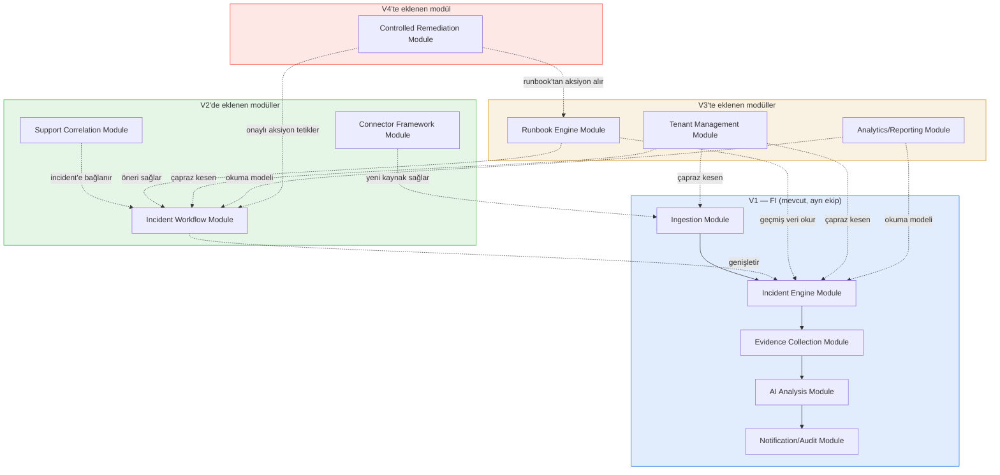
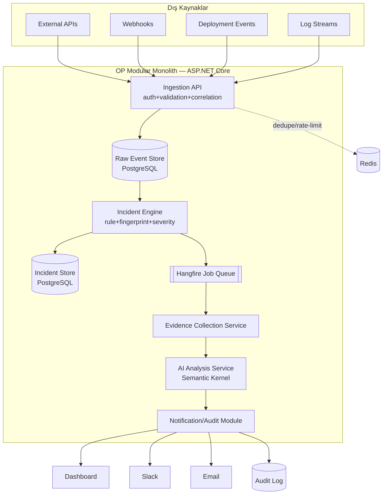
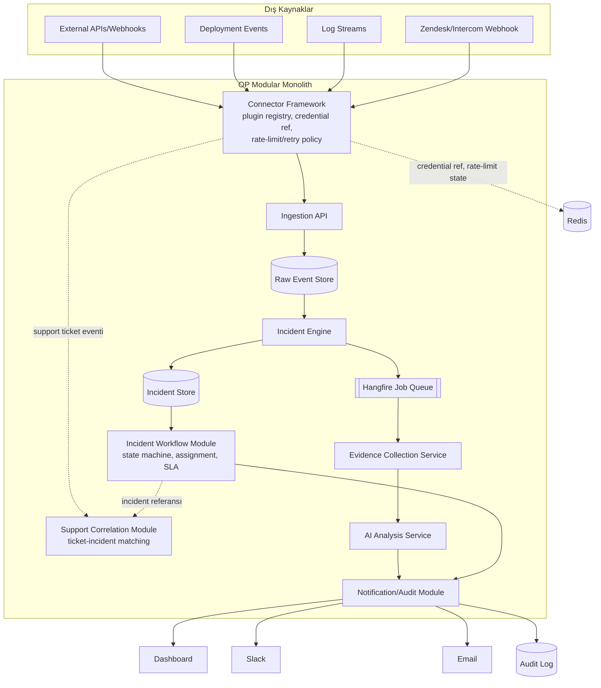
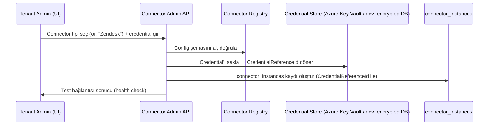
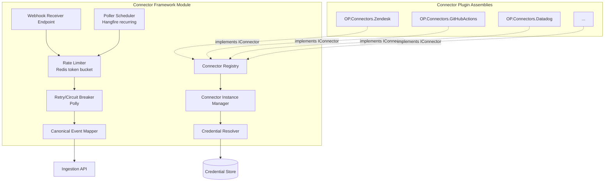
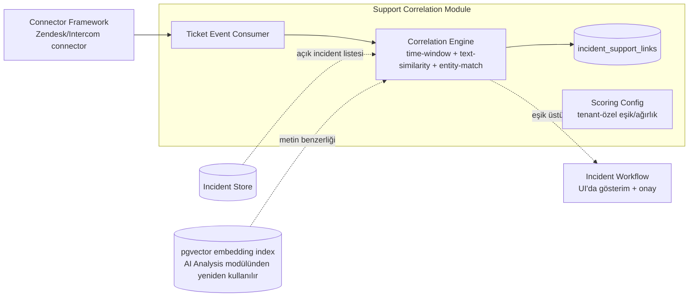
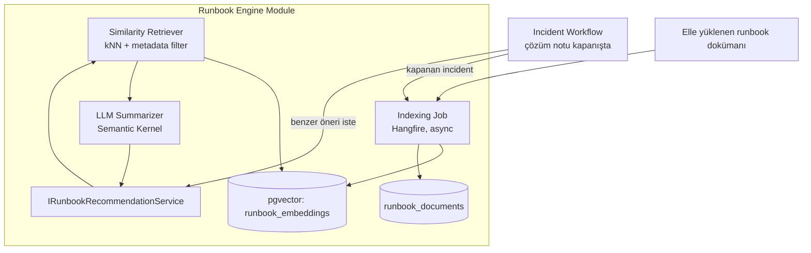
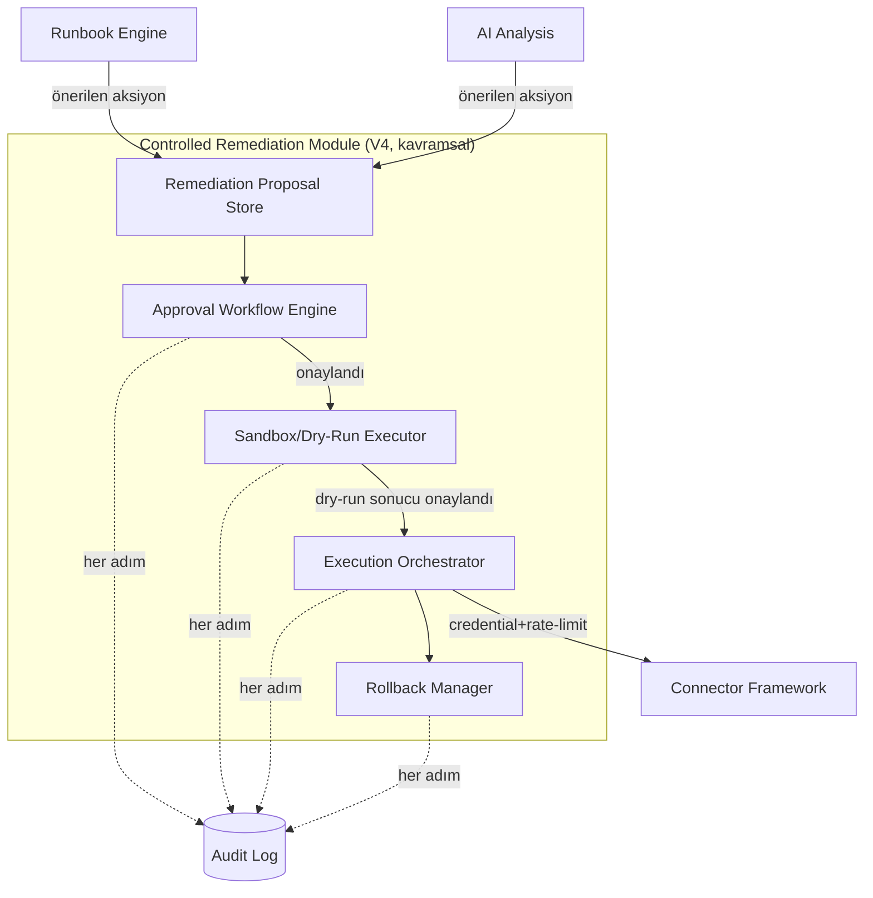
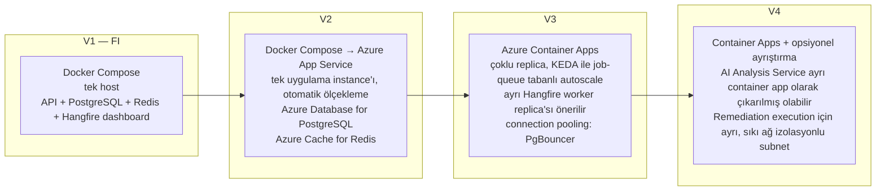
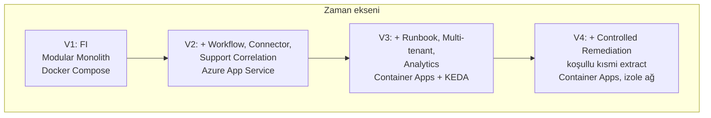

# AI Integration Operations Platform (OP) — Sistem Mimarisi (V1 → V4 Evrimi)

**Doküman durumu:** Taslak — Platform mimarisi (V2, V3, V4)
**Kapsam dışı:** V1 "AI Integration Failure Intelligence" (FI) ürününün kendi iç mimarisi ayrı bir ekip tarafından yürütülüyor; bu doküman FI'yi sabit bir temel (foundation) olarak kabul eder ve **üzerine nasıl inşa edileceğini** tasarlar.
**Kritik ilke:** Modular Monolith V1'den itibaren varsayılan mimari stildir. Microservice'e geçiş bir hedef değil, kanıtlanmış somut bir ihtiyaca verilen cevaptır. Bu doküman boyunca "modül" kelimesi, aksi belirtilmedikçe **aynı process içinde çalışan, bağımsız deploy edilmeyen bir bounded context**'i ifade eder.

---

## 1. Bağlam ve Kapsam

FI (V1), OP platformunun ilk üretim sürümüdür ve şu akışı MVP kapsamında kurar:

```
[External APIs/Webhooks/Deployments/Logs]
   → [Ingestion API] (auth + validation + correlation)
   → [Raw Event Store]
   → [Incident Engine] (rule + fingerprint + severity)
   → [Incident Store]
   → [Background Job Queue]
   → [Evidence Collection Service]
   → [AI Analysis Service]
   → [Dashboard / Slack / Email / Audit]
```

OP'nin uzun vadeli vizyonu bu boru hattını dört eksende genişletmektir:

| Faz | Odak | Yeni yetenek |
|---|---|---|
| V1 (FI) | Failure Intelligence | Tespit + kök neden analizi (salt-okunur, insan aksiyon alır) |
| V2 | Operasyonelleştirme | Incident Workflow, Connector Framework, Support Correlation |
| V3 | Ölçek + Zeka | Runbook Engine, çoklu tenant, analytics |
| V4 | Otomasyon | Controlled Remediation (kontrollü, onaylı, geri alınabilir aksiyon) |

Bu doküman V2-V4'ün FI üzerine **nasıl eklemleneceğini**, hangi yeni bounded context'lerin doğacağını ve platformun ne zaman/nasıl microservice'e evrilebileceğini tanımlar.

---

## 2. Mimari Evrim İlkeleri

1. **Eklemleme, yeniden yazma değil.** Her yeni faz, FI'nin mevcut modüllerine yeni modüller ekler veya mevcut modüllerin arayüzlerini genişletir. FI'nin Ingestion → Raw Event Store → Incident Engine → Incident Store omurgası V4'e kadar değişmeden kalır.
2. **Bounded context'ler baştan ayrışık tasarlanır, deploy birimi olarak değil.** Modular Monolith içinde her modül kendi şemasına (PostgreSQL schema), kendi public interface'ine (C# interface + DTO) ve kendi arka plan job'larına (Hangfire) sahiptir. Modüller birbirine doğrudan repository/DbContext üzerinden değil, **application service interface'leri** üzerinden erişir.
3. **Veri sahipliği net olmalı.** Her yeni modül kendi tablolarının tek sahibidir; başka modül onun tablosuna doğrudan yazmaz. Cross-module okuma, ya event (Outbox/MediatR notification) ya da explicit query service üzerinden olur.
4. **Yamalar için "genişletici nokta" bırakılır.** FI tasarımında zaten var olması beklenen genişletme noktaları: Incident Engine'in kural motoru plugin'lenebilir olmalı, Ingestion API'nin auth katmanı kaynak-tipine göre strateji seçebilmeli. OP bu noktaları kullanarak Connector Framework ve Support Correlation'ı ekler.
5. **Senkron çağrı sayısı düşük tutulur.** Modüller arası iletişim tercihen event-driven (in-process domain event + Hangfire ile async iş) olur; bu, ileride bir modülü ayrı servise çıkarmayı (extract) ucuzlaştırır.

---

## 3. V1 → V4 Modül Haritası (Bounded Context Evrimi)



**Yeni doğan bounded context'ler ve gerekçeleri:**

| Modül | Faz | Neden ayrı bounded context |
|---|---|---|
| Incident Workflow | V2 | FI'deki "Incident" salt-okunur bir kayıttır (tespit edilir, gösterilir). V2 ile incident bir **yaşam döngüsüne** (open → acknowledged → in-progress → resolved → closed, atama, SLA, yorumlar) sahip olur. Bu, Incident Engine'in "tespit" sorumluluğundan tamamen farklı bir "durum yönetimi" sorumluluğudur → ayrı context. |
| Connector Framework | V2 | FI'de kaynak entegrasyonları (webhook alıcılar, log çekiciler) muhtemelen hard-coded/az sayıda. V2'de "N farklı sistemle konuşan, kayıt olabilen, credential yöneten, rate-limit'e uyan" bir soyutlama gerekir → kendi yaşam döngüsü olan bir plugin sistemi, ayrı context. |
| Support Correlation | V2 | Destek (Zendesk/Intercom) verisi hem farklı bir kaynak tipi (Connector Framework'ü kullanır) hem de farklı bir domain kavramı (ticket ↔ incident eşleştirme, müşteri etkisi) taşır → ayrı context, ama Connector Framework'ün üzerine kurulur. |
| Runbook Engine | V3 | Geçmiş incident + doküman bilgisini indeksleyip öneri üreten bir "bilgi motoru"dur; Incident Engine'in kural tabanlı tespit mantığından ayrıdır (retrieval + öneri) → ayrı context. |
| Tenant Management | V3 | Çapraz kesen (cross-cutting) bir concern; kendi başına bir bounded context olarak "tenant, plan, kullanıcı-tenant ilişkisi, tenant ayarları" yönetir, diğer tüm modüllere TenantId sağlar. |
| Analytics/Reporting | V3 | Yazma-ağır (write-heavy) operasyonel modüllerden ayrı, okuma-ağır (read-heavy) bir CQRS-tarzı okuma modelidir → ayrı context, kendi denormalize şeması. |
| Controlled Remediation | V4 | Aksiyon **yürütme** yetkisi, tespit/analiz modüllerinden radikal biçimde farklı bir risk profiline sahiptir (approval, sandbox, rollback, audit zorunlu) → izole, sıkı kontrollü ayrı context. |

---

## 4. Container Diyagramı — V1 (Referans, FI'nin mevcut hali)



---

## 5. Container Diyagramı — V2 (Incident Workflow + Connector Framework + Support Correlation)



**Değişikliklerin FI'ye etkisi:**
- Ingestion API artık doğrudan dış kaynaklarla konuşmaz; **Connector Framework** onun önüne bir soyutlama katmanı koyar (ama Ingestion API'nin auth+validation+correlation sorumluluğu değişmez, sadece "kaynak" artık bir connector'dan gelir).
- Incident Store, salt-okunur bir kayıt olmaktan çıkıp Incident Workflow modülünün üzerine yazdığı bir "durum" kazanır (yeni tablolar: `incident_status_history`, `incident_assignment`, `incident_sla`). **FI'nin incident tablosu şeması değişmez, genişletilir (ek tablo, foreign key ile ilişkilendirilir).**

---

## 6. Connector Framework Mimarisi (V2 — Detay)

### 6.1 Amaç ve Sınırlar

Connector Framework, "dış bir sistemle nasıl konuşulacağını" platformdan izole eden bir **plugin çerçevesidir**. Yeni bir kaynak (ör. PagerDuty, GitHub Actions, Datadog, Zendesk) eklemek, çekirdek Ingestion/Incident mantığına dokunmadan yeni bir connector paketi eklemek anlamına gelmelidir.

### 6.2 Connector Plugin Modeli

- **`IConnector` arayüzü** (çekirdek contract): `ConnectorType`, `Capabilities` (webhook-receiver / poller / both), `ValidateConfigAsync`, `HandleInboundAsync` (webhook için), `PullAsync` (poller için), `MapToRawEventAsync` (kaynağa özgü payload → OP'nin kanonik Raw Event şeması).
- Her connector, **assembly içinde ayrı bir proje** olarak paketlenir (ör. `OP.Connectors.Zendesk`, `OP.Connectors.GitHubActions`). Modular Monolith içinde bunlar derleme zamanında referans olarak eklenir (V1-V2-V3'te gerçek "runtime plugin loading / dinamik DLL yükleme" YAPILMAZ — bu gereksiz karmaşıklıktır; ihtiyaç somutlaşırsa MEF/AssemblyLoadContext değerlendirilir).
- **Connector Registry** (DB tablosu `connectors`): kurulu connector tipleri, versiyon, capability flag'leri, config şeması (JSON Schema olarak saklanır, UI'da form üretmek için kullanılır).
- **Connector Instance** (DB tablosu `connector_instances`): bir tenant'ın kurduğu somut bağlantı (ör. "Şirket X'in Zendesk hesabı"). Alanlar: `TenantId`, `ConnectorType`, `DisplayName`, `ConfigJson` (hassas olmayan ayarlar), `CredentialReferenceId`, `Status` (active/paused/error), `LastSyncAt`.

### 6.3 Kayıt (Registration) Akışı



Kritik nokta: **API katmanı ve DB, gerçek secret'ı asla görmez/saklamaz** — sadece bir referans (`CredentialReferenceId`) saklanır. Gerçek secret Key Vault'ta (prod) veya dev'de field-level encryption'lı bir tabloda tutulur ve sadece connector çalışma zamanında, kısa ömürlü olarak decrypt edilip belleğe alınır.

### 6.4 Credential Reference Yönetimi

- **Prod:** Azure Key Vault. `connector_instances.CredentialReferenceId` → Key Vault secret adı/URI. Uygulama Managed Identity ile Key Vault'a erişir.
- **Dev/Docker Compose:** Key Vault yoksa, PostgreSQL'de `connector_credentials` tablosu, AES-256 ile application-level encryption (anahtar `.env`'den, prod'a asla taşınmaz) — sadece local geliştirme içindir, prod'da devre dışı bırakılır (feature flag / environment check ile zorunlu kılınır).
- Credential rotation: her connector tipi için `RotateAsync` opsiyonel metodu; rotation event'i audit log'a yazılır.
- **Hiçbir credential log satırına, exception mesajına veya AI Analysis prompt'una dahil edilmez** — bu, Ingestion API'nin mevcut "sensitive data scrubbing" prensibiyle tutarlı olmalı (FI tarafında zaten olması beklenen bir güvenlik gereksinimi; Connector Framework bunu genişletir).

### 6.5 Connector-Özel Rate Limit / Retry

Her dış sistemin kendi rate limit karakteristiği var (Zendesk API rate limit'i GitHub'dan farklı). Bu nedenle rate limit/retry politikası **connector tipi bazında** tanımlanır, global değil:

- **Rate limit:** Redis üzerinde connector-instance bazlı token bucket / sliding window sayaç (`ratelimit:{connectorInstanceId}`). Her connector, kendi `RateLimitPolicy` (istek/saniye, burst) tanımını `IConnector.Capabilities`'de bildirir.
- **Retry:** Polly tabanlı, connector tipi bazında yapılandırılabilir exponential backoff + circuit breaker. Circuit açıldığında `connector_instances.Status = "error"` işaretlenir, admin'e bildirim (Notification modülü üzerinden) gider.
- **Poller connector'lar** (webhook desteklemeyen sistemler için) Hangfire recurring job olarak, connector instance başına ayrı bir job id ile zamanlanır (`connector-poll:{instanceId}`), böylece bir connector'daki yavaşlama diğerlerini bloklamaz.
- **Dead-letter:** Bir connector'dan gelen event, `MapToRawEventAsync` içinde parse edilemezse veya Ingestion API tarafından reddedilirse, `raw_events_dead_letter` tablosuna yazılır (kaynak connector, ham payload, hata nedeni) — hem debugging hem de gelecekte "connector sağlık skoru" için veri kaynağıdır.

### 6.6 Component Diyagramı — Connector Framework



---

## 7. Support Correlation Mimarisi (V2 — Detay)

### 7.1 Yaklaşım

Support Correlation, teknik incident'lar ile müşteri destek talepleri (Zendesk/Intercom ticket) arasında **olasılıksal eşleştirme** yapan bir modüldür. Kararlar:

1. **Ticket kaynağı entegrasyonu:** Zendesk/Intercom, **Connector Framework üzerinden** bir connector olarak entegre edilir (bkz. §6). Yani Support Correlation, kendi webhook alıcısını yazmaz — Connector Framework'ün ürettiği kanonik "support ticket event"ini tüketir. Bu, "her yeni destek sistemi eklemek Support Correlation'ı değiştirmesin" prensibini sağlar.
2. **Eşleştirme algoritmasının yaşadığı katman:** Eşleştirme mantığı, Support Correlation modülünün **kendi application service katmanında** (Incident Engine'in içinde DEĞİL) yaşar. Gerekçe: eşleştirme, incident tespitinden farklı bir sorumluluk (iki farklı domain nesnesini ilişkilendirme) ve farklı bir hızda değişen bir kural setidir (destek ekibinin ihtiyaçlarına göre ayarlanır, tespit kurallarından bağımsız evrilir).
3. **Eşleştirme sinyalleri (V2 kapsamı, basit-güçlü):**
   - Zaman penceresi korelasyonu (ticket açılış zamanı, açık/yeni incident'ların zaman aralığına düşüyor mu — Ingestion'daki mevcut correlation-id mantığıyla aynı prensip).
   - Metin benzerliği (ticket başlığı/içeriği ile incident özeti arasında embedding tabanlı benzerlik — AI Analysis modülünün zaten kullandığı embedding altyapısı, örneğin pgvector, yeniden kullanılır, tekrar icat edilmez).
   - Etkilenen müşteri/tenant/entegrasyon eşleşmesi (ticket'ın hangi müşteri/entegrasyon hakkında olduğu, incident'ın hangi entegrasyonu etkilediğiyle örtüşüyor mu).
   - Skor eşiği üstü eşleşmeler `incident_support_links` tablosuna `(IncidentId, TicketId, ConfidenceScore, MatchedSignals)` olarak yazılır; kesin eşik altı ama sıfır olmayan adaylar "öneri" olarak UI'da gösterilir, otomatik bağlanmaz (insan onayı V2'de hâlâ merkezi).
4. **Neden ayrı modül, Incident Engine'in içinde değil:** Incident Engine'in sorumluluğu "ham event'ten incident üretmek"tir — deterministik, kural+fingerprint tabanlı. Support Correlation ise olasılıksal, ikinci bir domain nesnesiyle (ticket) ilişki kurar ve zamanla farklı hızda evrilir (yeni eşleştirme sinyalleri, farklı destek sistemleri). İkisini birleştirmek Incident Engine'i şişirir ve test edilebilirliğini düşürür.

### 7.2 Component Diyagramı



---

## 8. Runbook Engine Mimarisi (V3 — Detay)

### 8.1 Yaklaşım Seçimi: RAG-benzeri, ama sade başla

Basit benzerlik aramasıyla başlayıp RAG'a **kademeli** geçiş önerilir; V3'ün başında tam bir RAG pipeline'ı (chunking + reranking + generation) kurmak, kanıtlanmamış bir karmaşıklık yatırımıdır.

**V3.0 (başlangıç):** Geçmiş incident kayıtları (özet, kök neden, çözüm notu) ve elle yüklenen runbook dokümanları, AI Analysis modülünün zaten kullandığı embedding modeli ile vektörleştirilip **pgvector**'da indekslenir. Öneri, basit **k-en-yakın-komşu benzerlik araması** + metadata filtresi (aynı connector tipi, benzer severity) ile üretilir. Semantic Kernel üzerinden "bul + özetleyip sun" — generation, ham arama sonuçlarını LLM'e bağlamla birlikte verip özetletmekten ibarettir (bu zaten "RAG"ın retrieval kısmı; generation kısmı da minimal düzeyde RAG'dır).

**V3.1+ (kanıtlanmış ihtiyaçla):** Eğer basit benzerlik yetersiz kalırsa (öneri kalitesi düşükse, kullanıcı geri bildirimi kötüyse) — chunking stratejisi iyileştirilir (doküman parçalama, overlap), reranking eklenir (embedding benzerliği + LLM tabanlı yeniden sıralama), feedback-loop (kullanıcının "faydalı/faydasız" işaretlemesi retrieval skorlarını ayarlar) devreye girer.

**Neden "tam RAG'ı V3'te baştan kurma":** RAG pipeline'ının karmaşıklığı (chunk boyutu tuning, embedding model seçimi, reranking, evaluation) belirsiz getiri karşısında yüksek mühendislik maliyetidir. Modular Monolith prensibiyle tutarlı olarak, önce en basit çözüm devreye alınır, ölçülür, gerekirse büyütülür.

### 8.2 Nerede Yaşar

- **Runbook Engine modülü**, kendi tablolarına sahiptir: `runbook_documents` (elle yüklenen prosedürler), `runbook_embeddings` (pgvector), `incident_resolution_notes` (Incident Workflow'un kapanış adımında girilen çözüm notları — bu tablo Incident Workflow tarafından yazılır, Runbook Engine tarafından okunur/indekslenir).
- İndeksleme, **arka planda asenkron** çalışır (Hangfire job: bir incident kapandığında veya bir doküman yüklendiğinde tetiklenir) — kullanıcı akışını bloklamaz.
- Öneri üretimi, Incident Workflow ekranında "Benzer geçmiş incident'lar / önerilen runbook adımları" paneli olarak sunulur; **Runbook Engine, Incident Workflow'a bir query service (`IRunbookRecommendationService`) üzerinden cevap verir**, kendi UI'ı yoktur.

### 8.3 Component Diyagramı



---

## 9. Controlled Remediation Mimarisi (V4 — Kavramsal Seviye)

**Not:** Bu faz uzak; aşağıdaki tasarım execution engine detaylarına inmez, sadece **mimari iskeleti ve güvenlik sınırlarını** tanımlar.

### 9.1 Temel İlke

Remediation modülü, "AI bir aksiyon önerir → insan onaylar → kontrollü ortamda denenir → gerçek ortama uygulanır → izlenir → gerekirse geri alınır" akışını, her adımda **durdurulabilir ve denetlenebilir** şekilde yürütür. Hiçbir aksiyon, açık onay olmadan prod'a dokunmaz (V4'ün ilk sürümünde tam otomatik/onaysız remediation kapsam dışıdır).

### 9.2 Kavramsal Bileşenler

- **Remediation Proposal:** Runbook Engine veya AI Analysis'in ürettiği "önerilen aksiyon" (ör. "şu connector'ı yeniden başlat", "şu feature flag'i kapat"). Serbest metin değil, **yapılandırılmış bir aksiyon şeması** (ActionType, TargetResource, Parameters) olarak modellenir — bu, hem sandbox'ta çalıştırılabilir hem de audit edilebilir olmasını sağlar.
- **Approval Workflow:** Remediation Proposal, Incident Workflow'daki rol/yetki modelini yeniden kullanan bir onay adımından geçer (kim onaylayabilir, çift onay gerekir mi gibi kurallar tenant/aksiyon-tipi bazında yapılandırılabilir). Onay olmadan aşağıdaki adımlara geçilmez.
- **Sandbox / Dry-Run Execution:** Onaylanan aksiyon önce **yalıtılmış bir ortamda** (ör. gerçek kaynağın salt-okunur/gölge kopyası, ya da "ne değişecek" simülasyonu — aksiyon tipine göre değişir) çalıştırılır; beklenen etki gösterilir. Gerçek execution, dry-run sonucu insan tarafından onaylanmadan tetiklenmez.
- **Execution:** Gerçek aksiyon, Connector Framework'ün zaten sahip olduğu credential/rate-limit altyapısı üzerinden tetiklenir (remediation kendi credential yönetimini icat etmez, connector soyutlamasını yeniden kullanır). Her execution, öncesi/sonrası durumu kaydeder (rollback için gerekli minimum state snapshot).
- **Rollback:** Her remediation aksiyonu, tanım gereği bir **ters aksiyon (compensating action)** ile eşleştirilir veya rollback'in mümkün olmadığı açıkça işaretlenir (bazı aksiyonlar geri alınamaz — bu durumda onay ekranında büyük harflerle belirtilmesi zorunludur). Rollback da aynı approval + audit disiplininden geçer.
- **Audit:** Proposal → approval → dry-run sonucu → execution → sonuç → (varsa) rollback zincirinin tamamı, değiştirilemez (append-only) bir audit log'a yazılır; FI'de zaten var olan Audit modülünün üzerine inşa edilir, ayrı bir audit mekanizması icat edilmez.

### 9.3 Component Diyagramı (Kavramsal)



### 9.4 Bilinçli Olarak Ertelenen Kararlar

- Hangi aksiyon tiplerinin desteklenip desteklenmeyeceği (whitelist yaklaşımı kesin, ama liste V4 başında somutlaştırılacak).
- Sandbox'ın teknik gerçekleştirimi (gerçek izole ortam mı, simülasyon mu, aksiyon tipine göre mi değişir) — bu, execution engine detayıdır ve bilinçli olarak bu dokümanın kapsamı dışında bırakılmıştır.
- Otomatik (onaysız) remediation'a geçiş — ancak V4'ün onaylı sürümü uzun süre üretimde güven kazandıktan sonra, ayrı bir karar olarak değerlendirilir.

---

## 10. Multi-Tenancy: Ne Zaman, Nasıl?

### 10.1 V1'de Neden Yok

FI (V1) tek-kiracılı (ya tek müşteri ya da "tenant" kavramı olmadan tek organizasyon) varsayımıyla çalışır. Bu, MVP'yi hızlandırmak için bilinçli bir kapsam daraltmasıdır — platformun tüm modülleri baştan multi-tenant tasarlanırsa V1'in teslim süresi ciddi şekilde uzar, ama henüz ikinci bir müşteri/tenant yoktur.

### 10.2 V2/V3'te Nasıl Eklenir

**Model seçimi: Shared schema + `TenantId` kolonu + EF Core Global Query Filter.** Ayrı şema (schema-per-tenant) veya ayrı veritabanı (database-per-tenant) YAPILMAZ; gerekçe:

| Kriter | Shared schema + TenantId | Schema/DB-per-tenant |
|---|---|---|
| Migration karmaşıklığı | Tek migration seti | Tenant sayısı kadar migration çalıştırma |
| Operasyonel yük | Düşük (tek connection pool) | Yüksek (N şema/DB izleme) |
| Tenant başına izolasyon garantisi | Query filter + test disiplinine bağlı | Fiziksel izolasyon (daha güçlü) |
| Ölçek | Onlarca-yüzlerce tenant'a kadar rahat | Az sayıda büyük/hassas tenant için uygun |
| OP'nin öngörülen tenant sayısı (V3 ufku) | Onlarca-yüzlerce müşteri organizasyonu | — |

OP'nin hedef kitlesi (entegrasyon operasyonları izleyen şirketler) için onlarca-yüzlerce tenant beklenir, tek tek büyük düzenleyici izolasyon gereksinimi (ör. sağlık/finans "ayrı DB zorunlu" senaryosu) yoksa shared schema yeterlidir. **İstisna:** Eğer belirli bir kurumsal müşteri sözleşme gereği fiziksel izolasyon talep ederse, bu münferit olarak database-per-tenant'a taşınabilir (mimari bunu engellemez, ama varsayılan değildir).

**Geçiş adımları (V2 sonu / V3 başı):**
1. Tüm modül tablolarına `TenantId` (uuid, not null) kolonu eklenir — migration ile, geriye dönük dolgu (backfill) tek-tenant varsayılan değerle yapılır.
2. EF Core `IEntityTypeConfiguration` düzeyinde her entity için **Global Query Filter** (`HasQueryFilter(e => e.TenantId == _currentTenant.Id)`) tanımlanır — geliştiricinin her sorguda elle `WHERE TenantId = ...` yazması gerekmez, unutma riski ortadan kalkar.
3. `ICurrentTenantAccessor` servisi (request-scoped) — HTTP isteğinde JWT claim'inden, background job'da job argümanından tenant çözümlenir.
4. Redis anahtarları tenant-prefix'li hale getirilir (`{tenantId}:ratelimit:...`).
5. Connector Framework, Support Correlation, Runbook Engine gibi V2/V3 modülleri baştan `TenantId`'li tasarlanır (V1'in aksine, bu modüller ilk günden multi-tenant-ready yazılır çünkü zaten V2/V3'te ekleniyorlar).
6. **Tenant Management modülü** (V3) bu noktada eklenir: tenant kaydı, plan/limit, tenant-kullanıcı ilişkisi, tenant bazlı feature flag.

### 10.3 Sınır

Bu değişiklik EF Core seviyesinde yönetildiği için mevcut FI kod tabanına (V1) makul bir migration + refactor maliyeti ile uygulanabilir; "sıfırdan yazma" gerekmez. Riskli nokta: global query filter'ın **her yerde** (raw SQL, bulk operation, Hangfire job) doğru uygulandığından emin olmak — bu, V2/V3 geçişinin test yükünün büyük kısmını oluşturur.

---

## 11. Microservice'e Geçiş Kriterleri

**Varsayılan cevap V4'e kadar "hayır"dır.** Aşağıdaki sinyallerden **en az biri somut ve sürdürülebilir şekilde** gerçekleşmeden mimari ayrıştırma (extract to service) başlatılmaz. Sinyaller kanıt gerektirir (metrik, organizasyonel gerçeklik), varsayım değil.

| # | Sinyal | Somut eşik / kanıt | Aday modül |
|---|---|---|---|
| 1 | **Bağımsız deploy zorunluluğu** | AI Analysis modülü, platformun geri kalanından farklı bir release kadansına (ör. haftalık model güncellemesi, ayrı canary süreci) ihtiyaç duyar hale gelir ve bu ayrı ekip tarafından yönetilir | AI Analysis Service |
| 2 | **Organizasyonel ayrışma** | Connector Framework'ü geliştiren ekip, çekirdek platform ekibinden farklı bir takım olur (Conway's Law) — ayrı backlog, ayrı on-call | Connector Framework |
| 3 | **Connector ölçeği** | Kayıtlı connector sayısı ~20'yi geçer VE her biri farklı release cycle/versiyon uyumluluğu talep eder (ör. bir connector'ın hatası tüm monolith'in deploy'unu bloklar hale gelir) | Connector Framework (veya tekil "yüksek riskli" connector'lar) |
| 4 | **Kaynak profili uyumsuzluğu** | Bir modülün kaynak ihtiyacı (ör. AI Analysis'in GPU/yüksek bellek gereksinimi) diğer modüllerden o kadar farklılaşır ki aynı process/container'da barındırmak maliyet-verimsiz hale gelir (ölçülebilir: ayrı ölçeklendirilse X% maliyet tasarrufu) | AI Analysis Service |
| 5 | **Hata izolasyonu ihtiyacı** | Bir modüldeki hata/yavaşlama (ör. Remediation execution) tüm monolith'in kararlılığını somut olarak tehdit ettiği prod insidanlarıyla kanıtlanır | Controlled Remediation |
| 6 | **Ölçek asimetrisi** | Event ingestion hacmi, incident işleme hacminden büyüklük mertebesi (order of magnitude) farklılaşır ve ortak process'te kaynak çekişmesi (contention) ölçülür | Ingestion API |
| 7 | **Uyumluluk/izolasyon zorunluluğu** | Belirli bir tenant/segment için düzenleyici gereklilik, fiziksel/süreç izolasyonunu **sözleşmesel olarak** zorunlu kılar | Tenant-specific deployment |

**Karar süreci:** Yukarıdaki sinyallerden biri gerçekleştiğinde bile önce **modül içi optimizasyon** (kaynak limiti ayarlama, ayrı Hangfire kuyruğu, ayrı thread pool) denenir; ancak bu yetersiz kalırsa extract işlemi yapılır. Extract, "her modülü ayrı servise böl" şeklinde toptan değil, **her seferinde tek bir modül**, kanıtlanmış ihtiyaç etrafında yapılır (muhtemel ilk aday: AI Analysis Service, çünkü hem kaynak profili hem release kadansı en olası ayrışma noktasıdır).

**Bilinçli olarak microservice'e GEÇİLMEYEN gerekçeler (V4 sonuna kadar):**
- "Mikroservisler ölçeklenebilir" genellemesi tek başına yeterli gerekçe değildir — Modular Monolith, doğru modülerlik disiplinine sahipse tek başına dikey+yatay ölçeklenebilir (birden fazla instance, load balancer arkasında).
- Takım büyüklüğü küçükken (tek platform ekibi) servis sınırları organizasyonel ihtiyacı değil, hayali gelecek ihtiyacı yansıtır — dağıtık sistem karmaşığı (network hataları, dağıtık transaction, gözlemlenebilirlik yükü) erken ödenir, geç kazanılır.

---

## 12. Deployment Topolojisi Evrimi (Zaman Çizelgesi)



| Faz | Ortam | Ölçekleme birimi | Not |
|---|---|---|---|
| V1 | Docker Compose, tek host (geliştirme + ilk prod pilotu) | Yok / manuel | Basitlik önceliklidir; single point of failure kabul edilir (MVP riski) |
| V2 | Azure App Service (veya Container Apps, tek uygulama) | Instance sayısı (yatay, App Service autoscale) | Managed PostgreSQL + Managed Redis'e geçiş; Key Vault entegrasyonu (Connector Framework credential'ları için zorunlu hale gelir) |
| V3 | Azure Container Apps, Hangfire worker'ları API'den ayrı replica seti | Web replica'sı + worker replica'sı bağımsız ölçeklenir (event/job hacmine göre KEDA) | Multi-tenant yükü nedeniyle connection pooling (PgBouncer) devreye girer; Runbook Engine'in pgvector indeks boyutu izlenir |
| V4 | Container Apps; §11 kriterleri karşılanmışsa AI Analysis ve/veya Remediation ayrı container app | Modül bazlı bağımsız ölçekleme (kanıtlanan modüller için) | Remediation execution, ayrı ağ segmentinde (dış sistemlere giden trafiğin daha sıkı izlendiği) çalıştırılabilir — güvenlik gerekçesiyle, illa "microservice" olduğu için değil |

**Not:** V2'de zaten "Docker Compose → Azure" geçişi başlar; bu FI'nin kendi yol haritasıyla örtüşüyorsa (FI ekibi muhtemelen V1 sonunda benzer bir hedef koyacaktır) koordinasyon gerekir, ama bu dokümanın kapsamı platform tarafıdır.

---

## 13. Ölçeklenebilirlik Varsayımları (Platform Ölçeğinde)

FI'nin V1 varsayımları muhtemelen tek-tenant, orta hacimli event akışı üzerine kuruluydu. OP'nin V2-V4 ufkunda güncellenen varsayımlar:

| Boyut | V1 (FI) varsayımı (referans) | V2-V3 platform varsayımı |
|---|---|---|
| Tenant sayısı | 1 (veya kavram yok) | Onlarca → yüzlerce (V3 sonu) |
| Connector/kaynak sayısı | Az sayıda, sabit | Tenant başına birden çok, platform genelinde 10-30+ connector tipi |
| Event hacmi | Orta (tek kaynak seti) | Tenant × connector çarpımıyla büyüyen, "gürültülü komşu" (noisy neighbor) riski — rate limit + kuyruk izolasyonu tenant bazında önem kazanır |
| Incident hacmi | Orta | Support Correlation ve Runbook Engine nedeniyle incident başına ilişkili veri (ticket link, embedding, resolution note) artar → depolama ve indeks büyümesi ayrı izlenmeli |
| Arka plan iş yükü | Evidence Collection + AI Analysis | + Connector polling job'ları (N connector instance × poll sıklığı) + Runbook indeksleme job'ları + (V4) Remediation execution job'ları — Hangfire kuyruk ayrımı (öncelik kuyrukları: `critical`, `default`, `background-index`) gerekir |
| Veri saklama | Tek şema büyümesi | TenantId ile partition edilebilir büyüme; eski raw event/incident verisi için saklama politikası (retention) ve muhtemel tablo partitioning (PostgreSQL native partitioning, `TenantId`+zaman bazlı) V3'te değerlendirilir |
| Gözlemlenebilirlik | OpenTelemetry, tek uygulama izleme | Tenant + connector + modül boyutlu etiketleme (trace/metric'lere `tenant_id`, `connector_type` attribute'ları eklenir) — hangi tenant/connector'ın sisteme yük bindirdiği ayırt edilebilmeli |

---

## 14. Architecture Trade-off Tablosu

| Genişleme adımı | Kabul edilen karmaşıklık | Feda edilen basitlik | Gerekçe |
|---|---|---|---|
| Connector Framework (V2) | Plugin soyutlaması, credential reference dolaylılığı, connector-bazlı rate limit/retry yönetimi | "Her kaynak için özel entegrasyon kodu yaz" basitliği | Kaynak sayısı arttıkça tekilleştirme maliyeti azalır; V1'in "az sayıda sabit kaynak" basitliği artık ölçeklenmez |
| Support Correlation (V2) | Olasılıksal eşleştirme, ikinci bir domain nesnesiyle (ticket) ilişki yönetimi, embedding altyapısına bağımlılık | "Incident tek başına yeterli" basit modeli | Müşteri etkisini görmeden operasyonel karar kalitesi düşük kalır |
| Multi-tenancy (V2/V3) | Her sorguda tenant izolasyonu disiplini, global query filter'a güven, tenant-scoped test yükü | "Tek kiracı, global veri" basitliği | Platformun SaaS olarak birden fazla müşteriye satılabilmesi bu olmadan mümkün değil |
| Runbook Engine (V3) | Embedding indeksleme, retrieval pipeline'ı, LLM maliyeti/gecikmesi | "Sadece kural tabanlı tespit" basitliği | Geçmiş bilgi tekrar kullanılmazsa her incident sıfırdan çözülür, operasyonel verim düşük kalır |
| Analytics/Reporting (V3) | Ayrı okuma modeli (CQRS-vari), senkronizasyon gecikmesi (eventual consistency kabul edilir) | "Tek model, hep güncel" basitliği | Yazma-ağır operasyonel şema üzerinde ağır raporlama sorguları çalıştırmak prod performansını riske atar |
| Controlled Remediation (V4) | Approval/sandbox/rollback/audit'in her biri ayrı state machine, execution risk yönetimi | "AI önerir, biter" basitliği (V1-V3'ün salt-tavsiye modeli) | Gerçek aksiyon alma, hatanın maliyetini radikal biçimde artırır; kontrolsüz otomasyon kabul edilemez risk taşır |
| Deployment: Container Apps + KEDA (V3) | Autoscale yapılandırması, worker/web ayrımı, connection pooling ihtiyacı | "Tek instance, tek process" operasyonel basitliği | Tenant ve job hacmi arttıkça tek instance kapasite tavanına çarpar |
| Olası kısmi microservice extract (V4+, koşullu) | Dağıtık sistem karmaşığı (network hatası, dağıtık iz sürme, versiyon uyumu) — SADECE §11 kriterleri karşılanırsa | Modular Monolith'in "tek deploy, tek transaction sınırı, basit debugging" avantajı | Kanıtlanmamış ölçek/organizasyon ihtiyacı için bu bedel bugünden ödenmez |

---

## 15. Özet — Platformun Uzun Vadeli Şekli



Platform, V1'in disiplinli modülerliğini (net bounded context sınırları, event-driven iç iletişim, tek veri sahipliği) korudukça, V4'e kadar tek bir deploy birimi olarak kalabilir. Microservice'e geçiş bir "sonraki adım" değil, **§11'de tanımlanan somut sinyallerin gerçekleştiği anda değerlendirilecek bir opsiyondur** — platform mimarisinin başarısı, bu opsiyonu erken kullanmaktan kaçınabilmesiyle ölçülür.
