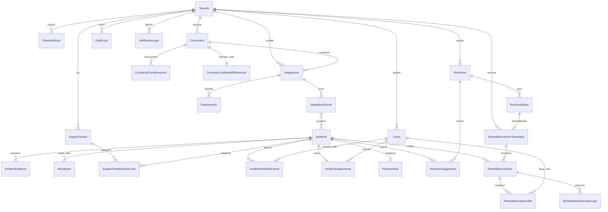

# 03 — Veri Modeli, API ve Entegrasyon Mimarisi (V2–V4)

**Kapsam:** Bu doküman, "AI Integration Failure Intelligence" (FI, V1) dışındaki ekip tarafından **zaten tasarlanmış ve dar kapsamlı MVP olarak yürütülen** bir alt üründür. Bu dokümanın amacı FI'yı yeniden tasarlamak değildir. Amaç, FI'nın veri modeli ve API'sinin üzerine, **AI Integration Operations Platform**'un V2 (Incident Intelligence) → V3 (Operations Platform) → V4 (Controlled Automated Remediation) fazlarında **nelerin ekleneceğini** mimari düzeyde netleştirmektir.

**Temel ilke:** FI'nın `/api/v1/*` sözleşmesi ve `Integrations / IntegrationEvents / Deployments / Incidents / IncidentEvidence / AIAnalyses` tabloları **sabit referans noktasıdır**. Platform bu tabloların yerine geçmez, onların üzerine inşa edilir. Yeni entity'ler FI tablolarına foreign key ile bağlanır; hiçbir V2+ tablo, FI'nın V1 sözleşmesini bozacak şekilde mevcut alan anlamını değiştirmez.

---

## 1. FI Üzerine Eklenen Yeni Entity'ler (V2–V4)

FI'nın referans veri modelinde zaten yer alan ama V1 MVP kapsamında **basitleştirilmiş/ertelenmiş** iki tablo (`Tenants`, `Users`) platformun gerçek çok-kiracılı hale geldiği V2'de tam olarak devreye girer. Bunların yanına V2–V4'te yeni entity grupları eklenir.

### 1.1 Tenancy & Kimlik (V2 — zorunlu ön koşul)

| Tablo | Amaç | Önemli Alanlar |
|---|---|---|
| `Tenants` | Müşteri/organizasyon izolasyonu | `Id`, `Name`, `Plan` (Free/Pilot/Pro/Enterprise), `Status` (Active/Suspended/Churned), `CreatedAt`, `DataRegion` |
| `Users` | Kullanıcı ve rol yönetimi | `Id`, `TenantId`, `Email`, `Role` (Owner/Admin/Engineer/Viewer/SupportAgent), `Status`, `LastLoginAt` |
| `TenantApiKeys` | FI'daki tek `apiKey` alanının çoğaltılabilir, rotate edilebilir hale gelmesi | `Id`, `TenantId`, `IntegrationId` (nullable — tenant-wide veya integration-scoped key), `KeyHash`, `Scopes`, `CreatedAt`, `RevokedAt`, `LastUsedAt` |

> V1'de `POST /api/v1/integrations` tek bir `apiKey` döner ve tenant kavramı yoktur (implicit tek-kiracı varsayımı). V2'de bu, `TenantApiKeys` tablosuna taşınır; V1 endpoint'i **davranışsal olarak** aynı kalır (bkz. Bölüm 10), sadece arka planda tenant çözümlemesi eklenir.

### 1.2 Connector Framework (V2)

| Tablo | Amaç | Önemli Alanlar |
|---|---|---|
| `Connectors` | Provider tipi registry (Stripe, GitHub, SendGrid, custom HTTP...) | `Id`, `TenantId`, `ProviderType`, `DisplayName`, `ConfigSchemaVersion`, `Config` (JSONB — public/non-secret alanlar), `CredentialReferenceId`, `Status` (Draft/Active/Disabled/Error), `CreatedAt`, `UpdatedAt` |
| `ConnectorConfigVersions` | Config değişikliklerinin versiyonlanması | `Id`, `ConnectorId`, `Version`, `ConfigSnapshot` (JSONB), `ChangedBy`, `ChangedAt`, `ChangeReason` |
| `ConnectorCredentialReferences` | Gerçek secret'ı DB'de tutmadan secret manager'a işaretçi | `Id`, `TenantId`, `SecretManagerProvider` (AzureKeyVault/AwsSecretsManager/HashicorpVault), `SecretPath`, `SecretVersion`, `RotationPolicy`, `LastRotatedAt` |

`Integrations` tablosu (FI, V1) ile `Connectors` (V2) ilişkisi: bir `Integration`, bir `Connector`'ın **kullanım örneğidir** (`Integrations.ConnectorId` nullable FK eklenir). FI'daki manuel/generic entegrasyon kaydı kalmaya devam eder; connector, bu kaydı bir "tip" ile standartlaştırır.

### 1.3 Support Correlation (V2)

| Tablo | Amaç | Önemli Alanlar |
|---|---|---|
| `SupportTickets` | Dış destek sisteminden (Zendesk/Intercom/Freshdesk) ingest edilen ticket'lar | `Id`, `TenantId`, `ExternalTicketId`, `Source`, `Subject`, `BodyExcerpt` (redaction sonrası), `CustomerRef`, `Priority`, `Status`, `CreatedAtSource`, `IngestedAt` |
| `SupportTicketIncidentLinks` | Ticket-incident eşleştirme sonucu | `Id`, `SupportTicketId`, `IncidentId`, `MatchScore` (0–1), `MatchMethod` (TimeWindow/KeywordSimilarity/CustomerOverlap/Manual), `Status` (Suggested/Confirmed/Rejected), `ConfirmedBy`, `ConfirmedAt` |

### 1.4 Incident Workflow (V2)

FI zaten `resolve` ve `reopen` aksiyonlarını sağlıyor. V2, bunun üzerine tam bir workflow geçmişi ve daha zengin durum makinesi ekler.

| Tablo | Amaç | Önemli Alanlar |
|---|---|---|
| `IncidentWorkflowEvents` | Assign/acknowledge/resolve/reopen/postmortem geçmişi (append-only) | `Id`, `IncidentId`, `EventType` (Assigned/Acknowledged/Resolved/Reopened/PostmortemCreated/PostmortemPublished), `ActorId`, `ActorType` (User/System/AI), `PreviousState`, `NewState`, `Note`, `OccurredAt` |
| `IncidentAssignments` | Güncel atama durumu (hızlı sorgu için denormalize) | `Id`, `IncidentId`, `AssigneeId`, `AssignedBy`, `AssignedAt`, `UnassignedAt` |
| `Postmortems` | Postmortem doküman kaydı | `Id`, `IncidentId`, `Summary`, `Timeline` (JSONB), `RootCauseFinal`, `ActionItems` (JSONB), `Status` (Draft/Published), `AuthorId`, `PublishedAt` |

### 1.5 Runbook Engine (V3)

| Tablo | Amaç | Önemli Alanlar |
|---|---|---|
| `Runbooks` | Kayıtlı çözüm prosedürleri | `Id`, `TenantId` (nullable — platform-wide şablonlar için null), `Title`, `Category`, `SourceType` (ManualAuthored/DerivedFromPostmortem), `IsTemplate` |
| `RunbookSteps` | Runbook'un sıralı adımları | `Id`, `RunbookId`, `StepOrder`, `Instruction`, `IsAutomatable`, `RemediationActionTemplateId` (nullable, bkz. 1.6) |
| `RunbookSuggestions` | Belirli bir incident için AI'ın önerdiği runbook eşleşmeleri | `Id`, `IncidentId`, `RunbookId`, `MatchScore`, `MatchReasoning`, `SuggestedAt`, `Status` (Suggested/Accepted/Dismissed) |

### 1.6 Controlled Remediation (V4)

| Tablo | Amaç | Önemli Alanlar |
|---|---|---|
| `RemediationActionTemplates` | Ne tür otomatik aksiyonlar tanımlanabilir (rollback config, restart connector, rotate credential vb.) | `Id`, `TenantId`, `ActionType`, `TargetResourceType`, `ParameterSchema` (JSON Schema), `RiskLevel` (Low/Medium/High) |
| `RemediationActions` | Belirli bir incident için önerilen/talep edilen aksiyon | `Id`, `IncidentId`, `RemediationActionTemplateId`, `Parameters` (JSONB), `Status` (Proposed/PendingApproval/Approved/Rejected/Executing/Succeeded/Failed/RolledBack), `ProposedBy` (AI/User), `CreatedAt` |
| `RemediationApprovals` | Onay/red kararları | `Id`, `RemediationActionId`, `ApproverId`, `Decision` (Approved/Rejected), `Reason`, `DecidedAt` |
| `RemediationExecutionLogs` | Çalıştırma denetim izi | `Id`, `RemediationActionId`, `ExecutedBy` (System), `StartedAt`, `FinishedAt`, `Outcome`, `OutputLog`, `RollbackOf` (nullable self-FK) |

---

## 2. ER Diyagramı (Mermaid)

FI'nın mevcut tabloları **kalın çerçeveyle işaretlenmemiştir** (Mermaid stil sınırlaması nedeniyle yorum satırıyla belirtilmiştir) ama isim olarak aynen korunmuştur; platform eklentileri bu çekirdeğin etrafında büyür.



**Okuma notu:** `Integrations`, `IntegrationEvents`, `Deployments`, `Incidents`, `IncidentEvidence`, `AIAnalyses` FI'da tanımlıdır ve şema değişmez; yalnızca `TenantId` FK'si eklenir (Bölüm 3). `AuditLogs` ve `NotificationLogs` FI'nın referans veri modelinde zaten vardır; platform bunları connector, runbook ve remediation olaylarını da kapsayacak şekilde genişletir.

---

## 3. Multi-Tenancy'nin Veri Modeline Yansıması

FI, V1 MVP'de bilinçli olarak **gerçek multi-tenancy içermez** ("MVP'de Olmayacaklar" listesinde açıkça belirtilmiş). V2'nin ilk ve zorunlu ön koşulu budur — Incident Intelligence ve Connector Framework, birden fazla müşteriyi izole edebilen bir temel gerektirir.

### 3.1 TenantId'nin Eklendiği Tablolar

| Tablo | TenantId Kaynağı |
|---|---|
| `Integrations` | Doğrudan eklenir (V1'de implicit tek-kiracı; V2'de zorunlu FK) |
| `IntegrationEvents` | `Integrations.TenantId` üzerinden implicit; performans için event tablosuna da **denormalize edilir** (yüksek hacimli tabloda join'siz filtreleme şart) |
| `Deployments` | `Integrations.TenantId` üzerinden implicit + denormalize |
| `Incidents` | Denormalize edilir (event fingerprinting ve dashboard sorguları tenant bazlı yoğun filtrelenir) |
| `IncidentEvidence`, `AIAnalyses` | `Incidents.TenantId` üzerinden implicit; join maliyeti düşükse denormalize edilmeyebilir |
| `Connectors`, `SupportTickets`, `Runbooks`, `RemediationActionTemplates` | Doğrudan eklenir (tenant-scoped kaynak) |
| `AuditLogs`, `NotificationLogs` | Doğrudan eklenir (zaten FI referans modelinde var) |

**Kural:** Yüksek yazım hacimli, sık filtrelenen tablolarda (`IntegrationEvents`, `Incidents`) `TenantId` **denormalize edilir** ve composite index'in (`TenantId`, ikincil filtre alanı) ilk sütunu olur. Düşük hacimli, her zaman parent üzerinden erişilen tablolarda (`IncidentEvidence`) implicit ilişki yeterlidir.

### 3.2 Global Query Filter Yaklaşımı

- EF Core `HasQueryFilter` ile her tenant-scoped entity'ye `TenantId == _currentTenant.Id` filtresi global olarak uygulanır; bu filtre **request-scoped bir `ICurrentTenantProvider`'dan** okunur, asla kod içinde manuel `WHERE` ile tekrarlanmaz.
- Filtre, yönetimsel/arka plan işleri (ör. cross-tenant Hangfire job'ları, platform admin panelleri) için **açıkça ve izlenebilir şekilde** `IgnoreQueryFilters()` ile bypass edilir; her bypass noktası code review'da ayrıca işaretlenir ve audit log'a yazılır.
- Migration ve seed script'leri filtre dışında çalışır; bu nedenle her yeni tenant-scoped tabloya `TenantId` eklenirken NOT NULL + FK constraint zorunludur (nullable tenant alanı = izolasyon açığı).
- **Savunma katmanı 2:** Uygulama seviyesi filtreye ek olarak, PostgreSQL Row-Level Security (RLS) V3'te (ölçek büyüdükçe) değerlendirilir — connection'a `SET app.tenant_id` ile session değişkeni set edilip RLS policy bununla eşleştirilir. Bu, EF Core filtresi atlanan bir kod yolunda bile izolasyonu korur.
- Entegrasyon testi zorunluluğu (FI'nın referans güvenlik tablosunda zaten belirtilmiş "Tenant veri karışması" riski): her yeni tenant-scoped entity için "Tenant A, Tenant B'nin kaydını göremez/değiştiremez" testi CI'da otomatik çalışır.

---

## 4. Connector Framework API Contract (V2)

### 4.1 Connector Registration

```
POST /api/v2/connectors
```

**Girdi (kavramsal):**
```json
{
  "providerType": "stripe",
  "displayName": "Production Stripe Account",
  "configSchemaVersion": "1.0",
  "config": {
    "webhookEndpointId": "we_123",
    "apiVersion": "2024-06-20",
    "environment": "production"
  },
  "credentialReference": {
    "secretManagerProvider": "AzureKeyVault",
    "secretPath": "tenants/{tenantId}/connectors/stripe/prod/apikey"
  }
}
```

**Çıktı:**
```json
{
  "connectorId": "conn_...",
  "status": "Active",
  "configVersion": 1,
  "validationResult": { "valid": true, "errors": [] }
}
```

**Kurallar:**
- `config` alanı **yalnızca gizli olmayan** bağlantı meta verisini içerir (webhook id, environment, API version). Gerçek API key/secret asla bu payload'da taşınmaz.
- `credentialReference`, secret'ın kendisi değil, secret manager'daki **yolu**dur; kayıt anında backend bu yolun var olduğunu secret manager'a bir "exists" çağrısıyla doğrular, secret değerini asla okumaz/loglamaz.
- Kayıt, `ConfigSchemaVersion`'a karşı JSON Schema validation'dan geçmeden `Active` olamaz.

### 4.2 Connector Config Şeması (JSON Schema ile Validation)

Her `providerType` için bir JSON Schema tanımı, connector registry'de tutulur (`ConnectorTypeSchemas` — statik/seed edilen bir referans tablo, tenant-scoped değildir). Kayıt/güncelleme sırasında gelen `config` bu şemaya göre doğrulanır.

```
GET /api/v2/connector-types/{providerType}/schema
```

**Çıktı (kavramsal, Stripe örneği):**
```json
{
  "providerType": "stripe",
  "schemaVersion": "1.0",
  "jsonSchema": {
    "type": "object",
    "required": ["webhookEndpointId", "environment"],
    "properties": {
      "webhookEndpointId": { "type": "string" },
      "apiVersion": { "type": "string" },
      "environment": { "type": "string", "enum": ["sandbox", "production"] }
    },
    "additionalProperties": false
  },
  "credentialShape": {
    "requiredSecretKeys": ["apiKey", "webhookSigningSecret"]
  }
}
```

`credentialShape`, secret manager'da hangi anahtarların bulunması gerektiğini tanımlar (secret'ların kendisini değil). UI, connector kurulum formunu bu şemadan üretir.

### 4.3 Credential Reference API

```
POST /api/v2/connectors/{connectorId}/credential-reference
```

**Girdi:**
```json
{
  "secretManagerProvider": "AzureKeyVault",
  "secretPath": "tenants/{tenantId}/connectors/{connectorId}/credentials",
  "secretVersion": "latest",
  "rotationPolicy": "P90D"
}
```

**Çıktı:**
```json
{
  "credentialReferenceId": "cref_...",
  "verified": true,
  "lastVerifiedAt": "2026-07-12T10:00:00Z"
}
```

**Desen:** Platform veritabanı yalnızca `secretPath` + `secretVersion` + rotasyon politikası tutar. Secret'ın gerçek değeri hiçbir zaman platform DB'sine yazılmaz, API response'unda dönmez, log'a düşmez. Çalışma zamanında connector'ın gerçek işlem yapması gerektiğinde (ör. webhook signature doğrulama), backend secret manager'dan **kısa ömürlü, cache'lenmeyen** bir okuma yapar ve değeri process belleğinde tutar, disk/log/DB'ye asla yazmaz. Rotasyon, secret manager tarafında gerçekleşir; platform yalnızca `secretVersion` referansını günceller ve `ConnectorConfigVersions`'a bir versiyon kaydı düşer.

---

## 5. Support Correlation API/Veri Akışı (V2)

### 5.1 Ticket Ingestion (Webhook)

```
POST /api/v2/support-tickets/webhook/{source}
```

Örn. `POST /api/v2/support-tickets/webhook/zendesk`. Dış destek sisteminin native webhook payload'ı kabul edilir; her `source` için ayrı bir **adapter** payload'ı normalize eder.

**Normalize edilmiş iç temsil (kavramsal):**
```json
{
  "externalTicketId": "zd_48213",
  "source": "zendesk",
  "subject": "Payments failing since this morning",
  "bodyExcerpt": "<redaction sonrası özet>",
  "customerRef": "cust_889",
  "priority": "high",
  "createdAtSource": "2026-07-12T08:14:00Z"
}
```

**Çıktı:** `202 Accepted` + `supportTicketId` + `correlationId` (FI'daki event ingestion desenine paralel — asenkron işleme, senkron kabul).

### 5.2 Ticket–Incident Eşleştirme (API Contract Seviyesi)

Eşleştirme, ingest'ten sonra arka planda (Hangfire job) tetiklenir; algoritmanın kendisi (zaman penceresi + anahtar kelime benzerliği + müşteri kesişimi ağırlıklı skor) bu dokümanın kapsamı dışıdır — yalnızca **girdi/çıktı sözleşmesi** tanımlanır.

**Girdi (job'a verilen bağlam):**
```json
{
  "supportTicketId": "st_...",
  "tenantId": "t_...",
  "candidateWindow": { "beforeMinutes": 30, "afterMinutes": 120 },
  "candidateIncidents": ["inc_101", "inc_102"]
}
```

**Çıktı (`SupportTicketIncidentLinks` kaydına yazılır):**
```json
{
  "supportTicketId": "st_...",
  "matches": [
    {
      "incidentId": "inc_101",
      "matchScore": 0.87,
      "matchMethod": "TimeWindow+KeywordSimilarity",
      "signals": {
        "timeProximityMinutes": 6,
        "keywordOverlap": ["payments", "failing"],
        "customerOverlap": true
      }
    }
  ],
  "status": "Suggested"
}
```

**API'ler:**

| Endpoint | Amaç |
|---|---|
| `GET /api/v2/support-tickets/{id}/incident-matches` | Önerilen eşleşmeleri listeler |
| `POST /api/v2/support-tickets/{id}/incident-matches/{incidentId}/confirm` | Manuel onay → `Status: Confirmed` |
| `POST /api/v2/support-tickets/{id}/incident-matches/{incidentId}/reject` | Manuel red → `Status: Rejected`, gelecekteki skorlama için negatif sinyal |

Eşik altı skorlar (ör. `matchScore < 0.5`) hiç öneri olarak yüzeye çıkmaz; UI yalnızca `Suggested` eşiği geçen adayları gösterir.

---

## 6. Incident Workflow API (V2)

FI'nın `resolve`/`reopen` uçları korunur; V2 bunun üzerine assign/acknowledge/postmortem ekler.

| Endpoint | Method | Girdi | Çıktı |
|---|---|---|---|
| `/api/v2/incidents/{id}/assign` | POST | `assigneeId` | `IncidentAssignments` kaydı + `IncidentWorkflowEvents: Assigned` |
| `/api/v2/incidents/{id}/acknowledge` | POST | `note` (opsiyonel) | `IncidentWorkflowEvents: Acknowledged` |
| `/api/v2/incidents/{id}/postmortem` | POST | `summary`, `timeline`, `rootCauseFinal`, `actionItems[]` | `postmortemId`, `status: Draft` |
| `/api/v2/incidents/{id}/postmortem/publish` | POST | — | `status: Published` + `IncidentWorkflowEvents: PostmortemPublished` |
| `/api/v2/incidents/{id}/workflow-history` | GET | — | `IncidentWorkflowEvents` listesi (timeline görünümü) |

**Durum makinesi genişlemesi:** FI'daki `Open → Resolved → Reopened` döngüsüne `Acknowledged` ara durumu eklenir (Open → Acknowledged → Resolved). `Assigned` durumu paralel bir alan olarak tutulur (bir incident hem `Acknowledged` hem `Assigned` olabilir), FI'nın temel durum alanını değiştirmez — yalnızca `IncidentAssignments` ile genişletir.

---

## 7. Runbook Engine API/Veri Modeli (V3)

### 7.1 Runbook Suggestion Request/Response

```
POST /api/v3/incidents/{id}/runbook-suggestions
```

Bu, FI'nın `POST /api/v1/incidents/{id}/reanalyze` deseniyle tutarlıdır — mevcut evidence + incident kategorisi üzerinden yeni bir öneri üretimi tetikler.

**Girdi:** gövde gerekmez; incident context zaten sunucu tarafında mevcuttur. Opsiyonel:
```json
{ "forceRefresh": false }
```

**Çıktı:**
```json
{
  "incidentId": "inc_...",
  "suggestions": [
    {
      "runbookId": "rb_...",
      "title": "Stripe credential rotation after deployment",
      "matchScore": 0.91,
      "matchReasoning": "Same category (AUTHENTICATION_ERROR) + evidence pattern matches 3 prior resolved incidents using this runbook",
      "steps": [
        { "stepOrder": 1, "instruction": "Verify current production secret against deployment metadata", "isAutomatable": false },
        { "stepOrder": 2, "instruction": "Rotate credential via connector credential reference", "isAutomatable": true }
      ]
    }
  ]
}
```

**Diğer uçlar:**

| Endpoint | Amaç |
|---|---|
| `POST /api/v3/runbooks` | Yeni runbook oluşturma (manuel authored) |
| `POST /api/v3/incidents/{id}/postmortem/derive-runbook` | Yayınlanmış bir postmortem'den runbook taslağı türetme |
| `POST /api/v3/incidents/{id}/runbook-suggestions/{runbookId}/accept` | Öneri kabul → `RunbookSuggestions.Status: Accepted`, incident timeline'a not düşülür |

**Kaynak veri:** Runbook önerisi, `AIAnalyses` (FI) çıktısındaki `category` ve `probableRootCause` alanlarını, geçmiş `Postmortems.RootCauseFinal` ile eşleştirerek üretilir — yani V3, FI'nın V1 çıktısını **tüketen** bir katmandır, üretim mantığını değiştirmez.

---

## 8. Controlled Remediation Approval Workflow (V4, Kavramsal Contract)

Bu bölüm **kavramsal düzeydedir**; hiçbir gerçek execution mantığı tanımlanmaz, yalnızca onay/denetim sözleşmesi.

| Endpoint | Amaç |
|---|---|
| `POST /api/v4/incidents/{id}/remediation-actions` | Bir `RemediationActionTemplate`'e dayalı aksiyon önerisi oluşturur → `Status: Proposed` |
| `POST /api/v4/remediation-actions/{id}/request-approval` | Öneriyi onaya sunar → `Status: PendingApproval`, ilgili approver'lara bildirim |
| `POST /api/v4/remediation-actions/{id}/approve` | `RemediationApprovals` kaydı ekler → `Status: Approved` |
| `POST /api/v4/remediation-actions/{id}/reject` | `RemediationApprovals` kaydı ekler (Decision: Rejected) → `Status: Rejected`, terminal |
| `POST /api/v4/remediation-actions/{id}/execute` | Yalnızca `Status: Approved` iken çağrılabilir → `Status: Executing` → sonuçta `Succeeded`/`Failed` |
| `GET /api/v4/remediation-actions/{id}/execution-log` | `RemediationExecutionLogs` — tam denetim izi |

**Değişmez kurallar (invariant):**
- `Execute`, `Approved` durumu dışında hiçbir durumdan tetiklenemez — bu kısıtlama hem API katmanında hem domain modelinde (durum makinesi) zorunlu kılınır.
- `RiskLevel: High` şablonlar için **çift onay** (iki farklı `ApproverId`) gerektirebilir; bu, `RemediationActionTemplates` üzerinde bir politika alanı olarak modellenir.
- Her execution, `RollbackOf` ile geriye dönük izlenebilir bir rollback aksiyonu üretebilir; rollback da aynı approval akışından geçer (kendiliğinden/otomatik rollback V4 kapsamı dışıdır).
- `RemediationExecutionLogs` **append-only**'dir ve `AuditLogs`'a (FI referans modeli) bir özet olay olarak yansıtılır.

---

## 9. Retention/Versioning Stratejisi — Platform Ölçeği

### 9.1 Tenant Bazlı Retention Farklılaşması

FI'nın temel veri modeli, tekil retention politikası varsayar. Platformda plan/tenant bazlı farklılaşma gerekir:

| Kavram | Model |
|---|---|
| `TenantRetentionPolicies` | `TenantId`, `EntityType` (IntegrationEvents/Incidents/SupportTickets/AuditLogs), `RetentionDays`, `ArchiveStrategy` (Delete/ColdStorage) |
| Varsayılan politika | Plan'a bağlı seed değer (ör. Free: 30 gün event, Pro: 180 gün, Enterprise: özelleştirilebilir) |
| Uygulama | Zamanlanmış arka plan işi (Hangfire), her tenant için `TenantRetentionPolicies`'i okuyup süresi dolan kayıtları arşivler/siler; **incident'a bağlı evidence, incident açıkken retention'dan muaftır** (aktif soruşturma verisi silinmez) |
| Uyum notu | `AuditLogs` ve `Postmortems`, güvenlik/uyum gereksinimleri nedeniyle tenant retention politikasından bağımsız, platform genelinde daha uzun minimum bir süre (ör. 1 yıl) ile korunur |

### 9.2 Connector Config Versioning

`ConnectorConfigVersions` her config değişikliğinde yeni bir satır oluşturur (immutable snapshot); `Connectors.Config` yalnızca **güncel** durumu tutan bir denormalize alan olarak kalır. Bu, iki nedenle gereklidir:
1. Bir incident'ın "config değişikliğinden mi kaynaklandığı" sorusu (FI'nın zaten `Deployments.ChangedConfig` ile yaptığı korelasyonun connector'lara genişletilmiş hali), geçmiş versiyonlara referans gerektirir.
2. Rollback senaryolarında (V4 remediation), "önceki config versiyonuna dön" aksiyonu somut bir hedef versiyon gerektirir.

`JsonSchemaVersion` alanı, connector tipi şeması zamanla değiştiğinde eski config kayıtlarının hangi şema ile doğrulandığını izlenebilir kılar — şema V2'ye geçtiğinde V1 ile oluşturulmuş config'ler otomatik geçersiz sayılmaz, ayrı bir migration/uyarı akışı ile ele alınır.

---

## 10. API Versiyonlama ve Geriye Dönük Uyumluluk

### 10.1 Temel Kural

`/api/v1/*` (FI), platformun **hiçbir V2+ fazında bozulmaz**. FI'yı kullanan mevcut entegrasyonlar (mock Stripe/GitHub/SES connector'ları, pilot müşteriler) kod değişikliği yapmadan çalışmaya devam eder.

### 10.2 V1 Üzerine Ekleme Stratejisi (Additive-Only)

- Yeni alanlar (ör. `Incidents.TenantId`), V1 response şemalarına **opsiyonel, geriye dönük varsayılan değeri olan** alanlar olarak eklenir; V1 tüketicileri bu alanları görmezden gelebilir.
- Tenant çözümlemesi V1'de **implicit** kalır: `apiKey` üzerinden tek bir örtük tenant'a bağlanır (V1'i entegre eden bir müşteri, tenant kavramından habersiz çalışmaya devam eder). V2'nin çoklu-key/rol modeli yalnızca `/api/v2/*` üzerinden yüzeye çıkar.
- FI'nın `POST /api/v1/incidents/{id}/resolve` / `reopen` uçları, `IncidentWorkflowEvents` tablosuna yazmaya **arka planda** başlar (V2 workflow geçmişini beslemek için) ama V1 request/response sözleşmesinde hiçbir alan değişmez.

### 10.3 /v2 Ne Zaman Gerekir

Yeni endpoint eklemek (`/api/v2/connectors`, `/api/v2/support-tickets/*` gibi) **yeni bir major versiyon gerektirmez** — bunlar zaten `/v2` altında yeni yollardır ve `/v1`'i etkilemez. Gerçek bir **breaking change** yalnızca şu durumlarda gerekir ve o zaman dahi yalnızca etkilenen kaynak için (tüm API için değil) yeni versiyon açılır:

| Senaryo | Versiyonlama Kararı |
|---|---|
| Yeni alan ekleme, yeni endpoint ekleme | `/v1` içinde kalır (additive) |
| Var olan bir alanın anlamının/tipinin değişmesi (ör. `severity` enum değerlerinin yeniden tanımlanması) | O kaynak için `/v2/incidents` açılır, `/v1/incidents` eski semantikle **paralel** yaşamaya devam eder, deprecation header (`Sunset`) ile duyurulur |
| Zorunlu tenant/auth modeli değişikliği (ör. API key yerine OAuth zorunlu hale gelirse) | Yeni auth şeması yeni bir header/scheme olarak eklenir; eski API key deste bir geçiş penceresi boyunca (ör. 6-12 ay) desteklenmeye devam eder |
| Ingestion payload şemasının zorunlu alan eklemesi | Yeni alan başlangıçta opsiyonel kabul edilir, bir sonraki majör versiyonda zorunlu hale getirilir |

**Deprecation süreci:** Bir `/v1` davranışının değiştirilmesi kaçınılmaz olduğunda: (1) `/v2` paralel yayınlanır, (2) `/v1` yanıtlarına `Deprecation` ve `Sunset` HTTP header'ları eklenir, (3) `NotificationLogs`/tenant dashboard üzerinden aktif `/v1` kullanıcılarına bildirim gider, (4) minimum bir geçiş penceresi sonunda `/v1` salt-okunur/kapatılır. FI'nın MVP doğası gereği bu senaryonun V1 lansmanından itibaren en az 12-18 ay içinde gerçekleşmesi beklenmez; platform büyüdükçe gerçek ihtiyaç ortaya çıktığında devreye girer.
